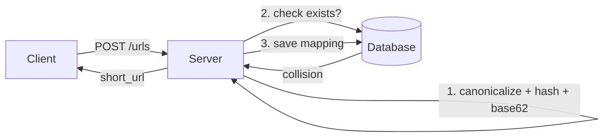
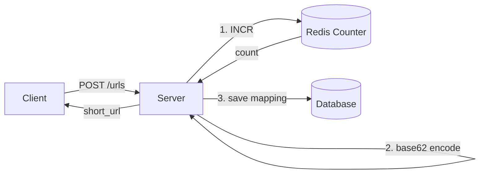

# Key Generation

**Category**: Scaling & Partitioning

## Key Insight

当系统需要为每条记录生成**全局唯一、短小、URL-safe** 的标识符时，核心决策是 **Hash-based vs Counter-based**。两者的根本区别在于：Hash 是确定性的（同输入同输出），Counter 是顺序性的（每次递增）。选择取决于是否需要去重、是否可接受外部依赖。

## When to Use

> 什么需求/约束出现时应该想到这个模式？

- 需要生成**短小唯一 ID**（如短链、paste ID、邀请码）
- ID 需要 **URL-safe**（不能有特殊字符）
- 写入 QPS 相对低，但唯一性要求严格
- 需要在**分布式环境**下保证唯一

## Design Framework

> 两种核心方案

### 方案 1: Hash Function + Base62

1. Canonicalize 输入（统一格式）
2. Hash（MD5/SHA256）→ 得到 hash code
3. Base62 encode → 取前 N 位作为 key
4. 碰撞处理：已存在 → 加 salt 重新生成（bounded retries, e.g. max 5）

**适用场景**: 无状态部署、需要去重（同输入 → 同输出）

### 方案 2: Counter + Base62

1. 全局 counter（Redis `INCR`）→ 原子递增
2. Base62 encode counter 值 → 得到唯一 key
3. SPOF 解决：Redis Sentinel/Cluster（自动故障转移）
4. 优化：Range-based counter（每台 server 预留一批号，减少 Redis 依赖）

**适用场景**: 严格唯一、可接受外部依赖（Redis）

### 方案选择决策

| 维度 | Hash | Counter |
|------|------|---------|
| 去重 | ✅ 天然去重 | ❌ 每次生成新 key |
| 碰撞 | 需要重试 | 无碰撞 |
| 外部依赖 | 无 | Redis |
| 可预测性 | 不可预测 | 顺序递增（可预测） |
| 无状态 | ✅ | ❌ |

### Base62 Encoding

- 62 进制: `0-9` + `a-z` + `A-Z`
- 用更少字符表达更大数字: 1,000,000,000 → `15FTGg`（6 位）
- 6 位 → 62⁶ ≈ 568 亿组合；7 位 → 62⁷ ≈ 3.5 万亿组合

## Architecture Diagram

> Hash-based 方案

> Counter-based 方案

## Trade-offs

| 优势 | 劣势 |
|------|------|
| Hash: 无状态、天然去重 | Hash: 碰撞需要重试逻辑 |
| Counter: 零碰撞、简单可靠 | Counter: 依赖 Redis、可预测 |
| Base62: URL-safe、短小 | Base62: 大小写敏感（移动端输入不友好） |

## Problems

| # | Name | Difficulty | Date |
|---|------|-----------|------|
| 1 | Design a URL Shortener (Bitly) | Medium | 2026-06-23 |

## Common Mistakes

- 忘记处理 Hash 碰撞（没有 bounded retries → 可能死循环）
- Counter 方案忘记考虑 Redis SPOF
- 用 Base64 而非 Base62（Base64 含 `+` `/` `=`，不是 URL-safe）
- Range-based counter 在 Lambda/Serverless 环境下不适用（实例短命，预留号段浪费）
