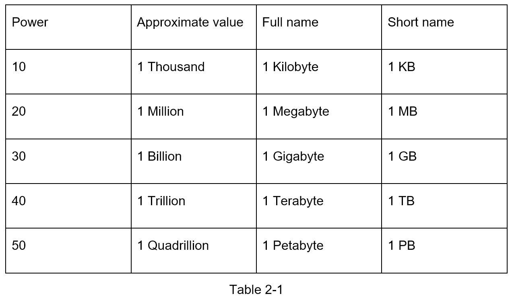
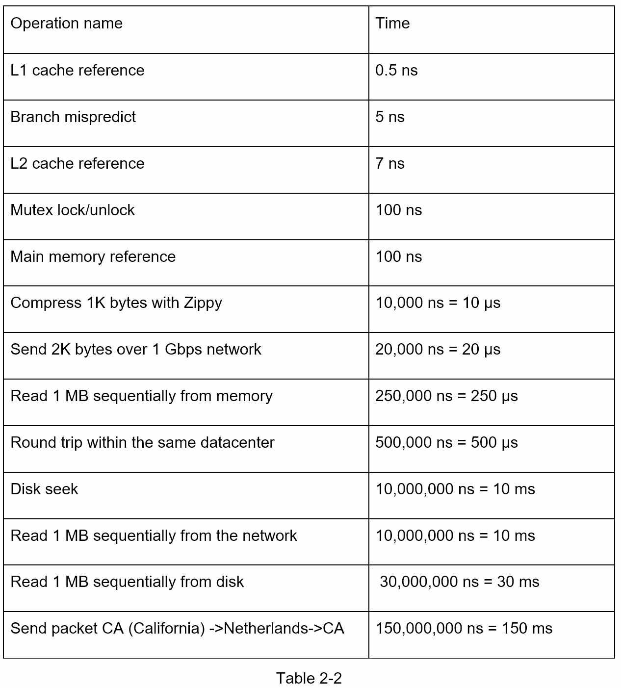
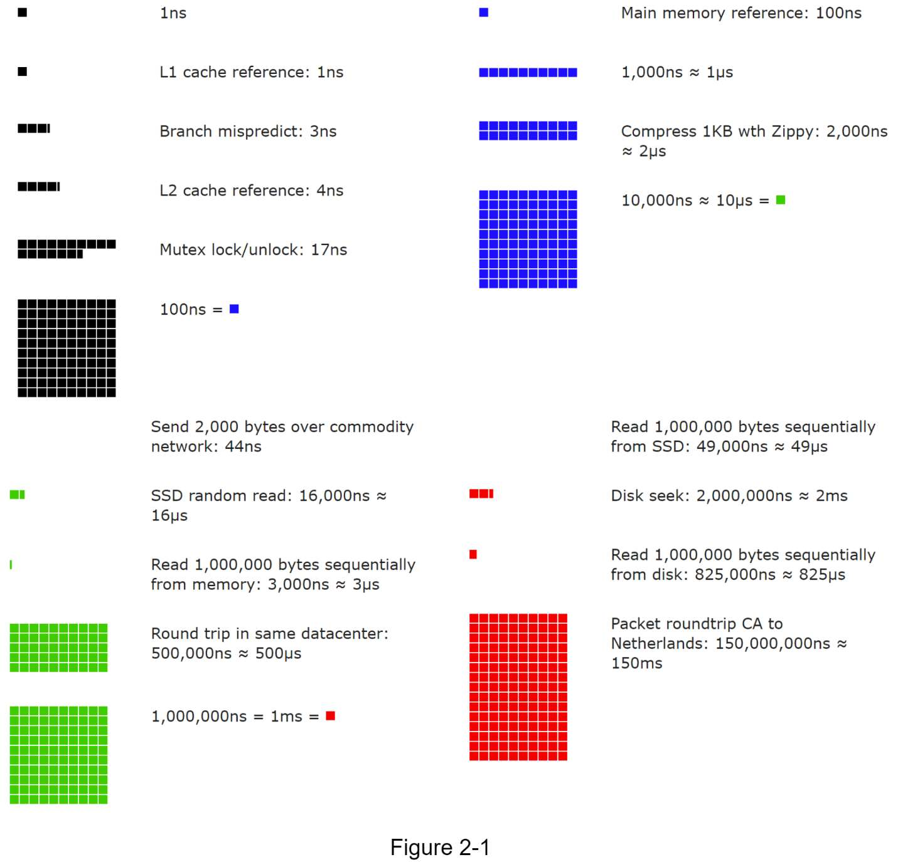
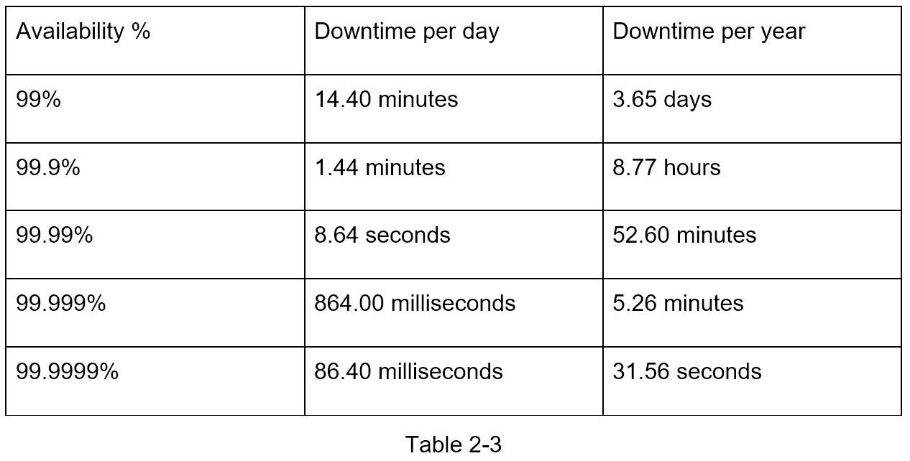

# Chapter 2: Back-of-the-Envelope Estimation

## 问题定义

Back-of-the-Envelope Estimation（粗略估算）是系统设计面试中的常见环节，用于在设计初期快速评估系统容量和性能需求。

**核心目标：**
- 通过思维实验 + 常用性能数字，快速判断设计方案是否可行
- 展示对 scalability 基础概念的掌握
- 重点不在精确计算，而在推理过程和量级判断

**三大基础知识：**
- Power of Two（2 的幂次方与数据单位）
- Latency Numbers（延迟数字）
- Availability Numbers（可用性数字）

---

## 架构图索引

| Figure | 文件 | 内容 | 类别 |
|--------|------|------|------|
| Table 2-1 |  | 数据单位表：Power of 2（10→KB, 20→MB, 30→GB, 40→TB, 50→PB） | 基础知识 |
| Table 2-2 |  | 延迟数字表：从 L1 Cache 0.5ns 到跨大洲 150ms 的各级操作耗时 | 基础知识 |
| Figure 2-1 |  | 延迟数字可视化（2020 版）：用色块面积直观展示各操作耗时差异 | 基础知识 |
| Table 2-3 |  | 可用性表：99%~99.9999% 对应每天/每年停机时间 | 基础知识 |

---

## 设计思路演进

### Step 1: 掌握数据单位 — Power of Two

分布式系统中数据量级的基础换算：

| Power | 近似值 | 全称 | 缩写 |
|-------|--------|------|------|
| 2^10 | 1 Thousand | 1 Kilobyte | 1 KB |
| 2^20 | 1 Million | 1 Megabyte | 1 MB |
| 2^30 | 1 Billion | 1 Gigabyte | 1 GB |
| 2^40 | 1 Trillion | 1 Terabyte | 1 TB |
| 2^50 | 1 Quadrillion | 1 Petabyte | 1 PB |

**记忆技巧：** 每增加 10 次方，单位进一级（KB → MB → GB → TB → PB）。

### Step 2: 熟记延迟数字 — Latency Numbers

Jeff Dean 在 2010 年总结的各级操作延迟（2020 版更新值）：

| 操作 | 耗时 | 量级 |
|------|------|------|
| L1 Cache Reference | 1 ns | ns 级 |
| Branch Mispredict | 3 ns | ns 级 |
| L2 Cache Reference | 4 ns | ns 级 |
| Mutex Lock/Unlock | 17 ns | ns 级 |
| Main Memory Reference | 100 ns | ns 级 |
| Compress 1KB with Zippy | 2,000 ns = 2 us | us 级 |
| Send 2KB over commodity network | 44 ns | ns 级 |
| SSD Random Read | 16,000 ns = 16 us | us 级 |
| Read 1 MB sequentially from memory | 3,000 ns = 3 us | us 级 |
| Round trip in same datacenter | 500,000 ns = 500 us | us 级 |
| Read 1 MB sequentially from SSD | 49,000 ns = 49 us | us 级 |
| Disk Seek | 2,000,000 ns = 2 ms | ms 级 |
| Read 1 MB sequentially from disk | 825,000 ns = 825 us | us 级 |
| Packet roundtrip CA to Netherlands | 150,000,000 ns = 150 ms | ms 级 |

**核心结论：**
- Memory 快，Disk 慢 — 尽量避免 disk seek
- 简单压缩算法很快 — 传输前压缩数据
- 跨数据中心传输耗时大 — 异地部署需考虑延迟

### Step 3: 理解可用性 — Availability Numbers

SLA（Service Level Agreement）用 "9 的个数" 衡量可用性：

| 可用性 | 别名 | 每天停机 | 每年停机 |
|--------|------|----------|----------|
| 99% | Two 9s | 14.40 分钟 | 3.65 天 |
| 99.9% | Three 9s | 1.44 分钟 | 8.77 小时 |
| 99.99% | Four 9s | 8.64 秒 | 52.60 分钟 |
| 99.999% | Five 9s | 864 毫秒 | 5.26 分钟 |
| 99.9999% | Six 9s | 86.40 毫秒 | 31.56 秒 |

**行业基准：** AWS、Google Cloud、Azure 的 SLA 通常在 99.9% 或以上。

### Step 4: 实战估算 — Twitter QPS 与存储

**假设条件：**
- 300 million MAU（月活用户）
- 50% 用户每日活跃 → DAU = 150 million
- 每人每天发 2 条 tweet
- 10% 的 tweet 包含媒体文件
- 数据存储 5 年

**QPS 估算：**
```
DAU = 300M × 50% = 150M
Tweets QPS = 150M × 2 / 24h / 3600s ≈ 3,500
Peak QPS = 2 × QPS ≈ 7,000
```

**存储估算：**
```
单条 tweet：tweet_id (64 bytes) + text (140 bytes) + media (1 MB)
每日媒体存储 = 150M × 2 × 10% × 1 MB = 30 TB/天
5 年媒体存储 = 30 TB × 365 × 5 ≈ 55 PB
```

---

## 关键设计考量 (Tradeoffs)

### 1. 取整与近似 (Rounding and Approximation)
- **原则**：面试中不需要精确计算，用整数近似即可
- **示例**：99,987 / 9.1 → 简化为 100,000 / 10 = 10,000
- **好处**：节省时间，避免在算术上浪费面试宝贵时间

### 2. 写下假设 (Write Down Assumptions)
- 所有估算都基于假设，必须明确声明
- 便于后续回顾和调整
- 面试官可能挑战你的假设，这是正常的讨论过程

### 3. 标注单位 (Label Your Units)
- "5" 可以是 5 KB 也可以是 5 MB，差距 1000 倍
- 始终写上单位：5 MB、3,500 QPS、30 TB/day
- 避免因单位混淆导致量级错误

### 4. 估算精度 vs 速度的 Tradeoff
- 目标是量级正确（order of magnitude），不是精确数字
- 面试官看重的是推理过程，不是最终数字
- 快速得出合理范围 >> 缓慢算出精确结果

### 5. 常用估算换算技巧
- **时间换算**：1 天 ≈ 10^5 秒（准确值 86,400）
- **QPS 公式**：DAU × 每日操作次数 / 86,400
- **Peak QPS**：通常按 2x ~ 10x 平均 QPS 估算
- **存储增长**：日增量 × 365 × 年数

---

## 面试扩展话题

### 常见估算类型
面试中最常被问到的 back-of-the-envelope 估算包括：
- **QPS 和 Peak QPS**：系统每秒处理的请求量及峰值
- **Storage**：数据存储总量及增长速度
- **Cache**：缓存容量需求（通常基于 80/20 法则）
- **Number of Servers**：所需服务器数量

### 延迟数字的实际应用
- 选择存储方案时：Memory vs SSD vs HDD 的延迟差异决定了架构选型
- 设计缓存策略时：理解 cache hit 与 cache miss 的延迟差距
- 多数据中心部署时：跨区域延迟（150ms）影响用户体验和数据同步策略

### 可用性的设计启示
- 每增加一个 "9"，工程复杂度显著提升
- 需要在可用性目标和成本之间做权衡
- 冗余（Redundancy）是提高可用性的核心手段

---

## 速写练习要点

面试中常用的估算公式和关键数字，盲练时牢记：

### 1. 必背数字
```
1 天 ≈ 100,000 秒 (10^5)
1 年 ≈ 365 天
2^10 = 1 KB, 2^20 = 1 MB, 2^30 = 1 GB, 2^40 = 1 TB, 2^50 = 1 PB
Memory Reference: 100 ns
SSD Random Read: ~16 us
Disk Seek: ~2 ms (= 10,000x Memory)
跨大洲 Round Trip: ~150 ms
```

### 2. 常用 QPS 估算模板
```
Step 1: 确定 DAU（日活用户）
Step 2: 估算每用户每日操作次数
Step 3: QPS = DAU × 操作次数 / 86,400
Step 4: Peak QPS = QPS × 2 (或更高倍数)
```

### 3. 存储估算模板
```
Step 1: 确定每条记录的大小（text / media / metadata）
Step 2: 日新增数据 = DAU × 每日产生记录数 × 单条大小
Step 3: 总存储 = 日新增 × 365 × 保存年数
```

### 4. 可用性速查
```
99%    → 每年停机 3.65 天
99.9%  → 每年停机 8.77 小时
99.99% → 每年停机 52.60 分钟
99.999% → 每年停机 5.26 分钟
```

### 5. 量级直觉
```
Memory >> SSD >> Disk（速度递减，容量递增）
压缩数据再传输 > 直接传输（网络带宽是瓶颈）
同机房 RTT ~500us << 跨洲 RTT ~150ms（300x 差距）
```
