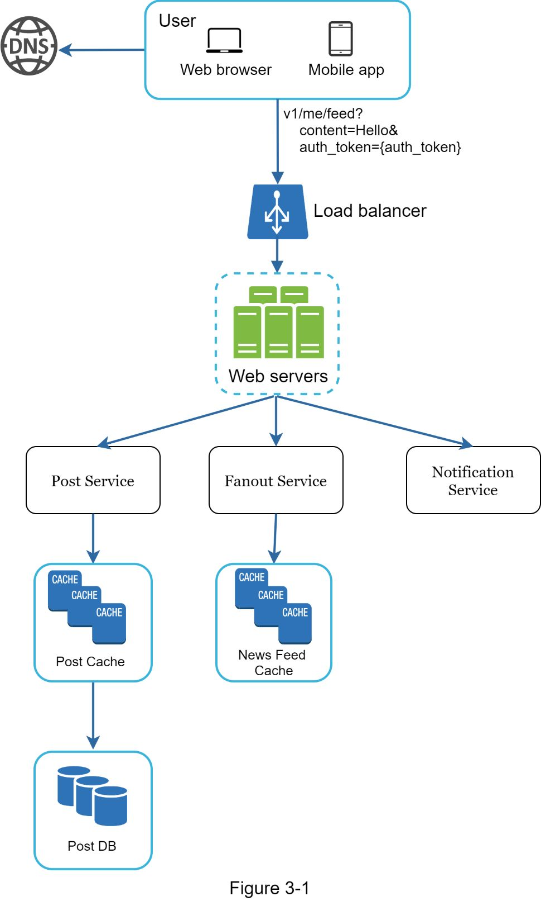
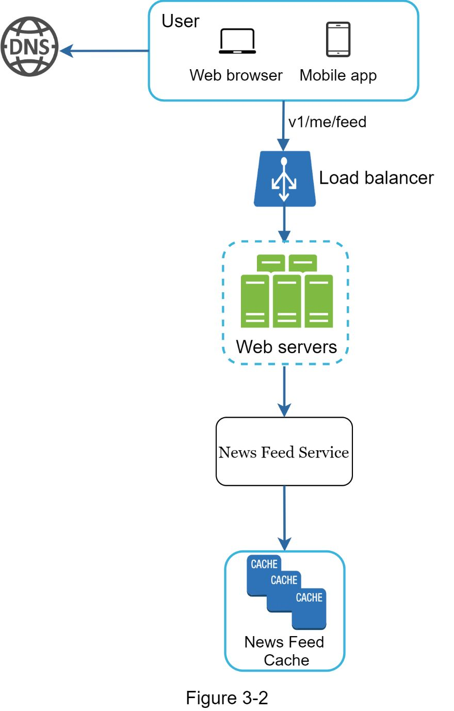
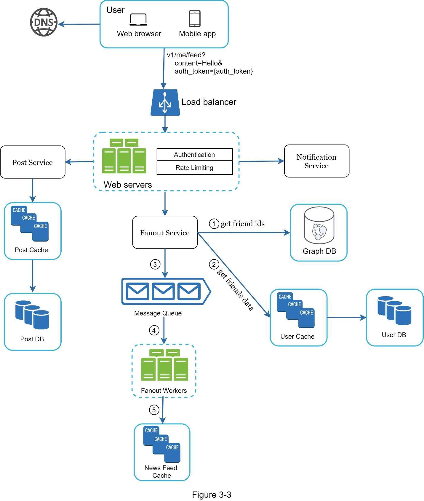
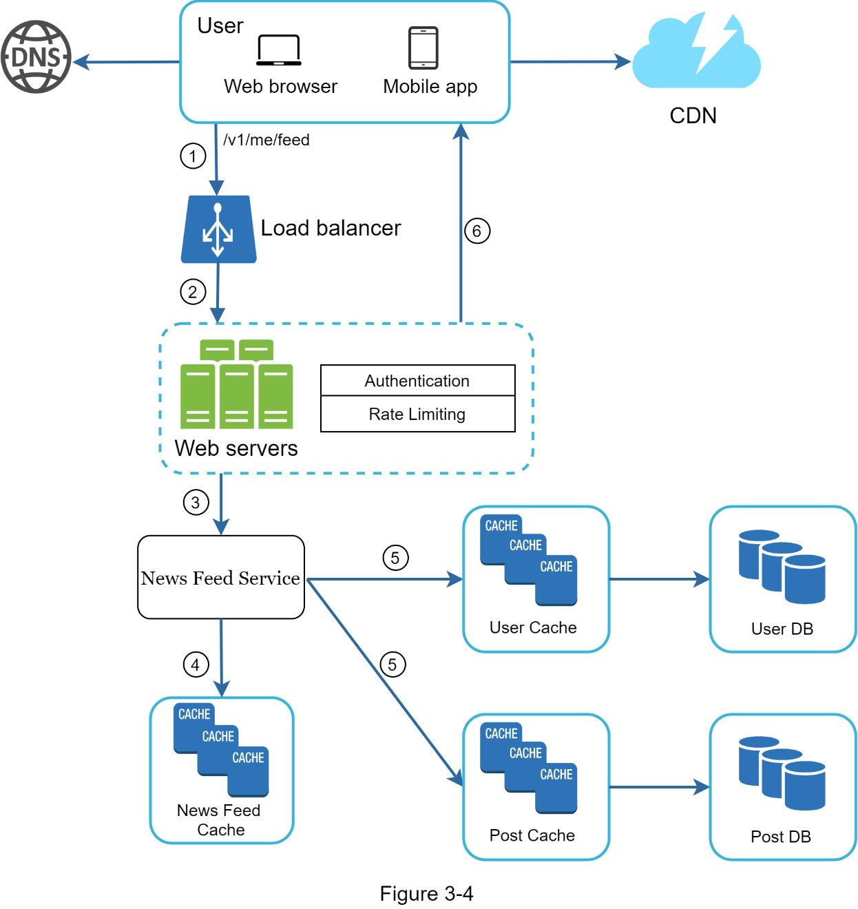

# Chapter 3: A Framework for System Design Interviews

## 核心思想

系统设计面试不是问答竞赛，没有标准答案。面试官评估的是：
- **协作能力**：能否与面试官像同事一样合作
- **压力下解决问题的能力**：面对模糊需求时的表现
- **沟通能力**：思考过程是否清晰可见
- **权衡取舍意识**：避免 over-engineering，理解 tradeoffs

**红旗信号**：Over-engineering、思维狭隘、固执己见、沉默思考不沟通

---

## 架构图索引

| Figure | 文件 | 内容 | 设计阶段 |
|--------|------|------|----------|
| 3-1 |  | News Feed 发布流程高层设计：User → Load Balancer → Web Servers → Post Service / Fanout Service / Notification Service → Post Cache + News Feed Cache → Post DB | 高层设计示例 |
| 3-2 |  | News Feed 构建流程高层设计：User → Load Balancer → Web Servers → News Feed Service → News Feed Cache | 高层设计示例 |
| 3-3 |  | Feed 发布详细设计：含 Authentication/Rate Limiting、Fanout Service 从 Graph DB 获取 friend IDs、User Cache/DB、Message Queue → Fanout Workers → News Feed Cache | 深入设计示例 |
| 3-4 |  | News Feed 读取详细设计：User → Load Balancer → Web Servers (含 Auth/Rate Limiting) → News Feed Service → News Feed Cache + User Cache/DB + Post Cache/DB → CDN 分发媒体内容 | 深入设计示例 |

---

## 四步框架

### Step 1: Understand the problem and establish design scope (3-10 分钟)

**核心原则**：不要急于给出答案，先搞清楚需求。

**Dos:**
- 主动提问，澄清需求和假设
- 把假设写在白板上，后续可参考
- 理解功能范围、用户规模、增长预期、技术栈

**Don'ts:**
- 不要像 "Jimmy" 一样不假思索就抢答
- 不要在没有充分理解需求的情况下就开始设计

**典型提问方向：**
- 要构建哪些具体功能？
- 产品有多少用户？
- 预期的增长速度是多少？（3个月、6个月、1年）
- 公司的技术栈是什么？有哪些现有服务可以复用？

**示例 -- 设计 News Feed 系统：**
```
Q: 移动端还是 Web 端？ → A: 都要
Q: 最重要的功能？ → A: 发帖 + 看好友动态
Q: 排序方式？ → A: 按时间倒序
Q: 好友数上限？ → A: 5000
Q: 流量规模？ → A: 10M DAU
Q: 内容类型？ → A: 文字 + 图片 + 视频
```

---

### Step 2: Propose high-level design and get buy-in (10-15 分钟)

**核心原则**：画出高层架构图，与面试官达成共识后再深入。

**Dos:**
- 先出 blueprint，主动寻求反馈
- 把面试官当作队友，协作讨论
- 画框图：Clients、APIs、Web Servers、Data Stores、Cache、CDN、Message Queue 等
- 做 Back-of-the-envelope 估算（先问面试官是否需要）
- 走几个具体 Use Case 验证设计

**Don'ts:**
- 不要一开始就陷入单个组件的细节
- 不要跳过高层设计直接进入深层

**是否需要 API Endpoints / DB Schema？**
- 大型设计题（如 Google Search）→ 不需要，太底层
- 特定功能题（如多人扑克游戏后端）→ 合适
- 关键：和面试官沟通确认

**示例 -- News Feed 高层设计分为两个流程：**
- **Feed Publishing**（Figure 3-1）：User → Load Balancer → Web Servers → Post Service + Fanout Service + Notification Service → Cache → DB
- **News Feed Building**（Figure 3-2）：User → Load Balancer → Web Servers → News Feed Service → News Feed Cache

---

### Step 3: Design deep dive (10-25 分钟)

**核心原则**：与面试官一起确定优先级，聚焦最关键的组件深入设计。

**Dos:**
- 根据面试官反馈确定深入方向
- 优先设计最关键的组件
- 展示你能在关键技术点上深入思考

**Don'ts:**
- 不要在无关紧要的细节上浪费时间
- 不要展开讲不能体现系统设计能力的算法细节（如 Facebook EdgeRank 排名算法）

**面试官关注点因人而异：**
- 有些偏好高层架构讨论
- Senior 候选人可能聚焦性能瓶颈和资源估算
- 大多数情况下要求深入特定组件（如 URL 短链的 Hash 函数、聊天系统的延迟优化和在线状态管理）

**示例 -- News Feed 深入设计：**
- **Feed Publishing 详细设计**（Figure 3-3）：加入 Authentication / Rate Limiting 层、Graph DB 查询好友关系、Message Queue 异步分发、Fanout Workers 写入 News Feed Cache
- **News Feed Retrieval 详细设计**（Figure 3-4）：News Feed Service 聚合 News Feed Cache + User Cache/DB + Post Cache/DB，通过 CDN 分发媒体文件

---

### Step 4: Wrap up (3-5 分钟)

**核心原则**：收尾不是结束，是最后展示思考深度的机会。

**可以讨论的方向：**
- **System Bottlenecks**：主动指出瓶颈并提出改进方案（永远不要说设计是完美的）
- **设计回顾**：给面试官做一个快速 recap，尤其是提出了多种方案时
- **Error Cases**：Server failure、Network loss 等异常场景
- **运维问题**：如何监控 metrics 和 error logs？如何上线发布？
- **扩展性**：当前支持 1M 用户，如何扩展到 10M？
- **时间有限时的取舍**：如果有更多时间，你会做哪些优化？

---

## 总结 Dos and Don'ts

### Dos
1. 永远先澄清需求，不要假设你的理解是对的
2. 充分理解问题 -- startup 和大公司的解决方案不同
3. 让面试官知道你在想什么，全程保持沟通
4. 尽可能提出多种方案
5. 达成高层设计共识后，再从最关键的组件开始深入
6. 把面试官当队友，互相交流想法
7. 永远不要放弃

### Don'ts
1. 不要对常见面试题毫无准备
2. 不要在没有澄清需求和假设的情况下就开始设计
3. 不要一开始就深入单个组件的细节，先给出高层设计
4. 卡住时不要犹豫，主动寻求提示
5. 不要沉默思考，全程保持沟通
6. 不要觉得给出设计就结束了 -- 面试官说结束才算结束，尽早并频繁地寻求反馈

---

## 时间分配参考（45 分钟面试）

| 阶段 | 时间 | 占比 |
|------|------|------|
| Step 1: 理解问题 & 确定范围 | 3 - 10 min | ~15% |
| Step 2: 高层设计 & 达成共识 | 10 - 15 min | ~30% |
| Step 3: 深入设计 | 10 - 25 min | ~40% |
| Step 4: 总结收尾 | 3 - 5 min | ~10% |

---

## 面试扩展话题

- **面试本质**：模拟真实工作中两个同事协作解决模糊问题的场景，过程比结果重要
- **面试官视角**：面试官最怕的是给出 inconclusive 评估，确保提供足够的信号
- **Back-of-the-envelope 估算**：在 Step 2 中酌情使用，先和面试官确认是否需要
- **Use Case 驱动设计**：走具体场景有助于发现 edge cases
- **沟通是贯穿全程的主线**：每一步都要和面试官保持互动，这本身就是被评估的能力
