# Chapter 4: Design a Rate Limiter

## 问题定义

Rate Limiter 用于控制客户端请求速率，防止过量请求到达服务端。

**核心需求：**
- 精确限流，低延迟（不拖慢 HTTP 响应）
- 内存效率高
- 分布式环境下共享限流状态
- 被限流时返回清晰的异常信息（HTTP 429）
- 高容错：限流器故障不影响整体系统

---

## 架构图索引

| Figure | 文件 | 内容 | 设计阶段 |
|--------|------|------|----------|
| 4-1 | 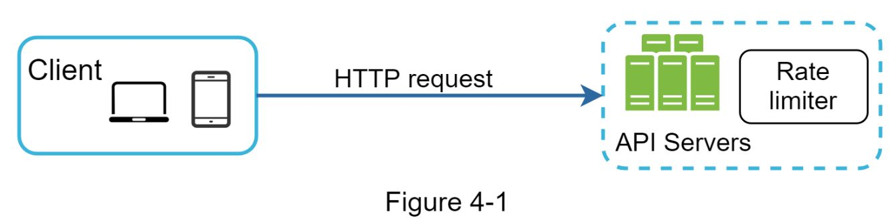 | Rate Limiter 放在 Server-side（API Server 内部） | 高层设计 |
| 4-2 | 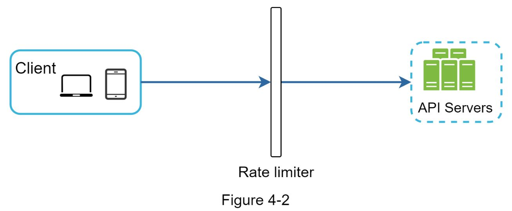 | Rate Limiter 作为独立中间件（Middleware） | 高层设计 |
| 4-3 | 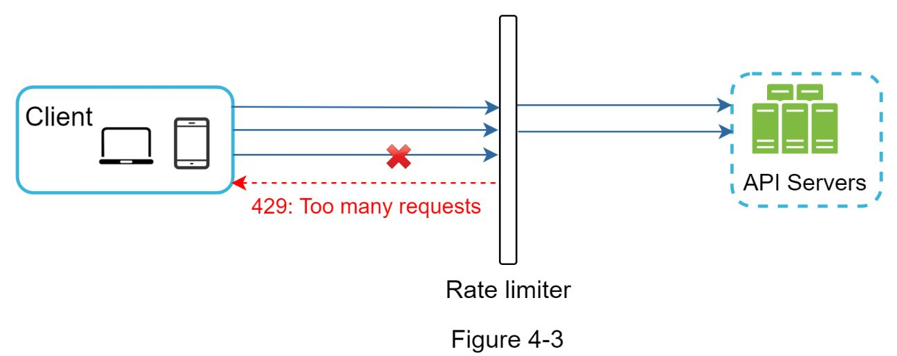 | 限流工作流程：2 req/s，第3个请求返回 429 | 高层设计 |
| 4-4 | 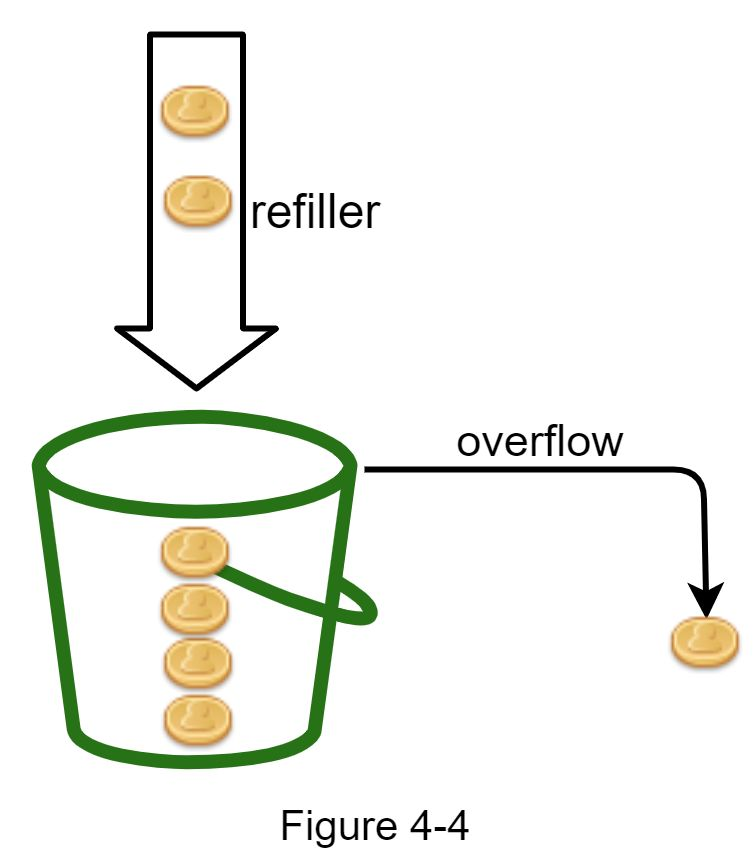 | Token Bucket 算法 - 令牌桶填充 | 算法 |
| 4-5 | 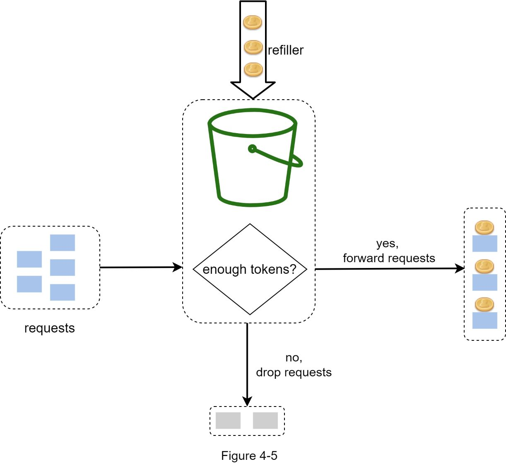 | Token Bucket 算法 - 请求消费令牌 | 算法 |
| 4-6 | 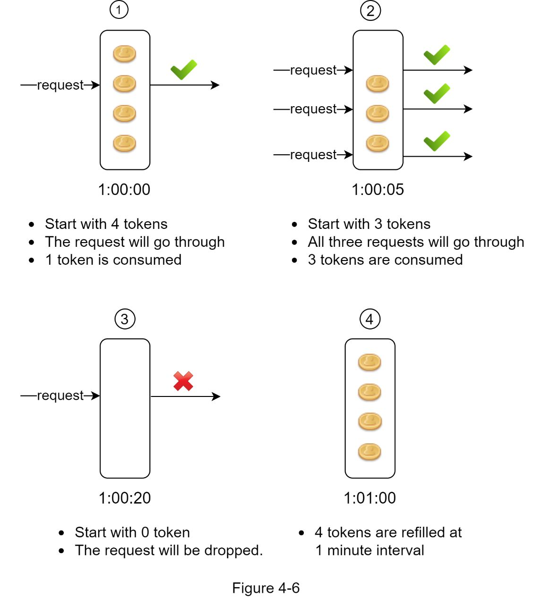 | Token Bucket 完整流程图 | 算法 |
| 4-7 | 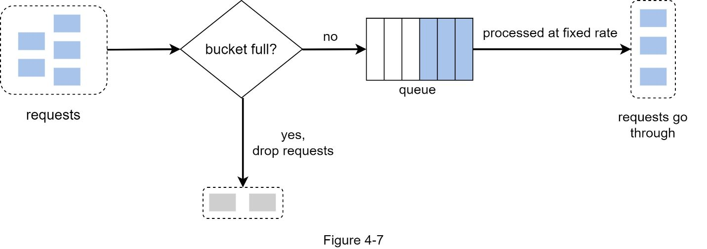 | Leaking Bucket 算法（FIFO 队列） | 算法 |
| 4-8 | 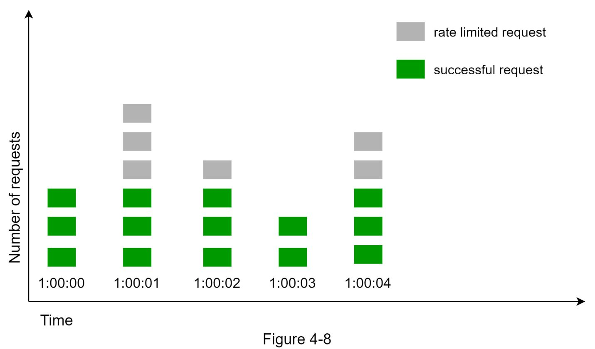 | Fixed Window Counter 算法 | 算法 |
| 4-9 | 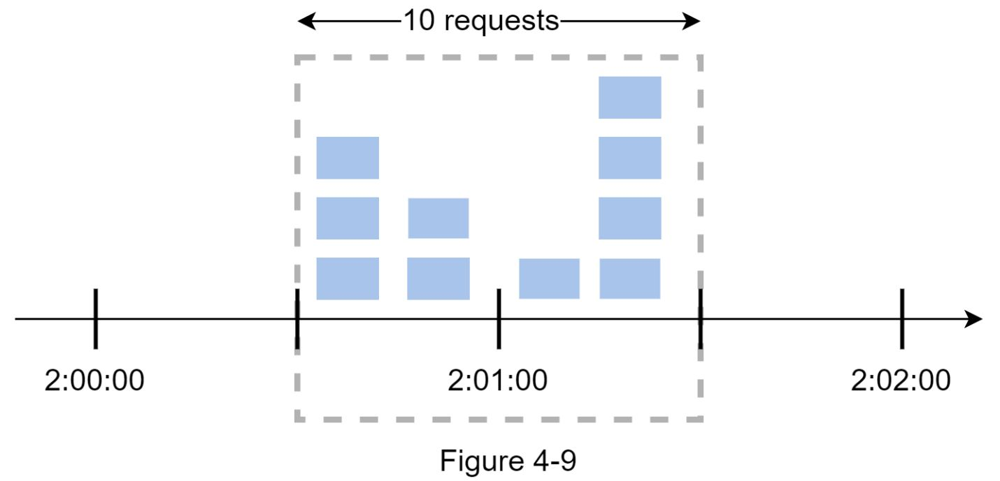 | Fixed Window 边界问题（spike at edges） | 算法 |
| 4-10 | 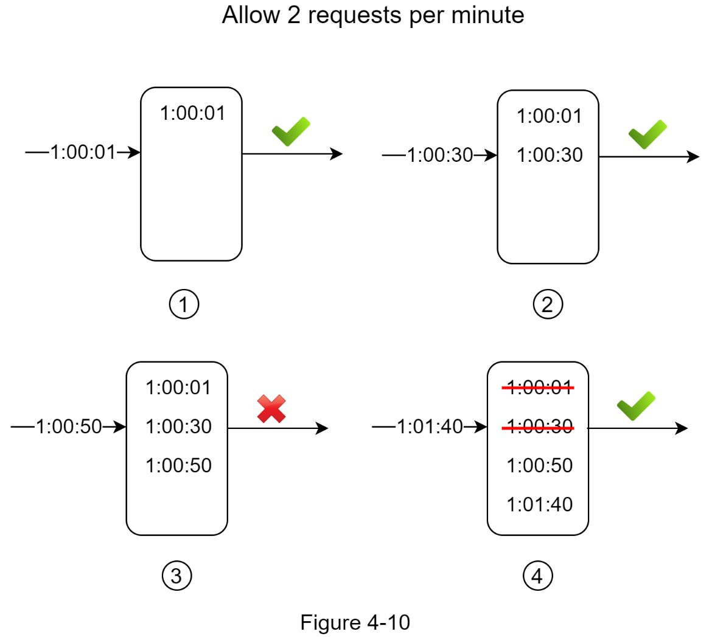 | Sliding Window Log 算法 | 算法 |
| 4-11 | 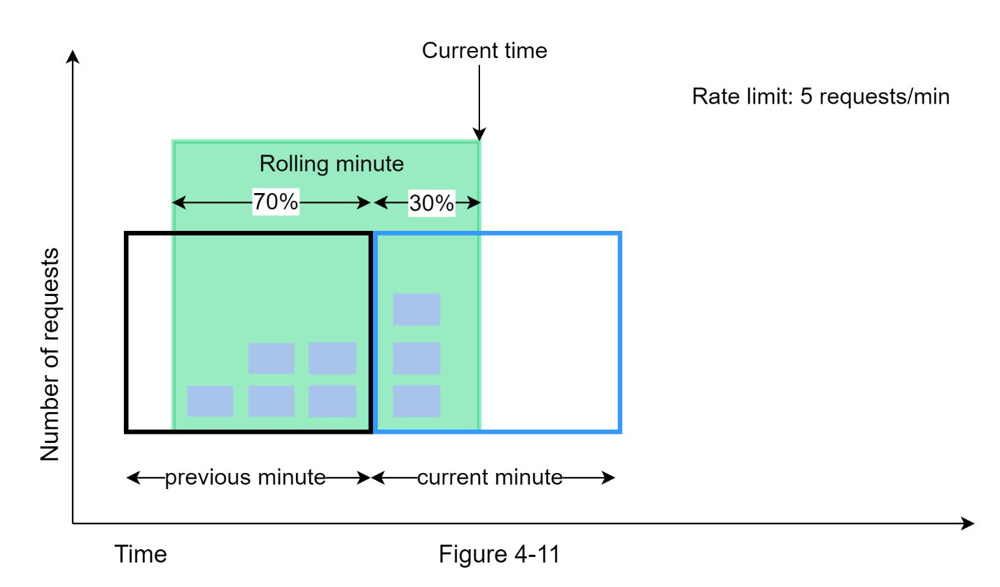 | Sliding Window Counter 算法（混合方式） | 算法 |
| 4-12 | 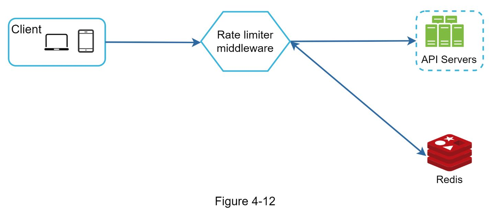 | **高层架构图**：Client → Rate Limiter Middleware → API Servers + Redis | 高层设计 |
| 4-13 | 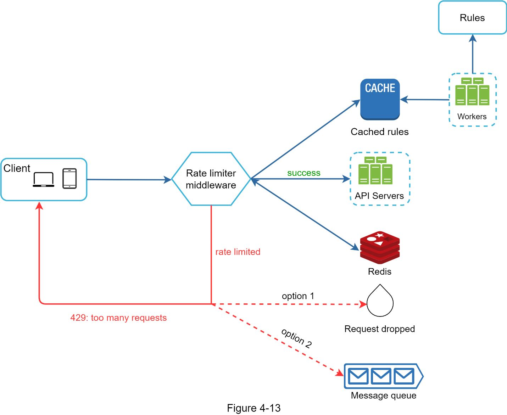 | **详细设计图**：含 Rules/Workers、Cache、Redis、Message Queue | 深入设计 |
| 4-14 | 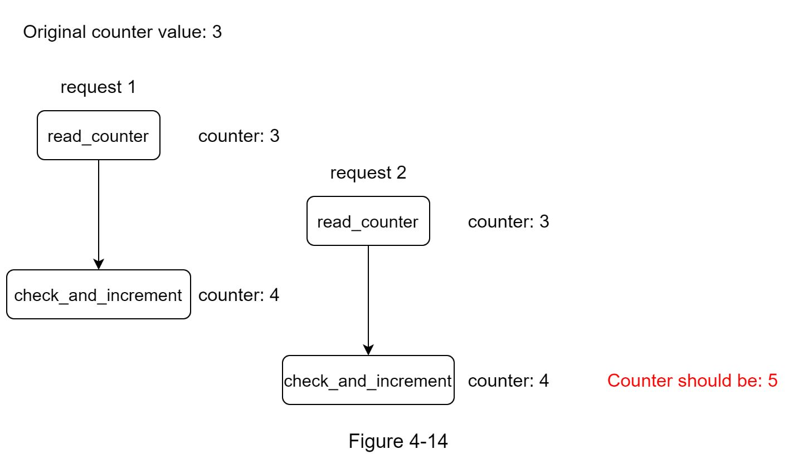 | 竞态条件（Race Condition）：两请求并发读 counter=3，各写回 4，应为 5 | 分布式挑战 |
| 4-15 | 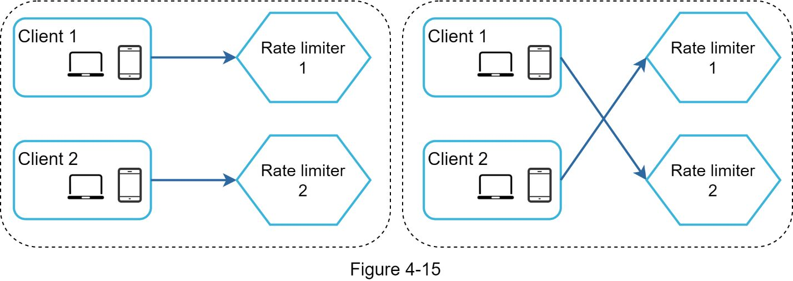 | 同步问题：多个 Rate Limiter 无共享状态，客户端可能打到不同实例 | 分布式挑战 |
| 4-16 | 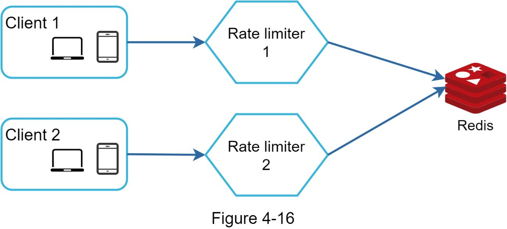 | 集中式 Redis 解决同步问题 | 分布式挑战 |
| 4-17 | 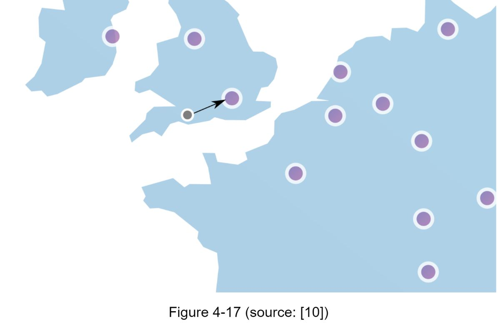 | 多数据中心 Edge Server 部署 | 性能优化 |

---

## 设计思路演进

### Step 1: 放在哪里？
```
Client-side ❌ → 不可信，可伪造
Server-side ✅ → 直接放在 API Server
Middleware ✅✅ → 作为独立中间件/API Gateway（推荐）
```

**决策考量：**
- 已有微服务 + API Gateway → 直接加到 Gateway
- 需要完全控制算法 → Server-side 实现
- 工程资源有限 → 商业 API Gateway

### Step 2: 选什么算法？

| 算法 | 核心思想 | 优点 | 缺点 | 适用场景 |
|------|----------|------|------|----------|
| **Token Bucket** | 令牌桶定期填充，请求消费令牌 | 简单，内存效率高，允许短时突发 | 参数调优困难 | Amazon, Stripe |
| **Leaking Bucket** | FIFO 队列，固定速率出队 | 内存效率高，输出速率稳定 | 突发流量时新请求被丢弃 | Shopify |
| **Fixed Window Counter** | 按固定时间窗口计数 | 简单，内存少 | **边界 spike 问题**：窗口交界处可能 2x 流量 | 简单场景 |
| **Sliding Window Log** | 记录每个请求的时间戳 | 精确 | 内存消耗大（即使被拒绝也存时间戳） | 高精度场景 |
| **Sliding Window Counter** | Fixed Window + Sliding Window 的混合 | 平滑突发，内存效率高 | 近似值（基于上一窗口均匀分布假设） | Cloudflare（0.003% 误差） |

### Step 3: 高层架构

```
Client → Rate Limiter Middleware → API Servers
                ↕
              Redis (INCR + EXPIRE)
```

**为什么用 Redis？**
- 数据库磁盘 I/O 太慢 ❌
- 内存缓存速度快，支持 TTL 自动过期 ✅
- INCR 原子递增 + EXPIRE 设置过期时间

### Step 4: 详细设计

```
                    Rules (磁盘)
                      ↓ (Workers 拉取)
Client → Rate Limiter → Cache (规则缓存)
              ↕
            Redis (计数器 + 时间戳)
              ↓
        ┌─ 未限流 → API Servers
        └─ 已限流 → 429 + 可选入 Message Queue 延后处理
```

**限流规则管理：**
- 规则以配置文件存储在磁盘（如 Lyft 开源的 ratelimit）
- Workers 定期从磁盘拉取规则到内存 Cache
- 支持按 domain/key/value 灵活配置

**HTTP 响应头：**
- `X-Ratelimit-Remaining`: 剩余可用请求数
- `X-Ratelimit-Limit`: 窗口内总配额
- `X-Ratelimit-Retry-After`: 限流后需等待的秒数

---

## 关键设计考量 (Tradeoffs)

### 1. 分布式环境的竞态条件 (Race Condition)
- **问题**：两个请求并发读取 counter=3，各自 +1 写回 4，实际应该是 5
- **解法**：Redis Lua Script（原子操作）或 Redis Sorted Sets
- **不推荐**：分布式锁（太慢）

### 2. 分布式环境的同步问题 (Synchronization)
- **问题**：多个 Rate Limiter 实例各自维护状态，无法正确限流
- **解法**：集中式 Redis 作为共享状态存储
- **不推荐**：Sticky Sessions（不可扩展）

### 3. 性能优化
- **多数据中心**：部署 Edge Server 就近处理，减少延迟
- **最终一致性**：数据同步采用 Eventual Consistency 模型

### 4. 监控
- 限流算法是否有效？是否太严格导致误杀？
- 是否需要根据流量模式切换算法？（如 Flash Sale → Token Bucket）

### 5. Hard vs Soft Rate Limiting
- **Hard**：绝对不超过阈值
- **Soft**：允许短时间超过阈值

### 6. 面试扩展话题
- 不同 OSI 层级的限流（Layer 7 HTTP vs Layer 3 IP/Iptables）
- 客户端最佳实践：客户端缓存减少调用、理解限额、异常捕获 + backoff 重试

---

## 速写练习要点

盲画时重点记住这些组件和连接：

1. **核心数据流**：Client → Middleware → Redis ↔ API Server
2. **规则加载**：Rules (disk) → Workers → Cache → Middleware
3. **限流后处理**：429 返回 OR 入 Message Queue
4. **分布式**：多个 Middleware 共享一个 Redis Cluster
5. **多 DC**：Edge Server 就近 + Eventual Consistency 同步
