# Chapter 5: Design Consistent Hashing

## 问题定义

当系统需要水平扩展时，必须将请求/数据高效且均匀地分配到多台服务器上。Consistent Hashing 是实现这一目标的关键技术。

**核心问题：传统 Hash 取模方式的致命缺陷**
- 使用 `serverIndex = hash(key) % N`，当服务器数量 N 变化时（增加或宕机），几乎所有 key 都会被重新映射
- 这导致大规模 cache miss 风暴，严重影响系统可用性

**Consistent Hashing 的核心优势：**
- 服务器增减时，平均只需重新映射 `k/n` 个 key（k 为总 key 数，n 为 slot 数）
- 支持水平扩展，数据分布更均匀
- 缓解 hotspot key 问题（避免所有热点数据落在同一 shard）

---

## 架构图索引

| Figure | 文件 | 内容 | 设计阶段 |
|--------|------|------|----------|
| 5-1 (Table 5-1) | 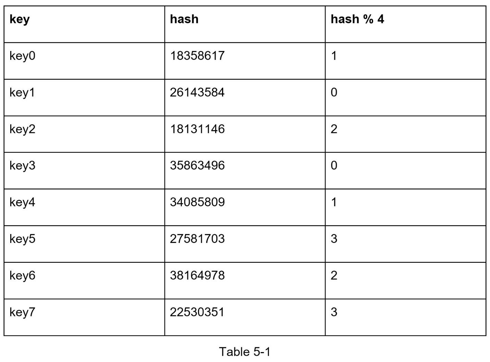 | 4 台服务器、8 个 key 的 hash 值表 | 问题背景 |
| 5-1 | 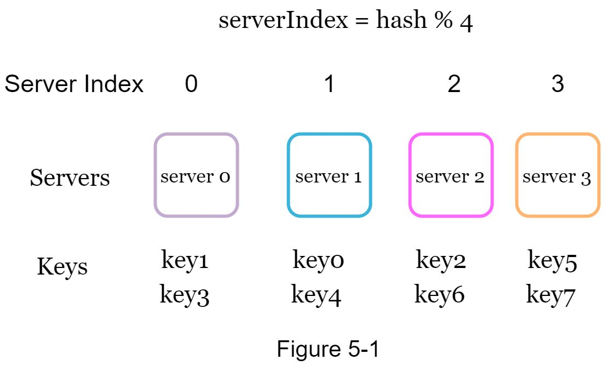 | 传统 hash % 4 的 key 分布图 | 问题背景 |
| 5-2 (Table 5-2) | 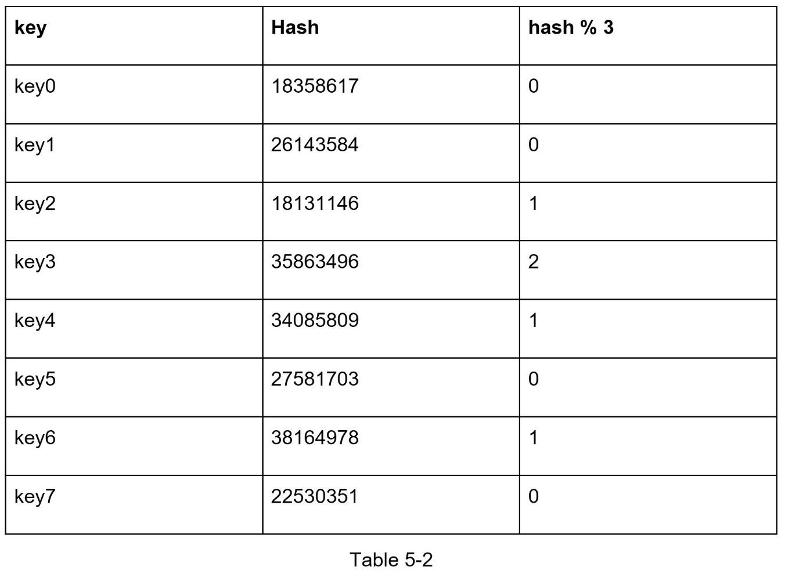 | 1 台服务器下线后 hash % 3 的 hash 值表 | 问题背景 |
| 5-2 | 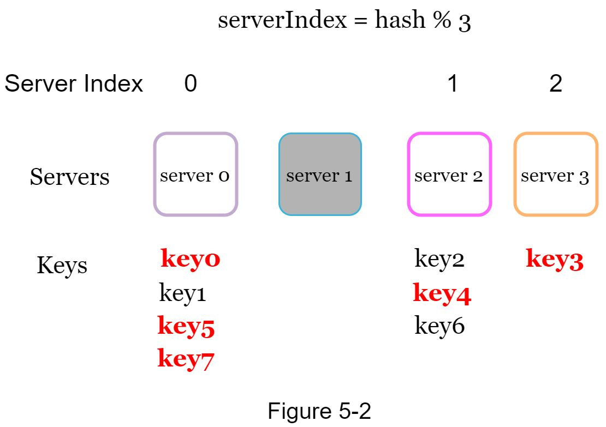 | 服务器下线后 key 大规模重新分布 | 问题背景 |
| 5-3 | 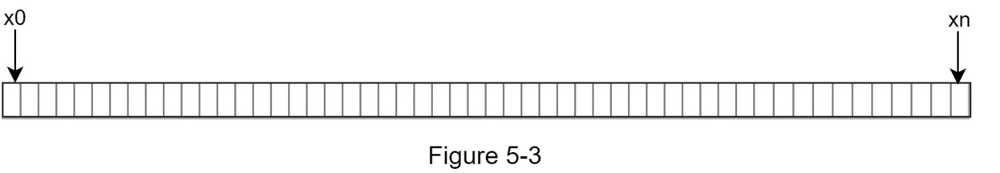 | Hash space 线性表示：x0 到 xn（0 到 2^160-1） | Hash Ring |
| 5-4 | 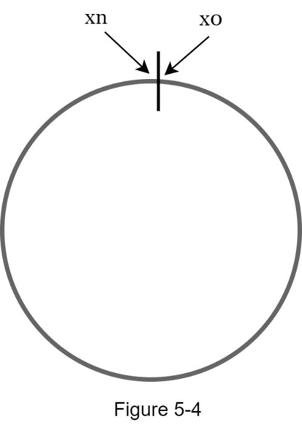 | **Hash Ring**：将线性 hash space 首尾相连形成环，xn 与 x0 在顶部相接 | Hash Ring |
| 5-5 | 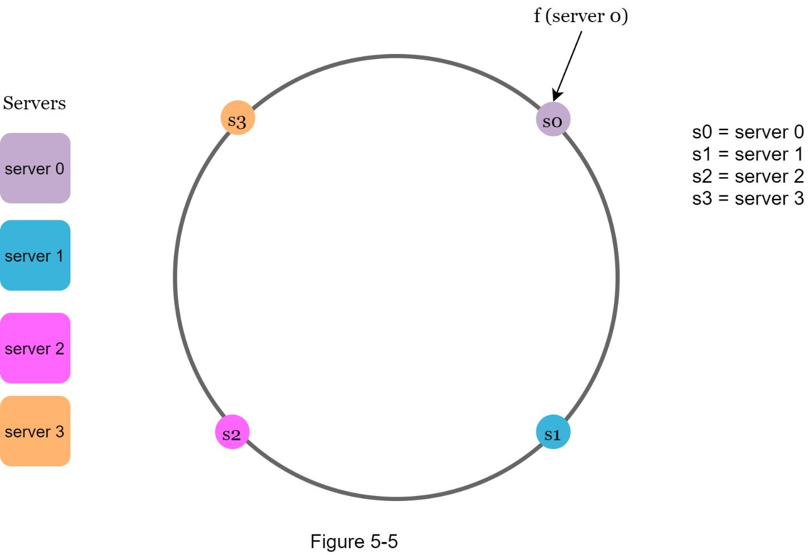 | 4 台服务器（s0-s3）映射到 hash ring 上 | Hash Ring |
| 5-6 | 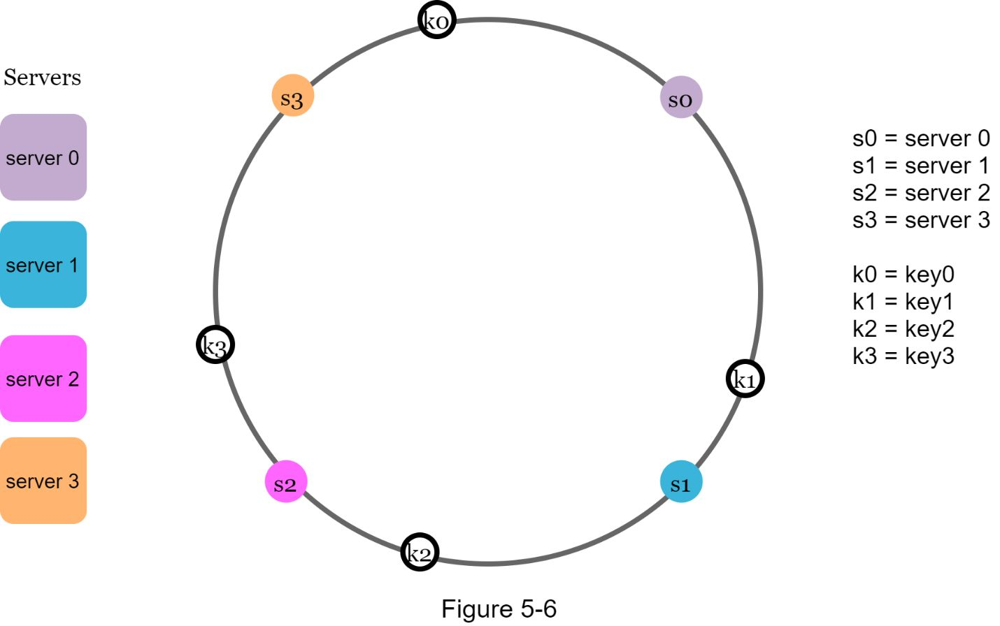 | 4 个 key（k0-k3）映射到 hash ring 上 | Hash Ring |
| 5-7 | 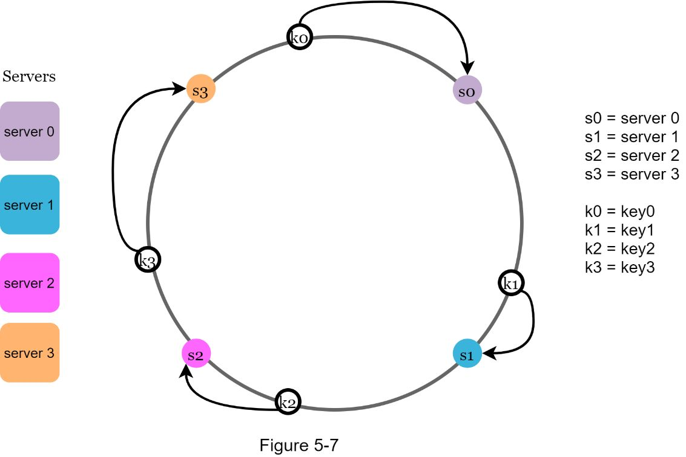 | **Server Lookup**：key 顺时针找到最近的 server（k0→s0, k1→s1, k2→s2, k3→s3），箭头标注查找方向 | 核心机制 |
| 5-8 |  | 添加 server 4：仅 key0 被重新分配到 s4 | 增删服务器 |
| 5-9 | 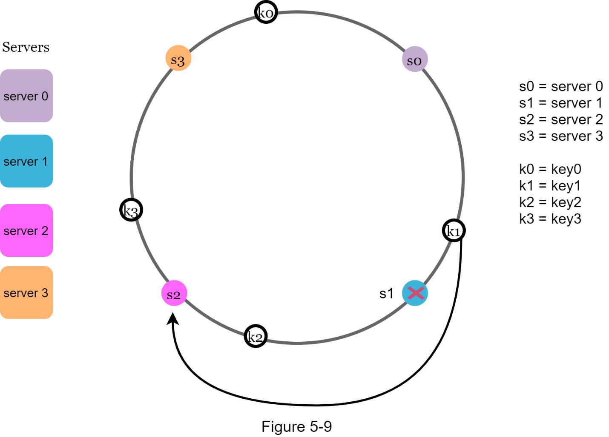 | 移除 server 1：仅 key1 被重新映射到 s2 | 增删服务器 |
| 5-10 | 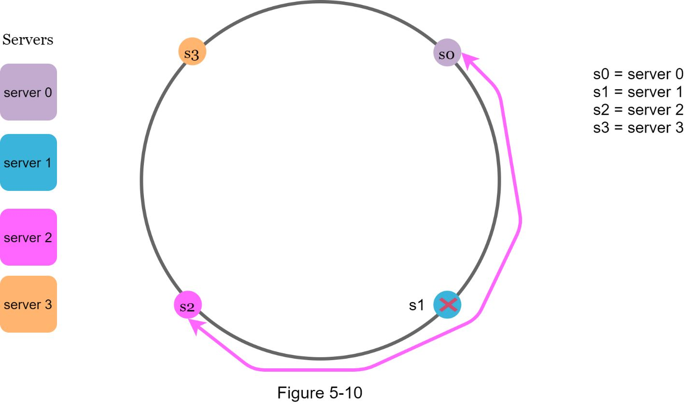 | **Partition 不均匀问题**：s1 被移除后，s2 的 partition 是 s0/s3 的两倍（粉色箭头标注不均匀区间） | 基础方案问题 |
| 5-11 | 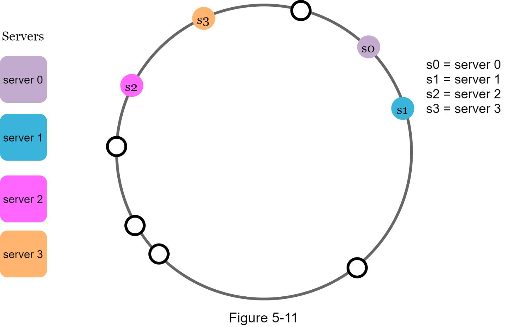 | **Key 分布不均匀问题**：大部分 key 集中在 server 2 | 基础方案问题 |
| 5-12 | 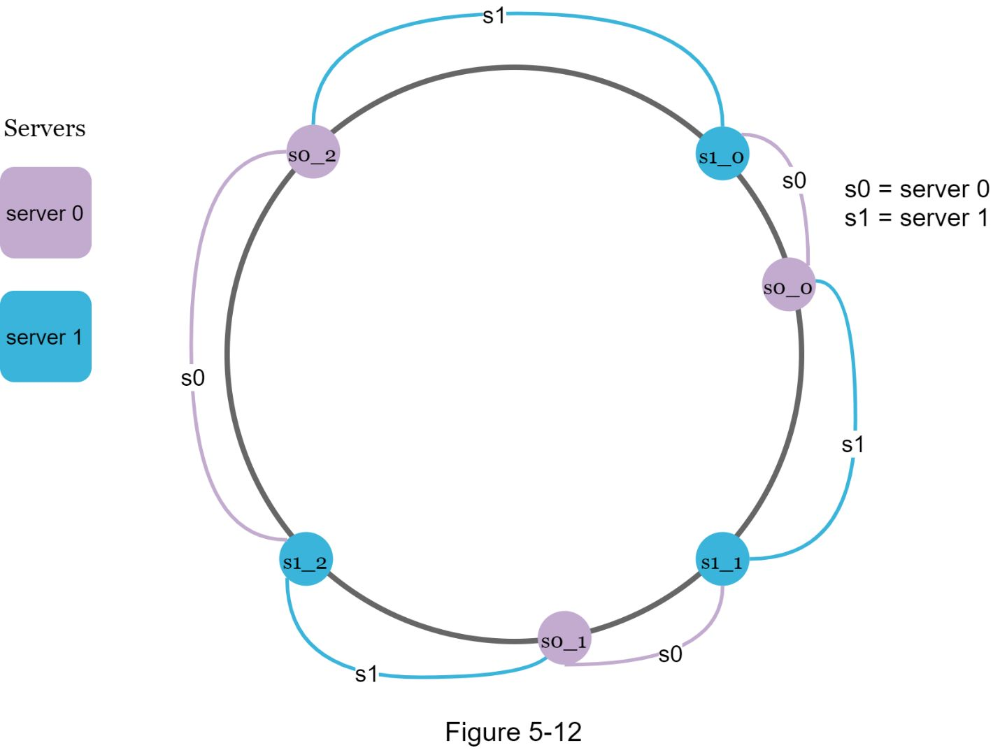 | **Virtual Nodes**：s0 和 s1 各有 3 个虚拟节点（s0_0/s0_1/s0_2, s1_0/s1_1/s1_2）交替分布在环上，紫色/蓝色标注所属 server | Virtual Nodes |
| 5-13 | 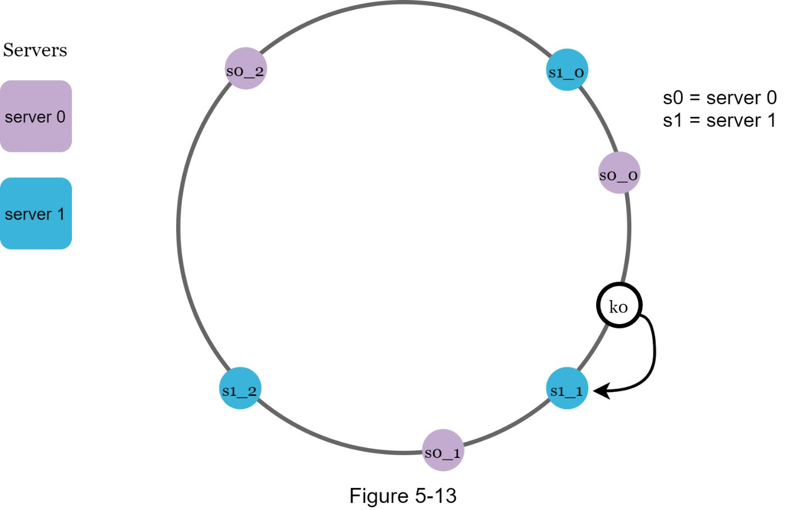 | Virtual Node Lookup：k0 顺时针找到 s1_1，映射到 server 1 | Virtual Nodes |
| 5-14 | 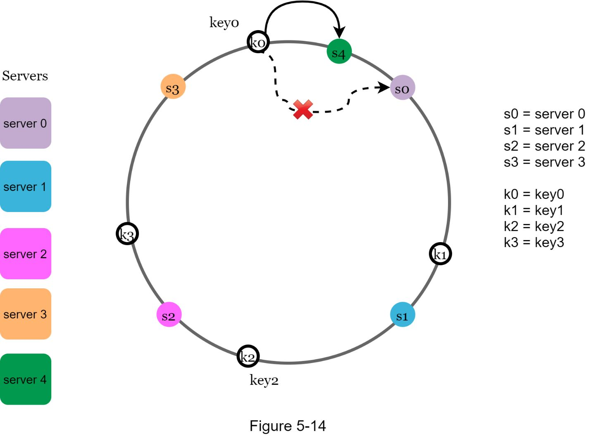 | **添加服务器的 Affected Range**：新增 s4（绿色）后，仅 s3 到 s4 之间的 key 需要重新分配，虚线标注原路径被截断 | Affected Keys |
| 5-15 | 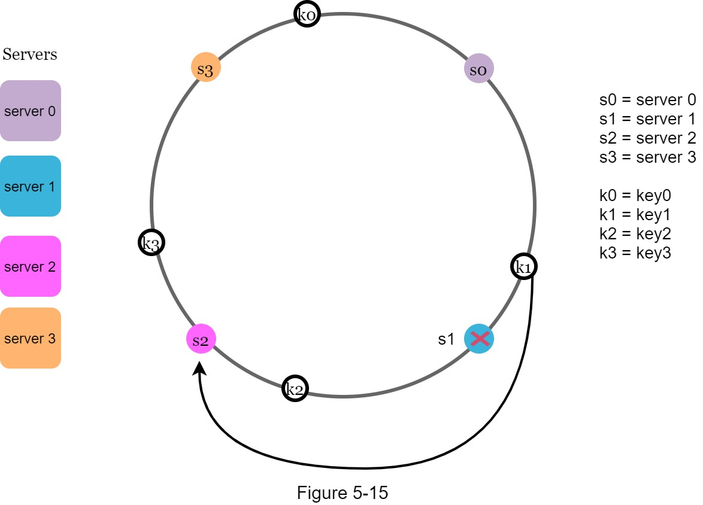 | 移除服务器的 Affected Range：s1 被移除，s0 到 s1 之间的 key 重新分配到 s2 | Affected Keys |

---

## 设计思路演进

### Step 1: 传统 Hashing 的问题

```
hash(key) % N → 当 N 变化时，几乎所有 key 重新映射
```

**示例：** 4 台服务器变 3 台（1 台宕机）
- 原来 key0 → server 1，key1 → server 0，key2 → server 3...
- 宕机后 key0 → server 1，key1 → server 0（部分碰巧不变），但大部分 key 发生迁移
- 结果：cache miss 风暴，系统瞬时压力暴增

### Step 2: Consistent Hashing 基础方案

```
Hash Space (SHA-1: 0 ~ 2^160-1)
    ↓ 首尾相连
Hash Ring（环形结构）
    ↓ 用同一 hash 函数
Server + Key 都映射到环上
    ↓ 顺时针查找
Key → 最近的 Server
```

**核心操作：**
- **Server Lookup**：从 key 位置顺时针走，遇到的第一个 server 就是目标
- **Add Server**：新增服务器只影响其逆时针方向到前一个服务器之间的 key
- **Remove Server**：移除服务器只影响其负责的 key，它们顺移到下一个 server

### Step 3: 基础方案的两个问题

1. **Partition 大小不均匀**：服务器增减后，某些 server 承担的 hash 区间可能远大于其他
2. **Key 分布不均匀**：如果 server 在环上的位置不均匀，数据会集中在少数 server

### Step 4: Virtual Nodes 解决方案

```
物理 Server → 多个 Virtual Nodes 映射到环上
  server 0 → s0_0, s0_1, s0_2, ...
  server 1 → s1_0, s1_1, s1_2, ...
```

- 每个物理服务器有多个虚拟节点散布在环上
- Virtual Node 数量越多，分布越均匀（标准差越小）
- 实验数据：100 个虚拟节点 → 标准差约 10%；200 个虚拟节点 → 标准差约 5%

### Step 5: 找到受影响的 Key 范围 (Affected Range)

- **添加服务器**：从新节点逆时针找到前一个服务器，之间的 key 需迁移到新节点
- **移除服务器**：从被移除节点逆时针找到前一个服务器，之间的 key 迁移到顺时针方向下一个节点

---

## 关键设计考量 (Tradeoffs)

### 1. Virtual Node 数量的权衡
- **数量多** → 数据分布更均匀，标准差更小
- **数量少** → 存储 virtual node 映射关系的内存开销更小
- 需根据系统实际需求调优（通常 100-200 个是较好的平衡点）

### 2. Hash 函数选择
- 需要均匀分布的 hash 函数（如 SHA-1，空间 0 ~ 2^160-1）
- 不使用取模操作，直接在 hash 空间上映射

### 3. 数据迁移成本
- 增删服务器时，需要有机制找到受影响的 key 范围并执行数据迁移
- 迁移范围仅限于相邻服务器之间的 partition，不影响全局

### 4. Hotspot 缓解
- 传统 hashing 可能导致热点数据（如名人用户）集中在同一 shard
- Consistent Hashing + Virtual Nodes 将数据分散到更多 partition，缓解 hotspot

### 5. 异构服务器支持
- 不同性能的服务器可以分配不同数量的 virtual nodes
- 高性能服务器 → 更多 virtual nodes → 承担更多数据

---

## 面试扩展话题

**Consistent Hashing 的实际应用：**
- **Amazon DynamoDB**：使用 consistent hashing 进行数据分区（Partitioning component）
- **Apache Cassandra**：跨集群的数据分区
- **Discord**：聊天应用的服务器扩展（Elixir 支撑 500 万并发用户）
- **Akamai CDN**：内容分发网络的节点分配
- **Google Maglev**：网络负载均衡器

**延伸讨论方向：**
- 当 virtual node 数量极大时，如何高效查找目标 server（二分查找 / TreeMap）
- Consistent Hashing 在分布式数据库 replication 中的角色
- 与 Rendezvous Hashing（Highest Random Weight）的对比
- 多数据中心场景下的 consistent hashing 策略

---

## 速写练习要点

盲画时重点记住这些核心概念和连接：

1. **Hash Ring 结构**：线性 hash space（0 ~ 2^160-1）首尾相连成环，xn 与 x0 在顶部相接
2. **映射规则**：Server 和 Key 用同一 hash 函数映射到环上，key 顺时针找最近 server
3. **增删影响范围**：只影响相邻 partition 的 key，而非全局重映射
4. **基础方案两大问题**：partition 不均匀 + key 分布不均匀
5. **Virtual Nodes 解法**：每个物理 server 对应多个虚拟节点，散布在环上，数量越多分布越均匀
6. **对比传统 hashing**：`hash % N` 在 N 变化时几乎全部 key 重映射 vs consistent hashing 仅 `k/n` 个 key
