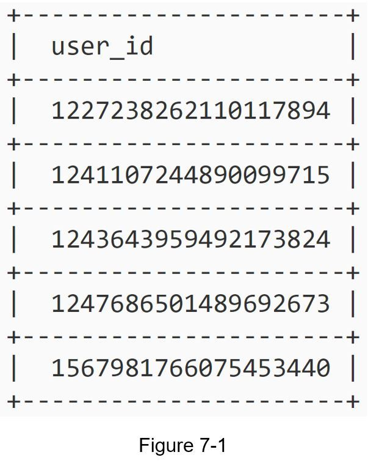
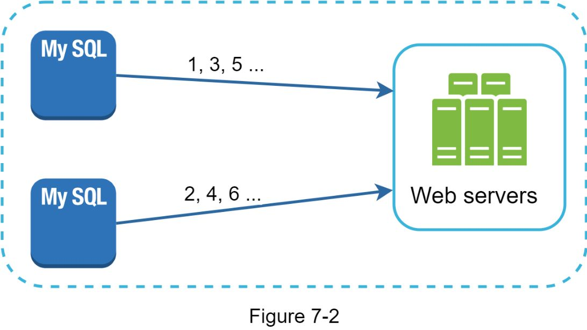
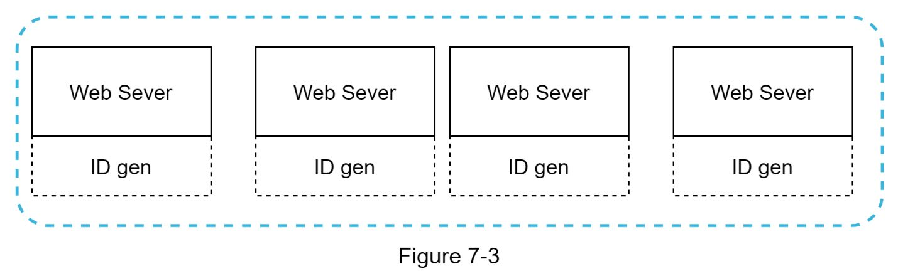
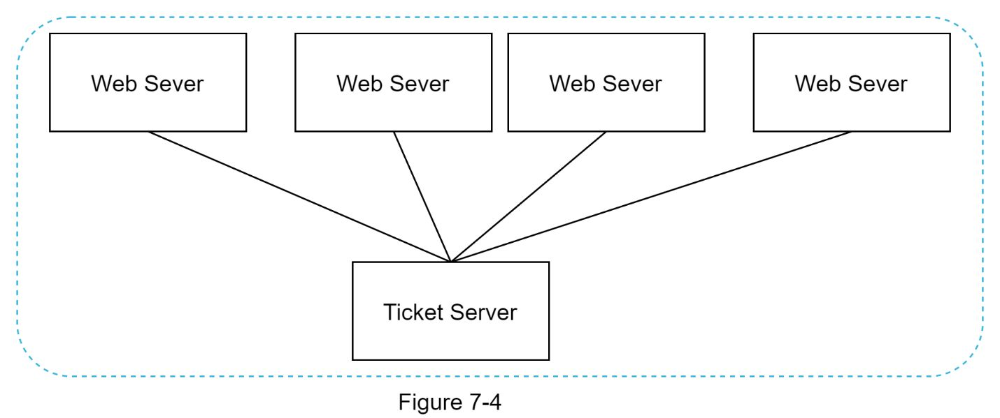
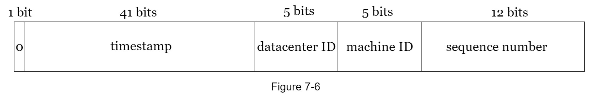
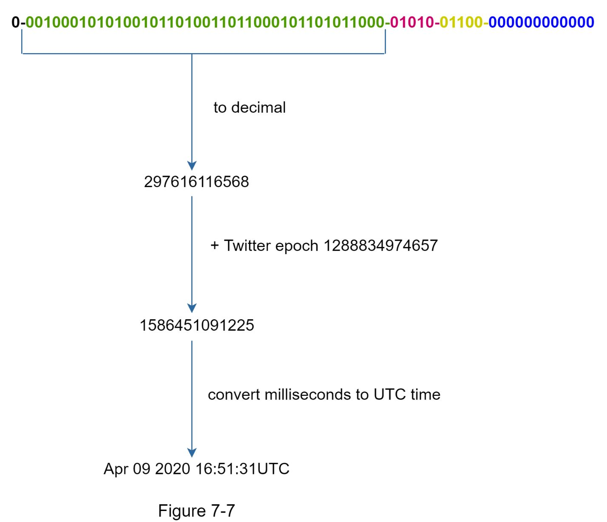

# Chapter 7: Design a Unique ID Generator in Distributed Systems

## 问题定义

在分布式系统中设计一个全局唯一 ID 生成器。传统数据库的 `auto_increment` 无法满足分布式环境需求：单数据库扩展性差，跨多数据库生成唯一 ID 且保证低延迟是核心挑战。

**核心需求：**
- ID 必须全局唯一
- ID 仅含数字（numerical values only）
- ID 长度适配 64-bit
- ID 按时间排序（time-sortable）
- 吞吐量：每秒生成超过 10,000 个唯一 ID

---

## 架构图索引

| Figure | 文件 | 内容 | 设计阶段 |
|--------|------|------|----------|
| 7-1 |  | 唯一 ID 示例 | 问题定义 |
| 7-2 |  | Multi-master Replication：两个 MySQL 分别生成奇偶 ID（1,3,5... 和 2,4,6...）汇入 Web Servers | 高层设计 |
| 7-3 |  | UUID 方案：4 个 Web Server 各自内嵌独立 ID gen，无需协调 | 高层设计 |
| 7-4 |  | Ticket Server 方案：4 个 Web Server 全部连接一个集中式 Ticket Server | 高层设计 |
| 7-5 |  | **Snowflake ID 结构**：1 bit sign + 41 bits timestamp + 5 bits datacenter ID + 5 bits machine ID + 12 bits sequence number | 高层设计 |
| 7-6 |  | Snowflake ID 结构（深入设计重列），与 Figure 7-5 相同的 64-bit 布局 | 深入设计 |
| 7-7 |  | Timestamp 转换流程：二进制 → 十进制 297616116568 → 加 Twitter epoch → 1586451091225 → UTC 时间 Apr 09 2020 16:51:31 | 深入设计 |

---

## 设计思路演进

### Step 1: 需求澄清

```
Q: ID 特性？           → 唯一且可排序
Q: 是否逐 1 递增？      → 按时间递增，不要求严格 +1
Q: 是否纯数字？         → 是
Q: 长度限制？           → 64-bit
Q: 系统规模？           → 10,000 IDs/s
```

### Step 2: 四种方案比较

| 方案 | 核心思想 | 优点 | 缺点 | 结论 |
|------|----------|------|------|------|
| **Multi-master Replication** | 多个 DB 使用 `auto_increment`，步长 = k（DB 数量）。如 DB1 生成 1,3,5...，DB2 生成 2,4,6... | 利用现有数据库特性，可水平扩展 | 跨数据中心难扩展；ID 不按全局时间排序；增删服务器时需调整步长 | 不满足时间排序需求 |
| **UUID** | 128-bit 随机数，每个 Web Server 独立生成，无需服务器间协调 | 实现简单，无需协调，易于扩展 | 128 bits 超出 64-bit 要求；不按时间排序；可能包含非数字字符 | 不满足多项需求 |
| **Ticket Server** | 集中式单数据库使用 `auto_increment`，所有 Web Server 向其请求 ID（Flickr 方案） | 纯数字 ID；实现简单；适合中小规模 | **Single Point of Failure**；多 Ticket Server 则引入数据同步问题 | 可靠性不足 |
| **Twitter Snowflake** | 将 64-bit ID 拆分为多个 section：sign + timestamp + datacenter ID + machine ID + sequence number | 满足全部需求；按时间排序；分布式可扩展 | 依赖时钟同步 | **最终选择** |

### Step 3: Snowflake 方案深入设计

**64-bit ID 结构：**
```
| 1 bit | 41 bits   | 5 bits       | 5 bits     | 12 bits         |
|-------|-----------|--------------|------------|-----------------|
| 0     | timestamp | datacenter ID| machine ID | sequence number |
```

**各字段详解：**
- **Sign bit (1 bit)**：始终为 0，预留给未来用途（区分有符号/无符号数）
- **Timestamp (41 bits)**：自定义 epoch 以来的毫秒数。Twitter 默认 epoch = 1288834974657（2010-11-04 01:42:54 UTC）。最大值 2^41 - 1 = 2199023255551 ms，约 **69 年**
- **Datacenter ID (5 bits)**：2^5 = 32 个数据中心
- **Machine ID (5 bits)**：每个数据中心 2^5 = 32 台机器
- **Sequence number (12 bits)**：同一毫秒内的序列号，2^12 = 4096，即单机每毫秒最多 4096 个 ID；每毫秒重置为 0

**Timestamp 转换示例（Figure 7-7）：**
```
二进制 41-bit → 十进制 297616116568
+ Twitter epoch 1288834974657
= Unix timestamp 1586451091225 ms
= Apr 09 2020 16:51:31 UTC
```

**启动时配置：**
- Datacenter ID 和 Machine ID 在启动时确定，运行后一般固定不变
- 修改这两个值需谨慎审核，误改会导致 ID 冲突

---

## 关键设计考量 (Tradeoffs)

### 1. 集中式 vs 分布式生成
- **集中式**（Ticket Server）：实现简单但有单点故障风险
- **分布式**（UUID / Snowflake）：无需协调，天然高可用
- **Snowflake 的平衡**：通过 bit 分区实现分布式生成，又保证全局唯一性和时间排序

### 2. 时间排序 vs 严格递增
- Snowflake 保证按时间大致排序（同一毫秒内通过 sequence number 递增）
- 跨机器的 ID 不保证严格递增，只保证时间趋势一致
- Multi-master Replication 的 ID 完全不具备跨服务器的时间排序能力

### 3. ID 长度 vs 信息容量
- UUID 128 bits 信息丰富但超出 64-bit 限制
- Snowflake 64 bits 精心分配各字段，在有限空间内编码了时间、位置、序列信息

### 4. 可扩展性 vs 复杂度
- Multi-master 增删节点需调整步长 k，运维复杂
- UUID 无状态、无限扩展，但不满足排序和长度需求
- Snowflake 通过预分配 datacenter/machine ID 实现简洁扩展

### 5. Epoch 选择 vs 系统寿命
- 41 bits timestamp 上限约 69 年
- 选择接近当前日期的 custom epoch 可延迟溢出时间
- 69 年后需新 epoch 或 ID 迁移策略

### 6. Section Length Tuning（字段长度调优）
- 低并发 + 长期运行：减少 sequence number bits，增加 timestamp bits
- 高并发 + 短期应用：增加 sequence number bits，减少 timestamp bits
- 需要更多数据中心/机器：调整 5-bit 字段的分配

---

## 面试扩展话题

### Clock Synchronization（时钟同步）
- **问题**：Snowflake 假设所有 ID 生成服务器使用相同时钟，但多核/多机环境下时钟可能漂移
- **影响**：时钟回拨会导致生成重复 ID 或时间排序错误
- **解法**：Network Time Protocol (NTP) 是最常见的时钟同步方案

### Section Length Tuning（字段长度调优）
- 根据实际业务需求调整各字段的 bit 分配
- 例：低并发长期应用 → 更多 timestamp bits + 更少 sequence bits
- 例：高并发短期应用 → 更多 sequence bits + 更少 timestamp bits

### High Availability（高可用性）
- ID 生成器是关键基础设施（mission-critical system），必须保证高可用
- 需要考虑的方面：故障转移、冗余部署、降级策略
- Snowflake 方案天然支持多节点独立生成，无单点故障

---

## 速写练习要点

盲画时重点记住这些组件和连接：

1. **四种方案对比布局**：Multi-master（多 DB 步长递增）→ UUID（多 Server 独立生成）→ Ticket Server（集中式单点）→ Snowflake（bit 分区）
2. **Snowflake 64-bit 结构**：`[0 | 41-bit timestamp | 5-bit DC | 5-bit Machine | 12-bit Seq]`，这是全章核心图，必须能盲画
3. **Timestamp 转换链路**：binary → decimal → + epoch → unix ms → UTC datetime
4. **关键数字**：69 年寿命、32 DC、32 machines/DC、4096 IDs/ms/machine
5. **方案淘汰逻辑**：Multi-master 不排序 → UUID 128-bit 太长 → Ticket Server 单点故障 → Snowflake 全部满足
