# Chapter 8: Design a URL Shortener

## 问题定义

设计一个类似 TinyURL 的短链接服务，支持 URL 缩短和重定向。

**核心需求：**
- URL shortening：给定长 URL，返回短 URL
- URL redirecting：给定短 URL，重定向到原始长 URL
- 高可用、可扩展、容错
- 短 URL 由 [0-9, a-z, A-Z] 组成，尽可能短
- 短 URL 不可删除或更新

**容量估算：**
- 写入：100M URLs/天 = 1,160 次/秒
- 读取（10:1 读写比）：11,600 次/秒
- 10 年总记录：365 billion
- 存储需求：365 TB（平均 URL 100 bytes）

---

## 架构图索引

| Figure | 文件 | 内容 | 设计阶段 |
|--------|------|------|----------|
| 8-1 | 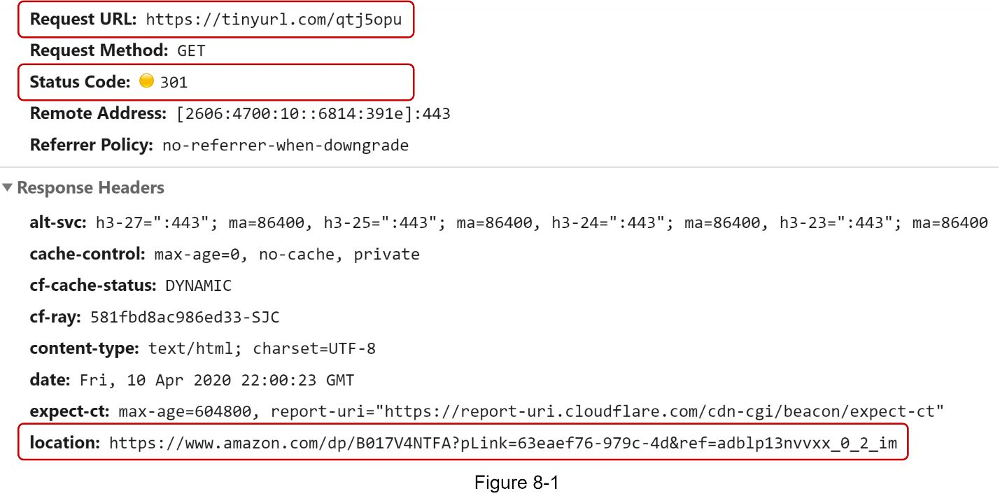 | 浏览器输入 tinyurl 后重定向到原始 URL 示意 | 高层设计 |
| 8-2 | 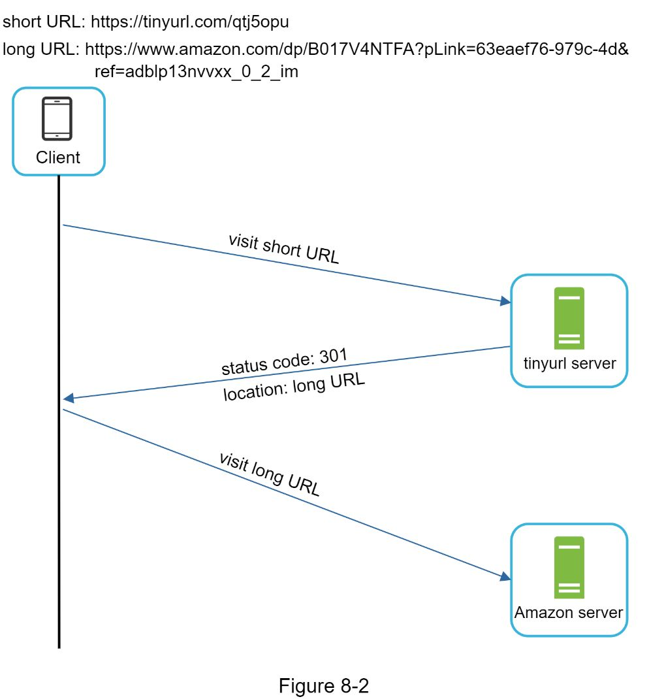 | Client-Server 重定向通信流程：Client → tinyurl server (301) → Amazon server | 高层设计 |
| 8-3 | 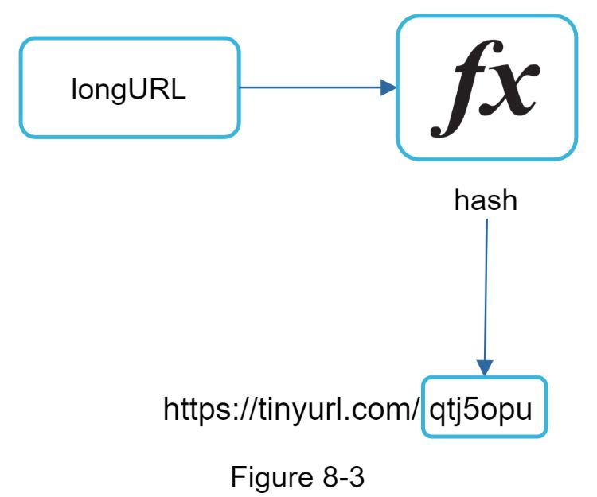 | Hash function 将 longURL 映射为 hashValue 的概念图 | 高层设计 |
| 8-4 | 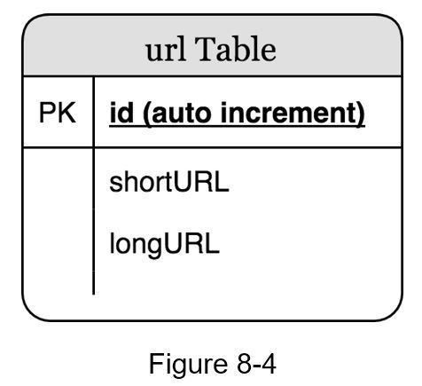 | 数据库表设计：id, shortURL, longURL 三列 | 深入设计 |
| 8-5 | 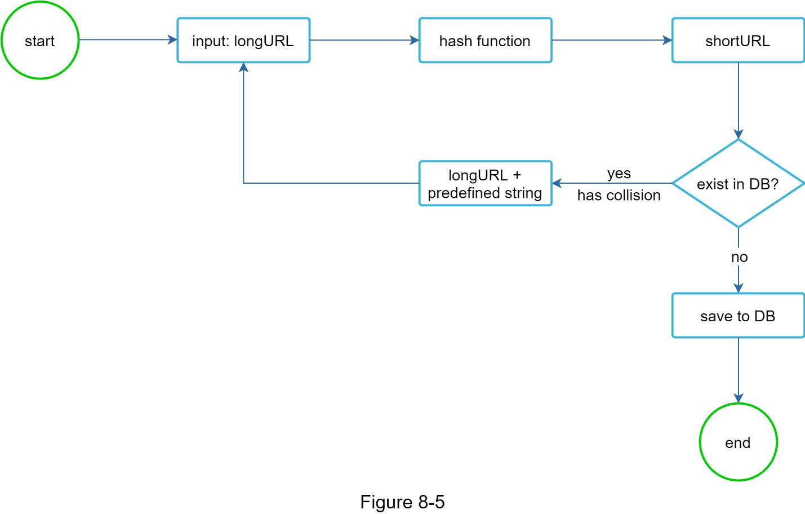 | Hash + collision resolution 流程图：longURL → hash → shortURL → 查 DB 是否冲突 → 冲突则追加 predefined string 重新 hash | 深入设计 |
| 8-6 | 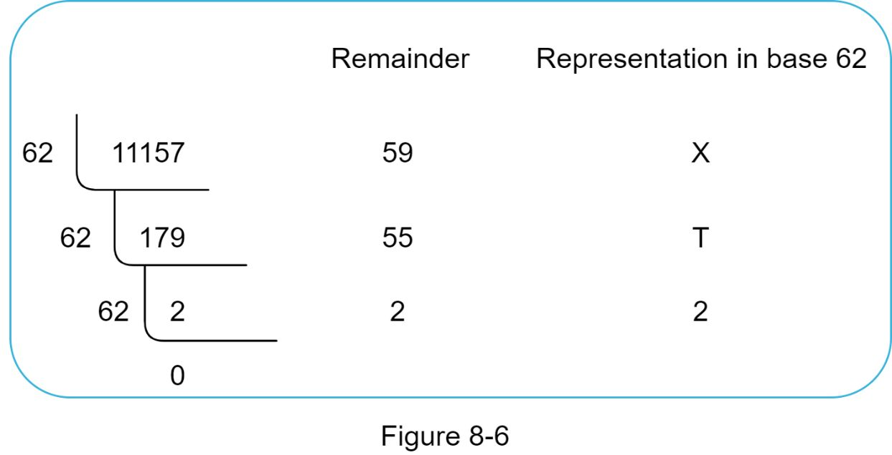 | Base 62 conversion 示例：11157₁₀ = [2, T, X] | 深入设计 |
| Table 8-1 | 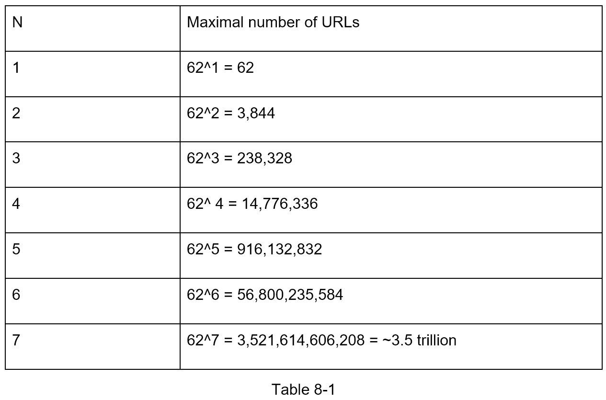 | hashValue 长度 n 与可支持 URL 数量对照表 | 深入设计 |
| Table 8-2 | 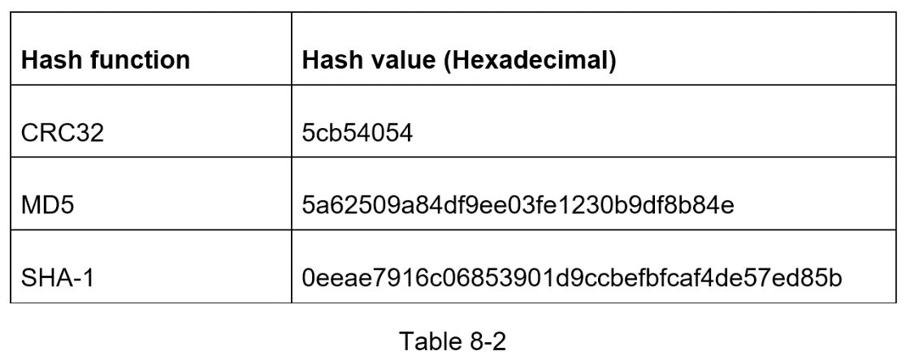 | CRC32/MD5/SHA-1 哈希结果长度对比 | 深入设计 |
| Table 8-3 | 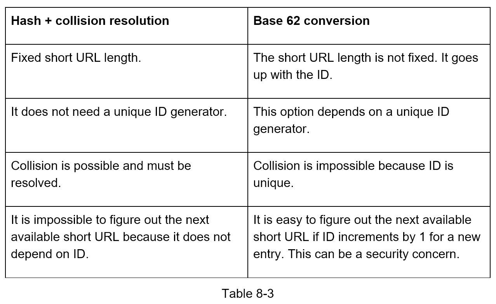 | Hash + collision resolution vs Base 62 conversion 对比表 | 深入设计 |
| 8-7 | 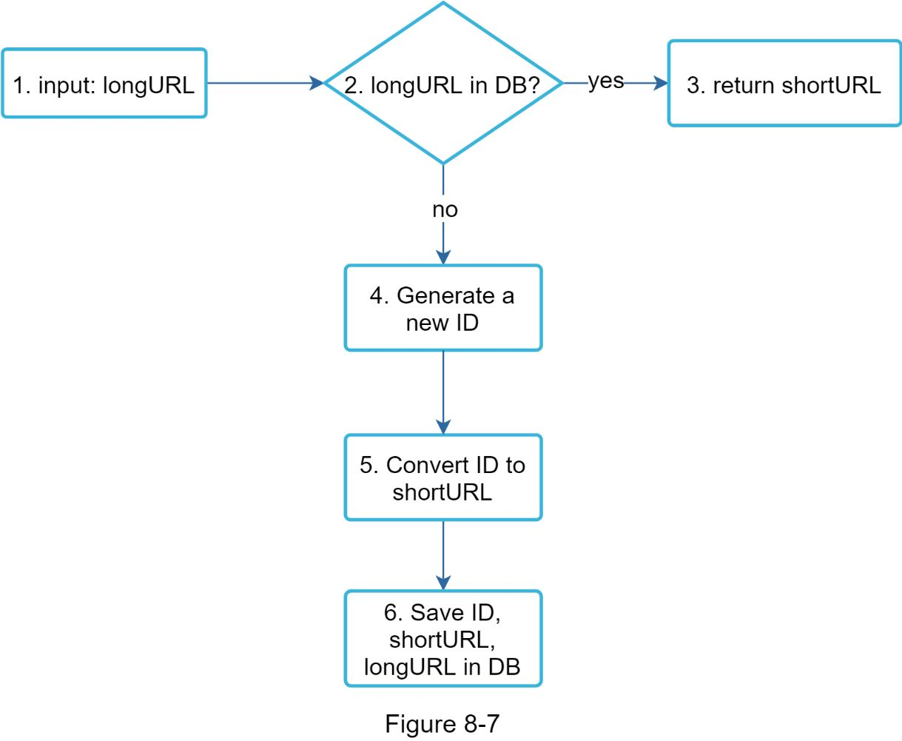 | **URL shortening 流程图**：input longURL → 查 DB → 已存在则返回 / 不存在则生成新 ID → Base 62 转换 → 存入 DB | 深入设计 |
| Table 8-4 | 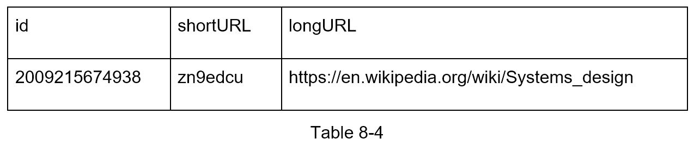 | 具体示例：ID 2009215674938 → shortURL "zn9edcu" 的数据库记录 | 深入设计 |
| 8-8 | 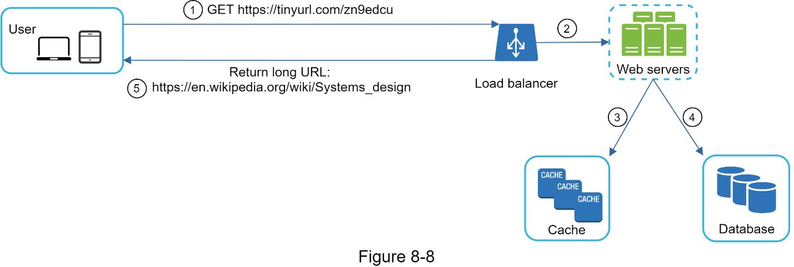 | **URL redirecting 详细架构图**：User → Load Balancer → Web Servers → Cache / Database → 返回 longURL | 深入设计 |

---

## 设计思路演进

### Step 1: API 设计

```
POST api/v1/data/shorten
  request: { longUrl: longURLString }
  response: shortURL

GET api/v1/shortUrl
  response: longURL (HTTP redirection)
```

### Step 2: URL 重定向 - 301 vs 302

```
Client → visit shortURL → tinyurl server → 返回 status code + Location header → Client 访问 longURL
```

| 方式 | 含义 | 优点 | 缺点 | 适用场景 |
|------|------|------|------|----------|
| **301 Redirect** | Permanently moved | 浏览器缓存后不再请求短链服务，减少服务器负载 | 无法追踪后续点击 | 优先降低服务器负载 |
| **302 Redirect** | Temporarily moved | 每次请求都经过短链服务，便于追踪分析 | 服务器负载更高 | 需要点击分析 |

### Step 3: Hash Function 选型

**hashValue 长度确定：**
- 字符集 [0-9, a-z, A-Z] = 62 个字符
- 需支持 365 billion URLs
- n=7 时 62^7 = ~3.5 trillion > 365 billion，所以 hashValue 长度为 7

**方案一：Hash + Collision Resolution**
```
longURL → hash function (CRC32/MD5/SHA-1) → 取前 7 位
  → 查 DB 是否冲突？
    → 是：longURL + predefined string → 重新 hash（递归）
    → 否：存入 DB
```
- 可用 Bloom Filter 优化冲突检测性能
- 缺点：冲突解决代价大，需多次 DB 查询

**方案二：Base 62 Conversion**
```
Unique ID Generator → 生成全局唯一 ID
  → Base 62 转换 → shortURL
  → 存入 DB (id, shortURL, longURL)
```
- 依赖分布式唯一 ID 生成器（参考 Chapter 7）
- 无冲突问题，但 URL 长度随 ID 增长

### Step 4: URL Shortening 完整流程（Base 62 方案）

```
1. 输入 longURL
2. 查 DB：longURL 是否已存在？
   → 是：直接返回已有 shortURL
   → 否：继续下一步
3. Unique ID Generator 生成新 ID
4. Base 62 转换 ID → shortURL
5. 存入 DB：(ID, shortURL, longURL)
6. 返回 shortURL
```

### Step 5: URL Redirecting 完整流程

```
User → GET shortURL
  → Load Balancer → Web Servers
    → 查 Cache：shortURL 是否命中？
      → 命中：返回 longURL
      → 未命中：查 Database
        → 找到：返回 longURL（同时写入 Cache）
        → 未找到：无效 shortURL
  → 返回 longURL 给用户（302/301 重定向）
```

---

## 关键设计考量 (Tradeoffs)

### 1. 301 vs 302 Redirect
- **核心权衡**：服务器负载 vs 分析能力
- 301 缓存后减少请求量，但丧失追踪能力
- 302 每次经过服务器，可做点击统计和来源分析
- 大多数短链服务选择 302（分析价值更高）

### 2. Hash + Collision Resolution vs Base 62 Conversion

| 维度 | Hash + Collision Resolution | Base 62 Conversion |
|------|---------------------------|-------------------|
| URL 长度 | 固定长度 | 不固定，随 ID 增长 |
| ID 生成器 | 不需要 | 需要分布式唯一 ID 生成器 |
| 冲突处理 | 可能冲突，需解决 | 不可能冲突（ID 唯一） |
| 可预测性 | 无法预测下一个 URL | 若 ID 递增则可推测下一个 URL（安全隐患） |

### 3. 数据模型
- **Hash Table**：内存有限，不适合海量数据
- **关系型数据库**：持久化存储 (id, shortURL, longURL)
- 读多写少（10:1），适合引入 Cache 层

### 4. Cache 策略
- 读操作远多于写操作，Cache 显著提升性能
- 热门 URL 缓存在内存中，减少数据库查询
- Cache miss 时回源到数据库并回填 Cache

### 5. 分布式唯一 ID 生成
- Base 62 方案的核心依赖
- 需要全局唯一、高并发、高可用
- 参考 Chapter 7 中的方案（Snowflake 等）

---

## 面试扩展话题

原书 Wrap-up 中提到以下可深入讨论的方向：

1. **Rate Limiter**：防止恶意用户大量创建短链接，基于 IP 或其他规则过滤请求（参考 Chapter 4）
2. **Web Server Scaling**：Web 层无状态（stateless），可通过增减 Web Server 实例水平扩展
3. **Database Scaling**：
   - Database Replication（主从复制）提高读性能和可用性
   - Database Sharding（分片）应对海量数据存储
4. **Analytics**：集成分析系统，追踪点击量、点击时间、来源等业务指标
5. **Availability, Consistency, Reliability**：大规模系统的核心保障（参考 Chapter 1）

---

## 速写练习要点

盲画时重点记住这些组件和连接：

1. **URL Shortening 流程**：longURL → 查 DB 去重 → Unique ID Generator → Base 62 Conversion → 存 DB → 返回 shortURL
2. **URL Redirecting 流程**：User → Load Balancer → Web Servers → Cache（命中直接返回） / Database（未命中则查库） → 返回 longURL
3. **核心组件**：Load Balancer + Web Servers + Cache + Database + Unique ID Generator
4. **Hash 方案对比**：Hash + Collision Resolution（固定长度，有冲突） vs Base 62（依赖 ID 生成器，无冲突）
5. **重定向选择**：301（缓存，减负载） vs 302（追踪，做分析）
