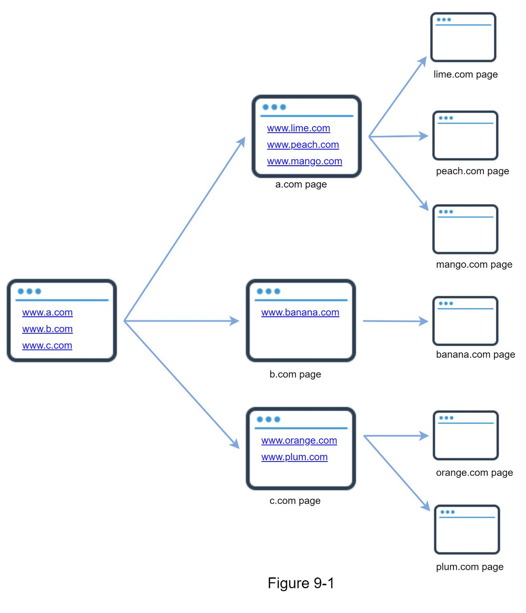
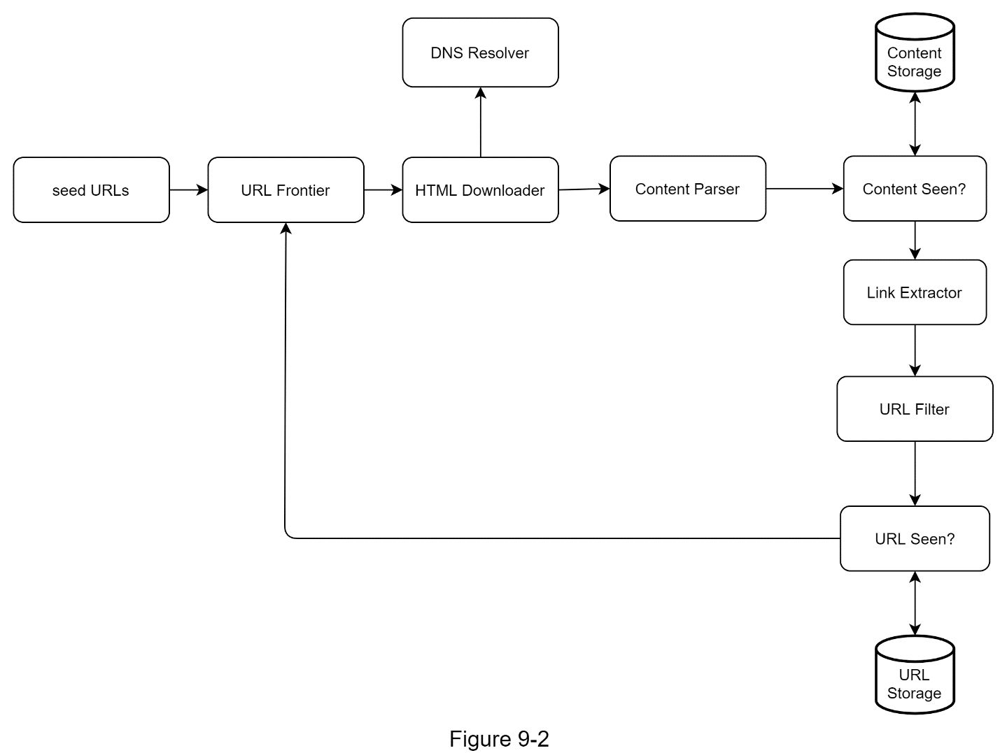
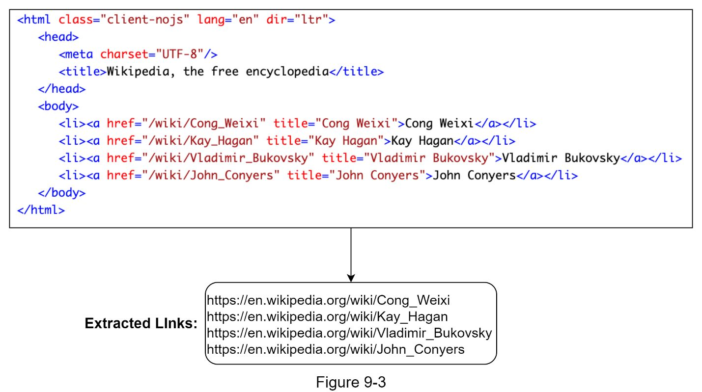
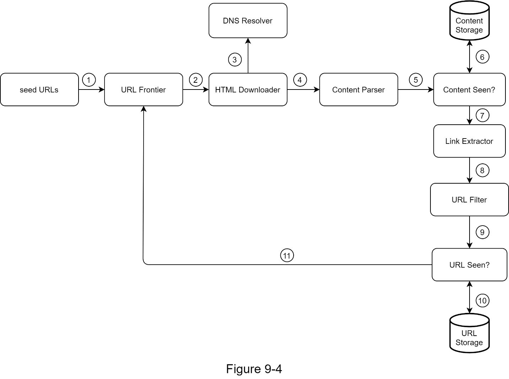
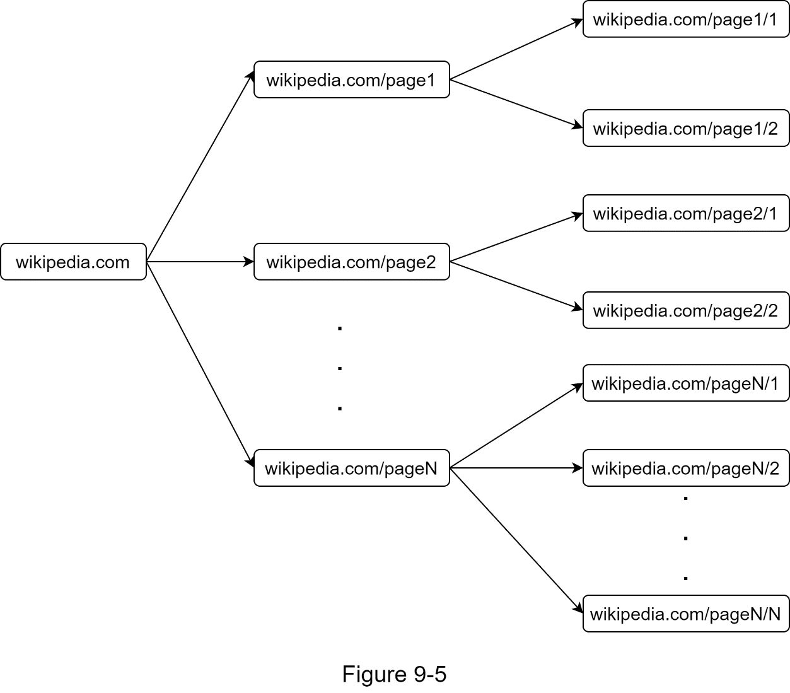
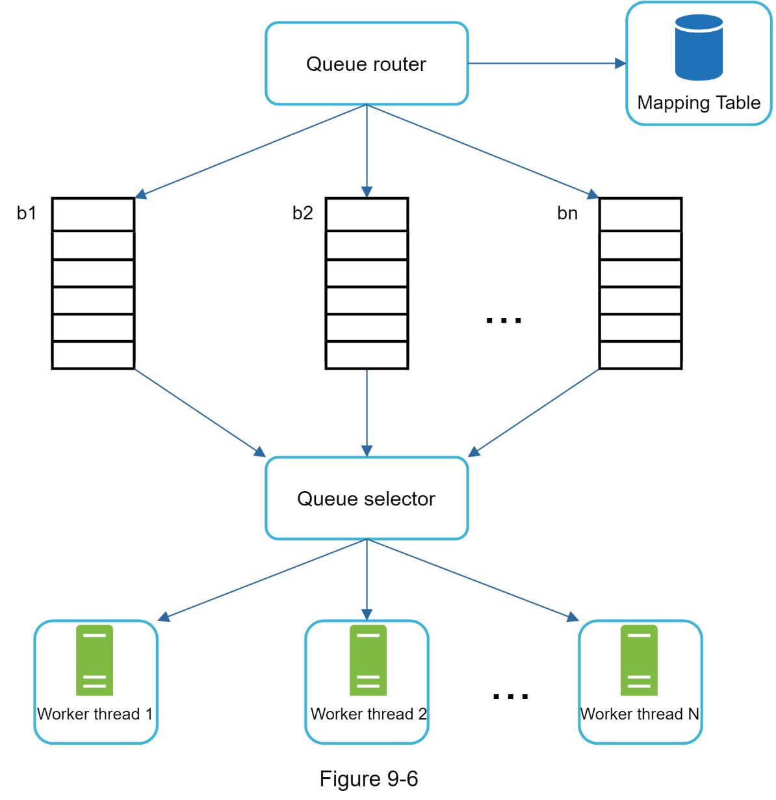
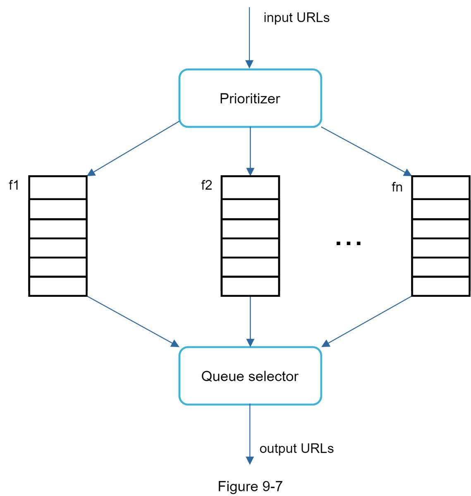
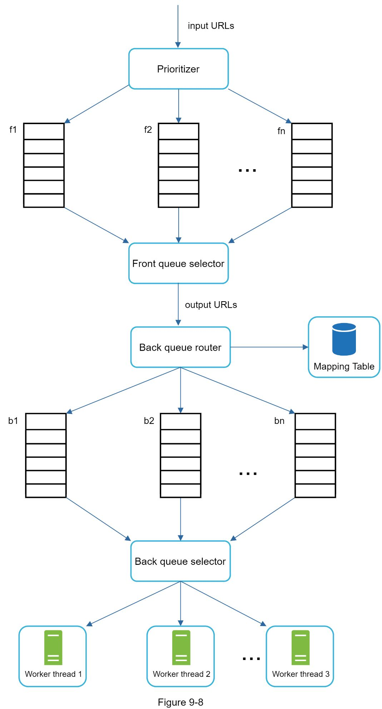
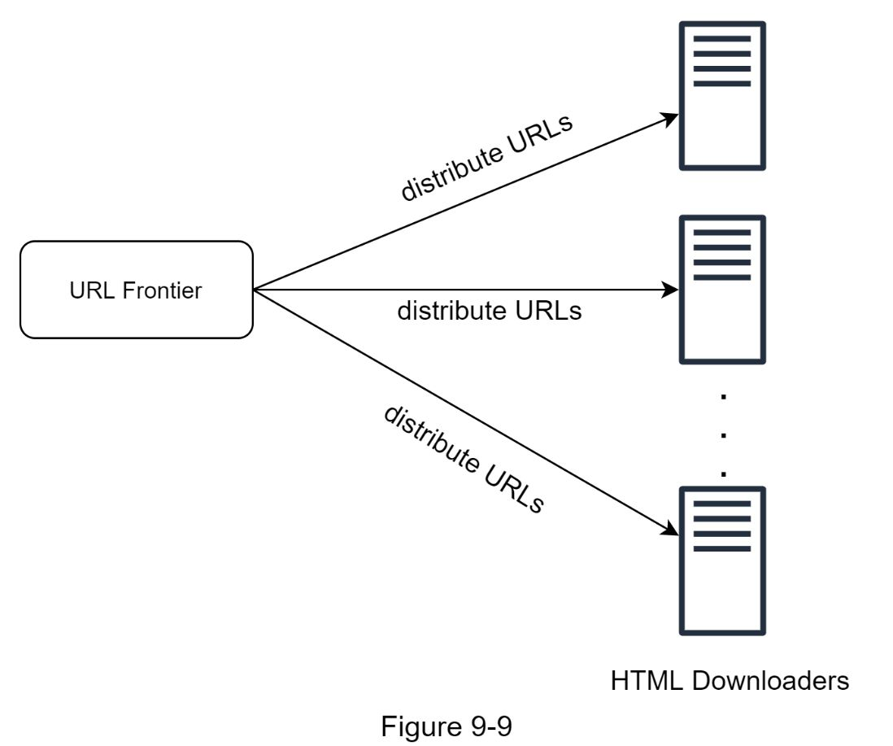
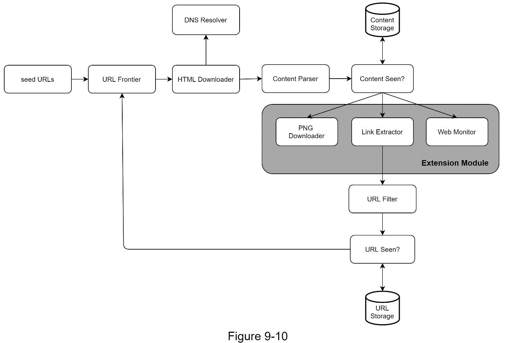

# Chapter 9: Design a Web Crawler

## 问题定义

Web Crawler（网络爬虫）从 Seed URLs 出发，递归抓取网页并提取链接，发现 web 上的新内容或更新内容。

**核心需求：**
- 用途：Search Engine Indexing
- 规模：每月抓取 10 亿网页
- 内容类型：仅 HTML
- 需考虑新增和编辑过的网页
- 存储已抓取的 HTML，保留 5 年
- 重复内容需去重忽略

**好的 Crawler 的四大特性：**
- **Scalability**：利用 parallelization 高效处理数十亿网页
- **Robustness**：应对 bad HTML、无响应服务器、恶意链接、crash 等异常
- **Politeness**：避免短时间内对同一网站发送大量请求
- **Extensibility**：系统易于扩展以支持新内容类型

**粗略估算：**
- QPS: ~400 pages/s，Peak QPS: ~800
- 每月存储：500 TB（平均页面 500KB）
- 5 年总存储：30 PB

---

## 架构图索引

| Figure | 文件 | 内容 | 设计阶段 |
|--------|------|------|----------|
| 9-1 |  | Crawl 过程的可视化示例 | 概述 |
| 9-2 |  | **高层架构图**：Seed URLs → URL Frontier → HTML Downloader → Content Parser → Content Seen? → Link Extractor → URL Filter → URL Seen?，配合 DNS Resolver / Content Storage / URL Storage | 高层设计 |
| 9-3 |  | URL Extractor 示例：从 HTML 中提取链接，相对路径转为绝对 URL | 高层设计 |
| 9-4 |  | 带序号的完整 Workflow 图（Step 1-11） | 高层设计 |
| 9-5 |  | BFS 问题示例：同一 host（wikipedia.com）的内部链接占满队列 | 深入设计 |
| 9-6 |  | Politeness 设计：Queue Router + Mapping Table + 每 host 独立 FIFO 队列 | 深入设计 |
| 9-7 |  | Priority 设计：Prioritizer → 按优先级分配到 f1..fn 队列 → Queue Selector | 深入设计 |
| 9-8 |  | **URL Frontier 完整设计**：上层 Front Queues（Prioritizer → f1..fn → Front Queue Selector）管理优先级，下层 Back Queues（Back Queue Router + Mapping Table → b1..bn → Back Queue Selector → Worker Threads）管理 Politeness | 深入设计 |
| 9-9 |  | Distributed Crawl：多台服务器分担 URL 子集 | 性能优化 |
| 9-10 |  | **Extensibility 设计**：在 Content Seen? 之后通过 Extension Module 灰色区域容纳 PNG Downloader、Link Extractor、Web Monitor 等可插拔模块 | 深入设计 |

---

## 设计思路演进

### Step 1: 基本算法 -- BFS 遍历 Web 图

Web 可以看作有向图：网页是节点，超链接是边。

```
DFS ❌ → 深度可能无限深，不适合
BFS ✅ → 用 FIFO 队列逐层遍历（但有两个问题）
```

**BFS 的两个问题：**
1. **Impolite**：同一页面的链接大多指向同一 host，导致并行下载时对单个服务器请求过多
2. **无优先级**：标准 BFS 不区分页面重要性，所有 URL 平等对待

### Step 2: 高层架构

核心数据流（对应 Figure 9-2）：

```
Seed URLs → URL Frontier → HTML Downloader ←→ DNS Resolver
                                ↓
                         Content Parser
                                ↓
                         Content Seen? ←→ Content Storage
                                ↓
                         Link Extractor
                                ↓
                           URL Filter
                                ↓
                           URL Seen? ←→ URL Storage
                                ↓
                     （新 URL 回到 URL Frontier）
```

**各组件职责：**
- **URL Frontier**：待下载 URL 的队列，管理优先级和 Politeness
- **HTML Downloader**：通过 HTTP 下载网页
- **DNS Resolver**：URL 转 IP 地址
- **Content Parser**：解析和验证 HTML（独立组件，避免拖慢爬取）
- **Content Seen?**：用 hash 值比较去重（约 29% 网页是重复的）
- **Content Storage**：存储 HTML，大部分在磁盘，热门内容在内存
- **Link Extractor**：从 HTML 提取链接，相对路径转绝对 URL
- **URL Filter**：排除特定内容类型、黑名单站点、错误链接
- **URL Seen?**：用 Bloom Filter 或 Hash Table 记录已访问 URL，避免重复和无限循环
- **URL Storage**：存储已访问的 URL

### Step 3: URL Frontier 深入设计

URL Frontier 是整个系统最关键的组件，解决 BFS 的两大问题。完整设计分为两层（对应 Figure 9-8）：

**Front Queues -- 管理优先级 (Priority)：**
```
Input URLs → Prioritizer（计算优先级：PageRank / 流量 / 更新频率）
                ↓
         f1, f2, ..., fn（每个队列对应一个优先级）
                ↓
         Front Queue Selector（按概率选取，高优先级概率更大）
```

**Back Queues -- 管理 Politeness：**
```
Output URLs → Back Queue Router（按 hostname 路由）←→ Mapping Table
                    ↓
              b1, b2, ..., bn（每个队列只含同一 host 的 URL）
                    ↓
              Back Queue Selector（每个 Worker Thread 对应一个队列）
                    ↓
              Worker Thread 1..N（逐个下载，可加延迟）
```

**Freshness 策略：**
- 根据网页更新历史决定 recrawl 频率
- 优先 recrawl 重要页面

**URL Frontier 存储：**
- 数亿 URL 全放内存不现实（不持久、不可扩展）
- 全放磁盘太慢
- **混合方案**：大部分 URL 存磁盘，内存中维护 enqueue/dequeue buffer，定期刷盘

### Step 4: HTML Downloader 优化

**Robots.txt 遵守：**
- 下载前先检查目标站点的 robots.txt
- 缓存 robots.txt 结果，定期更新

**性能优化四大手段：**

| 手段 | 说明 |
|------|------|
| **Distributed Crawl** | 多台服务器 + 多线程，URL 空间分区，每个 Downloader 负责子集 |
| **Cache DNS Resolver** | DNS 请求 10-200ms 且同步阻塞；自建 DNS 缓存 + cron 更新 |
| **Locality** | 爬取服务器地理分布就近部署，减少网络延迟 |
| **Short Timeout** | 设置最大等待时间，超时放弃并爬取其他页面 |

### Step 5: Extensibility 设计

系统通过可插拔模块扩展（对应 Figure 9-10）：Content Seen? 之后的处理通过 Extension Module 区域实现，新增模块无需重新设计整体架构。
- 新增 **PNG Downloader** 模块支持图片抓取
- 新增 **Web Monitor** 模块监控版权和商标侵权

---

## 关键设计考量 (Tradeoffs)

### 1. 内容去重策略
- **问题**：约 29% 网页内容重复，逐字符比较太慢
- **解法**：对 HTML 计算 hash（如 Rabin Fingerprint），比较 hash 值
- **权衡**：hash 碰撞率 vs 计算开销

### 2. URL 去重策略
- **问题**：大量重复 URL 增加服务器负载，可能导致无限循环
- **解法**：Bloom Filter（空间效率高，允许少量 false positive）或 Hash Table
- **权衡**：Bloom Filter 节省内存但有误判 vs Hash Table 精确但占用大

### 3. Politeness vs Throughput
- **问题**：每 host 单线程顺序下载 + 延迟会降低吞吐
- **解法**：大量 Back Queues 并行处理不同 host，同一 host 内保持顺序
- **权衡**：Politeness 延迟设置过长会降低效率，过短会触发目标站点反爬

### 4. Priority vs Fairness
- **问题**：高优先级页面总是被优先爬取，低优先级可能长期饥饿
- **解法**：概率性队列选择，而非绝对优先
- **权衡**：高优先级响应速度 vs 低优先级页面的新鲜度

### 5. URL Frontier 存储：内存 vs 磁盘
- **全内存**：快，但不持久、规模受限
- **全磁盘**：持久，但 I/O 成为瓶颈
- **混合方案**：内存 buffer + 磁盘持久化，平衡速度与容量

### 6. Robustness 措施
- **Consistent Hashing**：在 Downloader 之间分配负载，支持动态增删节点
- **状态持久化**：爬取状态和数据写入存储，故障后可恢复重启
- **异常处理**：优雅处理错误，不让单点故障 crash 整个系统
- **数据校验**：防止系统级错误传播

### 7. Spider Trap 问题
- **问题**：恶意或错误的网站产生无限深目录结构，如 `foo/bar/foo/bar/...`
- **解法**：设置 URL 最大长度；人工识别并加入黑名单；自定义 URL Filter
- **权衡**：无通用自动检测方案，需要人工干预与自动化结合

---

## 面试扩展话题

原书 Wrap-up 中提到的额外讨论方向：

1. **Server-side Rendering (Dynamic Rendering)**：许多网站用 JavaScript / AJAX 动态生成链接，直接下载 HTML 无法获取。需要先执行 Server-side Rendering 再解析页面。
2. **Filter Out Unwanted Pages**：反垃圾组件过滤低质量和 spam 页面，节省存储和爬取资源。
3. **Database Replication and Sharding**：使用数据库副本和分片提升数据层的可用性、可扩展性和可靠性。
4. **Horizontal Scaling**：大规模爬取需要数百甚至数千台服务器，关键是保持服务器 stateless。
5. **Availability, Consistency, and Reliability**：大规模系统的核心保障，需在 CAP 框架下做出权衡。
6. **Analytics**：收集和分析爬取数据，用于系统调优和业务洞察。

---

## 速写练习要点

盲画时重点记住这些组件和连接：

1. **核心数据流**：Seed URLs → URL Frontier → HTML Downloader（+ DNS Resolver）→ Content Parser → Content Seen?（+ Content Storage）→ Link Extractor → URL Filter → URL Seen?（+ URL Storage）→ 回到 URL Frontier
2. **URL Frontier 两层结构**：Front Queues（Prioritizer → f1..fn → Selector）负责优先级；Back Queues（Router + Mapping Table → b1..bn → Selector → Worker Threads）负责 Politeness
3. **两个去重组件**："Content Seen?" 用 hash 去重内容；"URL Seen?" 用 Bloom Filter 去重 URL
4. **Extensibility**：Content Seen? 之后是可插拔的 Extension Module 区域
5. **性能优化四要素**：Distributed Crawl / DNS Cache / Locality / Short Timeout
