# Chapter 10: Design a Notification System

## 问题定义

设计一个可扩展的通知系统，支持多种通知渠道，每天发送数百万条通知。

**核心需求：**
- 支持多种通知类型：Push Notification（iOS/Android）、SMS、Email
- Soft real-time：尽快送达，高负载时允许轻微延迟
- 支持设备：iOS、Android、桌面/笔记本
- 触发方式：客户端应用触发 + 服务端定时调度
- 用户可 opt-out 退出通知
- 规模：每天 1000 万 push、100 万 SMS、500 万 email

---

## 架构图索引

| Figure | 文件 | 内容 | 设计阶段 |
|--------|------|------|----------|
| 10-1 | 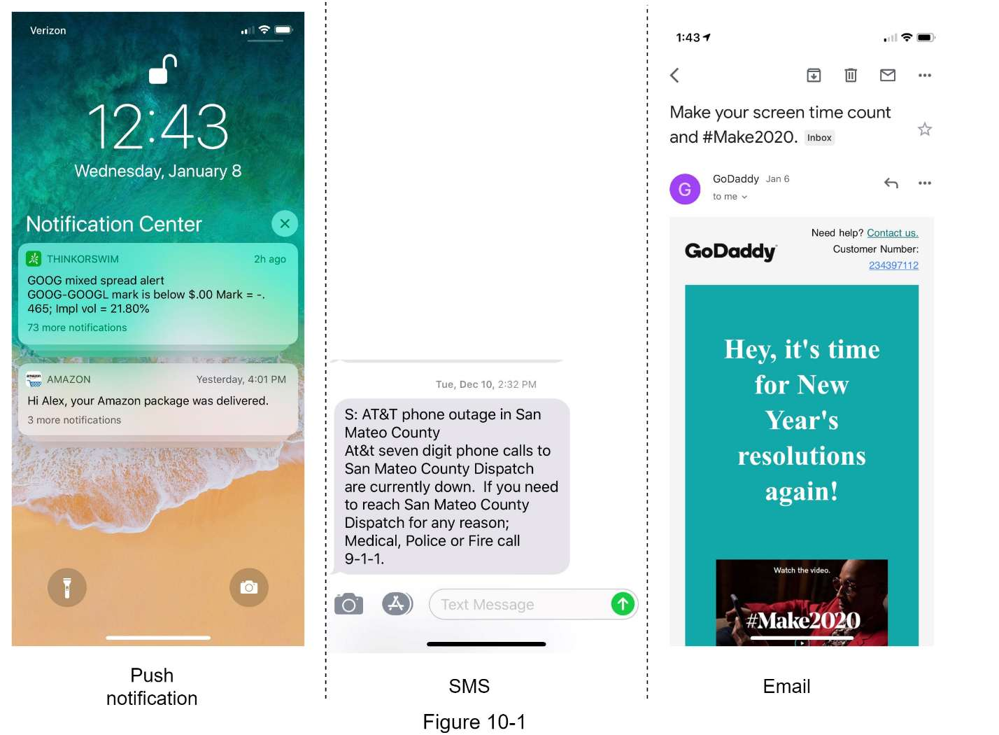 | 三种通知类型示例：Push、SMS、Email | 概览 |
| 10-2 | 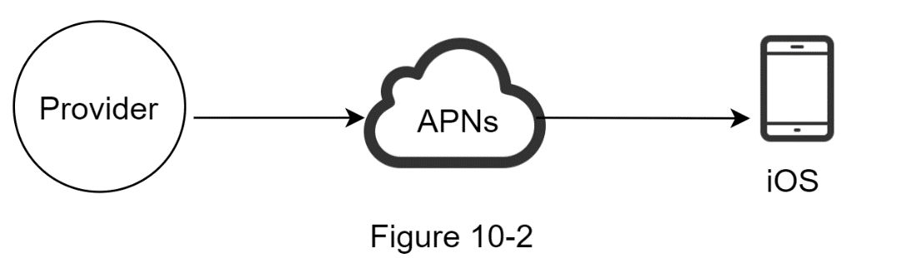 | iOS Push Notification 流程：Provider → APNs → iOS Device | 通知类型 |
| 10-3 | 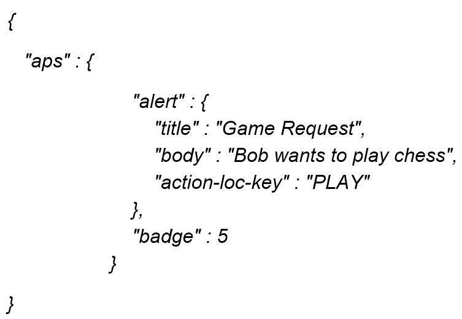 | APNs payload JSON 示例 | 通知类型 |
| 10-4 | 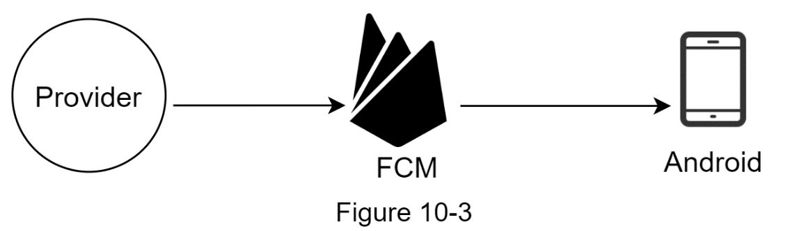 | Android Push Notification 流程：Provider → FCM → Android Device | 通知类型 |
| 10-5 | 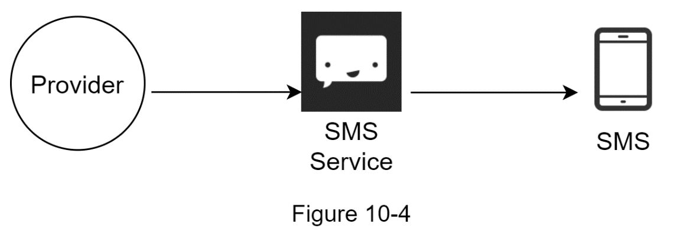 | SMS 流程：Provider → SMS Service (Twilio/Nexmo) → SMS | 通知类型 |
| 10-6 | 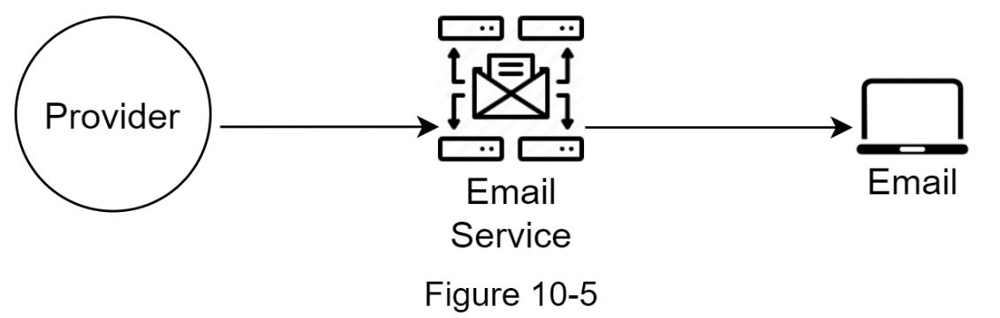 | Email 流程：Provider → Email Service (Sendgrid/Mailchimp) → Email | 通知类型 |
| 10-6 | 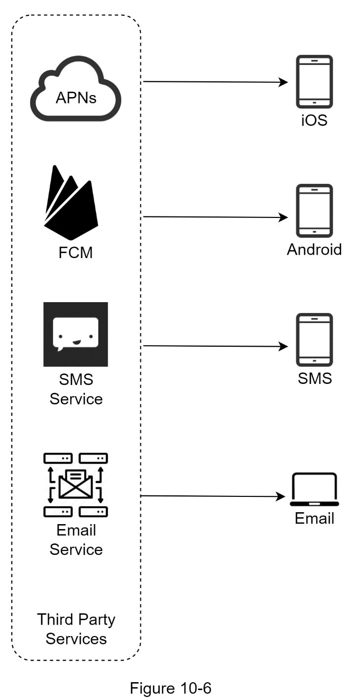 | 第三方服务汇总：APNs→iOS、FCM→Android、SMS Service→SMS、Email Service→Email | 通知类型 |
| 10-7 | 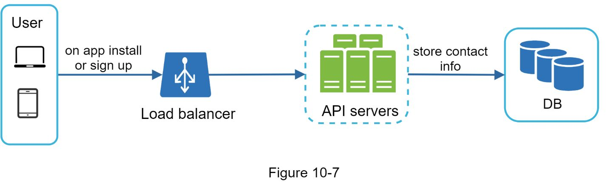 | 用户联系信息采集流程：用户注册/安装 → API Server → DB | 数据采集 |
| 10-8 | 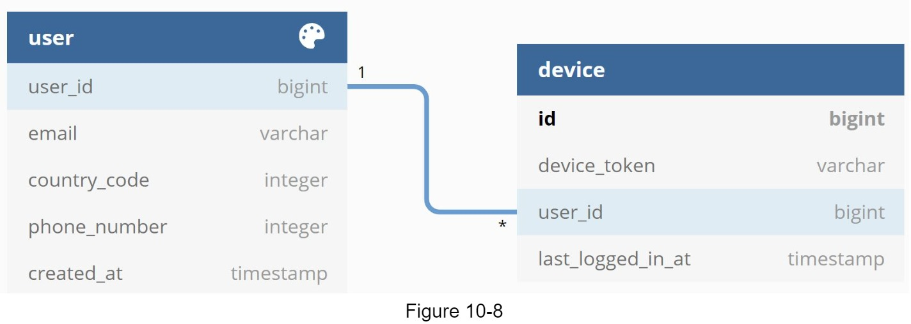 | 简化数据库表结构：user 表 + device 表 | 数据采集 |
| 10-9 | 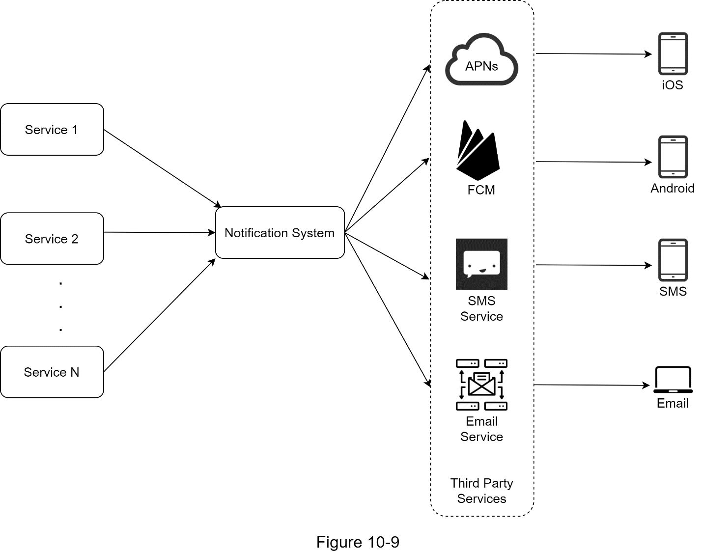 | **初始高层设计**：Service 1~N → 单体 Notification System → 第三方服务 → 设备 | 高层设计 |
| 10-10 | 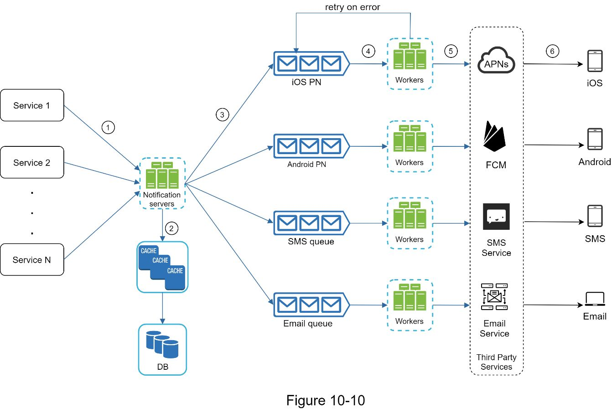 | **改进高层设计**：Service 1~N → Notification Servers + Cache/DB → 4 条 Message Queue → Workers → 第三方服务 → 设备，含 retry on error | 高层设计 |
| 10-11 | 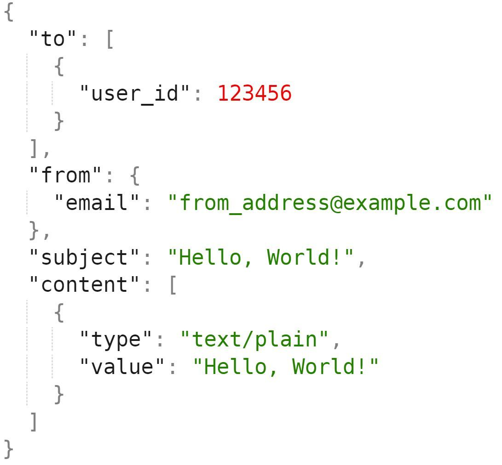 | 发送 Email 的 API 请求体示例 | 高层设计 |
| 10-11 | 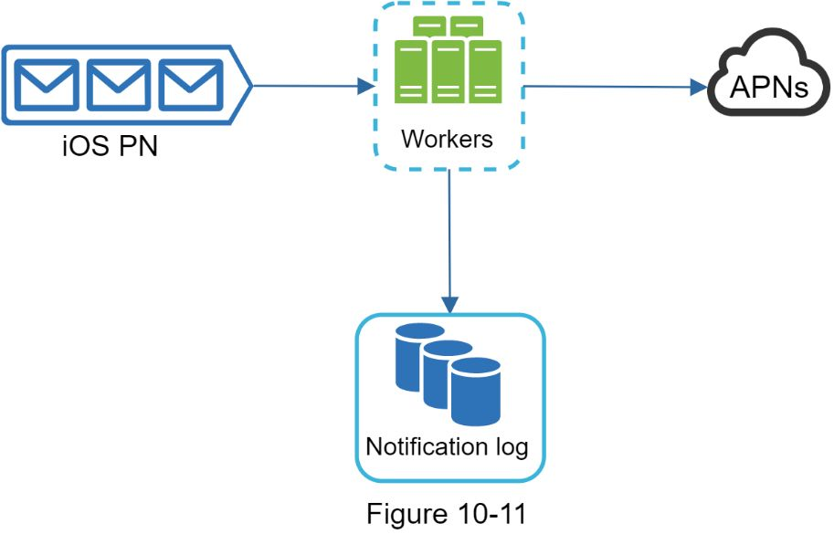 | 数据持久化：iOS PN Queue → Workers → Notification Log DB + APNs | 可靠性 |
| 10-12 | 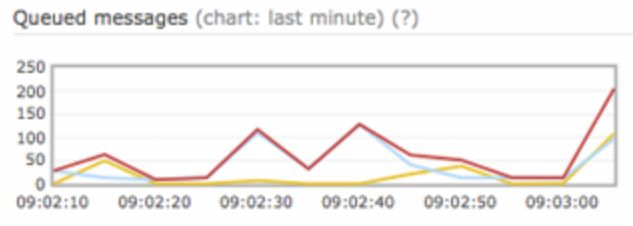 | 队列监控示例：queued messages 图表 | 监控 |
| 10-13 | 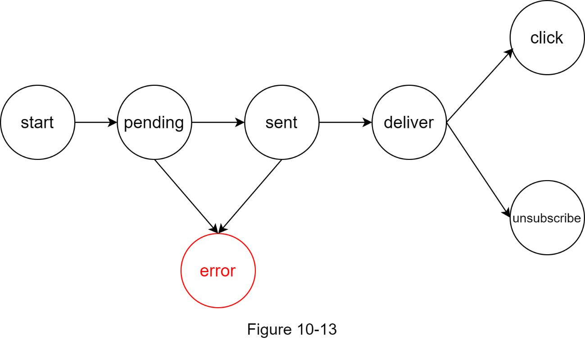 | 事件追踪状态机：start → pending → sent → deliver → click/unsubscribe，pending/sent 可进入 error | 事件追踪 |
| 10-14 | 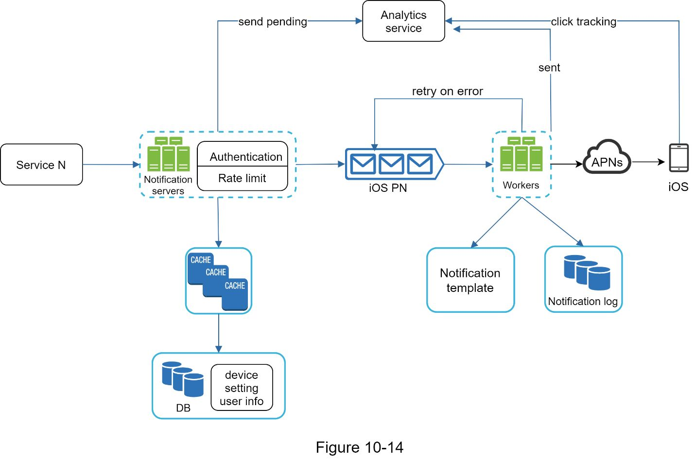 | **最终设计**：含 Authentication、Rate Limit、Notification Template、Notification Log、Analytics Service、retry on error | 深入设计 |

---

## 设计思路演进

### Step 1: 不同通知类型的架构差异

每种通知渠道依赖不同的第三方服务，但共享相同的 Provider 端逻辑：

| 通知类型 | 第三方服务 | 关键标识 | 特殊考量 |
|----------|-----------|---------|---------|
| **iOS Push** | APNs (Apple Push Notification Service) | Device Token | 需要 appKey/appSecret 认证；中国可用 |
| **Android Push** | FCM (Firebase Cloud Messaging) | Device Token | **中国不可用**，需替代方案如 JPush、PushY |
| **SMS** | Twilio、Nexmo 等 | Phone Number | 商业服务，按量付费 |
| **Email** | Sendgrid、Mailchimp 等 | Email Address | 自建邮件服务器可行但投递率低，商业服务提供更好的 delivery rate 和 data analytics |

**共同模式：** Provider 构建 payload → 第三方服务投递 → 用户设备接收

### Step 2: 初始设计及其问题

```
Service 1 ─┐
Service 2 ──┼─→ [Notification System] ─→ APNs/FCM/SMS/Email ─→ 设备
Service N ─┘         (单体)
```

**三大问题：**
- **SPOF**：单个 Notification Server 是单点故障
- **难以扩展**：所有处理逻辑在一台服务器，DB/Cache/处理组件无法独立扩展
- **性能瓶颈**：构建 HTML 页面、等待第三方响应等耗时操作，峰值时系统过载

### Step 3: 改进的高层设计（引入 Message Queue）

```
Service 1~N → Notification Servers → ┌─ iOS PN Queue   → Workers → APNs      → iOS
              (多实例, 水平扩展)      ├─ Android PN Queue → Workers → FCM      → Android
                   ↕                  ├─ SMS Queue       → Workers → SMS Svc  → SMS
              Cache + DB              └─ Email Queue     → Workers → Email Svc → Email
```

**关键改进：**
- DB 和 Cache 从 Notification Server 中抽离
- 多个 Notification Server 实例 + 自动水平扩展
- **每种通知类型独立的 Message Queue**：一个渠道故障不影响其他渠道
- Workers 从队列拉取任务，独立伸缩

**Notification Server 职责：**
1. 提供 API 供内部服务调用（需认证，防止 spam）
2. 基本校验（email 格式、手机号等）
3. 查询 DB/Cache 获取渲染通知所需数据
4. 将通知事件投递到对应的 Message Queue

### Step 4: 最终设计（加入可靠性和运营能力）

在改进设计基础上增加：
- **Authentication + Rate Limiting**：Notification Server 入口处校验
- **Notification Template**：模板化通知内容，统一格式、减少出错
- **Notification Log DB**：Workers 发送前持久化，用于 retry 和审计
- **Retry 机制**：发送失败 → 回到 Message Queue 重试
- **Analytics Service**：追踪 send pending、sent、click tracking 等事件

---

## 关键设计考量 (Tradeoffs)

### 1. 数据可靠性：不能丢失通知

- **问题**：通知可以延迟、可以重排序，但不能丢失
- **解法**：Worker 在发送前将通知数据持久化到 Notification Log DB，失败时从 DB 恢复重试
- **Tradeoff**：持久化增加延迟，但保证了 at-least-once delivery

### 2. 去重 (Deduplication)

- **问题**：分布式系统无法保证 exactly-once delivery，可能出现重复通知
- **解法**：基于 event ID 的去重逻辑 -- 首次到达检查 ID 是否已处理，已处理则丢弃
- **Tradeoff**：去重需要维护已发送 ID 集合，增加存储和查询开销；无法 100% 消除重复，只能降低概率

### 3. 每种通知类型独立队列

- **优点**：渠道隔离，某个第三方服务故障（如 APNs 宕机）不影响 SMS 和 Email 的发送
- **缺点**：运维复杂度增加，需要监控多条队列

### 4. Notification Template

- **优点**：统一格式、减少人为错误、节省开发时间
- **缺点**：模板管理本身需要版本控制和审核流程

### 5. Rate Limiting

- **问题**：通知过多会导致用户关闭通知权限
- **解法**：对每个用户设置通知频率上限（Frequency Capping）
- **Tradeoff**：限流可能导致重要通知延迟送达

### 6. Security

- **问题**：防止未授权客户端发送通知
- **解法**：iOS/Android 使用 appKey + appSecret 对 push notification API 进行认证；Notification Server API 仅内部可访问或需 verified client

### 7. 队列监控

- **关键指标**：queued notifications 数量
- 数量持续增长 → Workers 消费速度不足 → 需要增加 Worker 实例
- **Tradeoff**：过度扩容增加成本，不足则通知延迟

### 8. 用户设置 (Notification Setting)

- 发送前必须检查用户的 opt-in/opt-out 状态
- 按 channel 粒度（push/email/SMS）控制
- 数据结构：`user_id + channel + opt_in (boolean)`

---

## 面试扩展话题

原书 Wrap-up 中总结的关键话题和设计中的额外考量：

1. **Reliability（可靠性）**：健壮的 retry 机制最小化失败率；Notification Log DB 持久化保障数据不丢失
2. **Security（安全性）**：appKey/appSecret 机制确保只有经过认证的客户端才能发送通知
3. **Tracking and Monitoring（追踪和监控）**：在通知流程的每个阶段实施监控，捕获关键统计数据；事件状态机：start → pending → sent → deliver → click / unsubscribe，pending 和 sent 阶段均可能进入 error 状态
4. **Respect User Settings（尊重用户设置）**：系统在发送通知前先检查用户设置，opt-out 的用户不会收到通知
5. **Rate Limiting（频率限制）**：对用户接收通知的频率做 capping，避免打扰用户导致其完全关闭通知
6. **第三方服务的可扩展性**：设计需支持灵活接入/替换第三方服务（如 FCM 在中国不可用，需替换为 JPush/PushY）
7. **Exactly-once delivery 的不可能性**：分布式系统天然无法保证 exactly-once，只能通过去重机制尽量减少重复

---

## 速写练习要点

盲画时重点记住这些组件和连接：

1. **核心数据流（6 步）**：
   - Service 1~N → Notification Servers（调用 API）
   - Notification Servers ↔ Cache + DB（获取 metadata）
   - Notification Servers → 对应 Message Queue（投递事件）
   - Workers ← Message Queue（拉取事件）
   - Workers → Third-party Services（发送通知）
   - Third-party Services → 用户设备（投递通知）

2. **四条并行的 Message Queue 通道**：iOS PN / Android PN / SMS / Email 各自独立

3. **Retry 回路**：Workers 发送失败 → retry on error → 回到 Message Queue

4. **Notification Server 入口双重守卫**：Authentication + Rate Limiting

5. **数据持久层**：
   - DB：user info、device info、notification settings
   - Cache：热数据缓存
   - Notification Log DB：Workers 写入，用于 retry 和审计
   - Notification Template：预格式化模板

6. **Analytics Service**：接收 send pending（从 Notification Server）和 click tracking（从用户设备）两路事件
