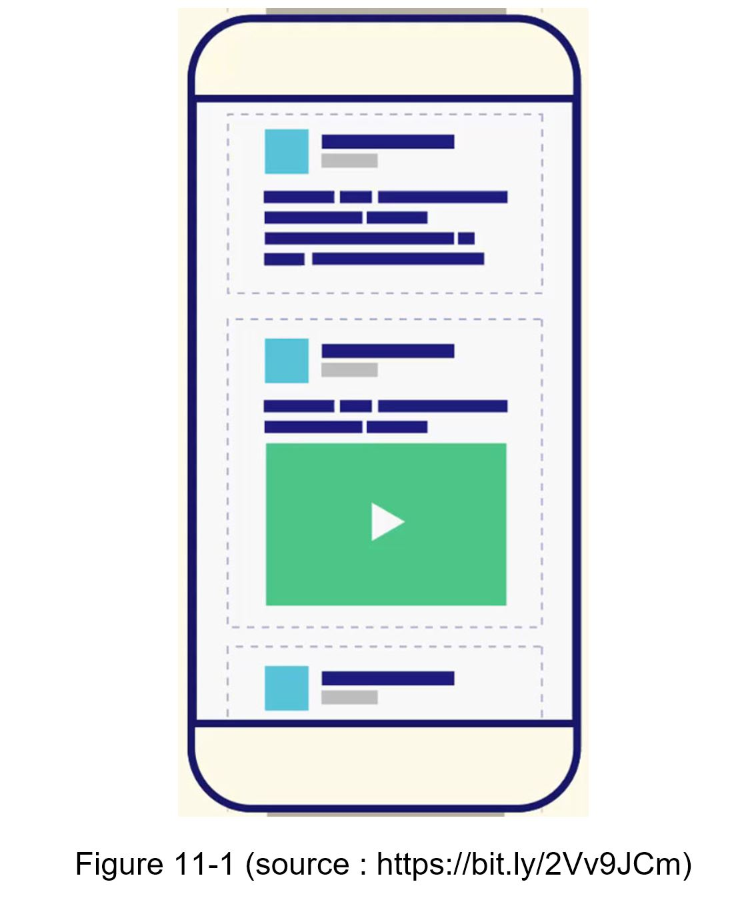
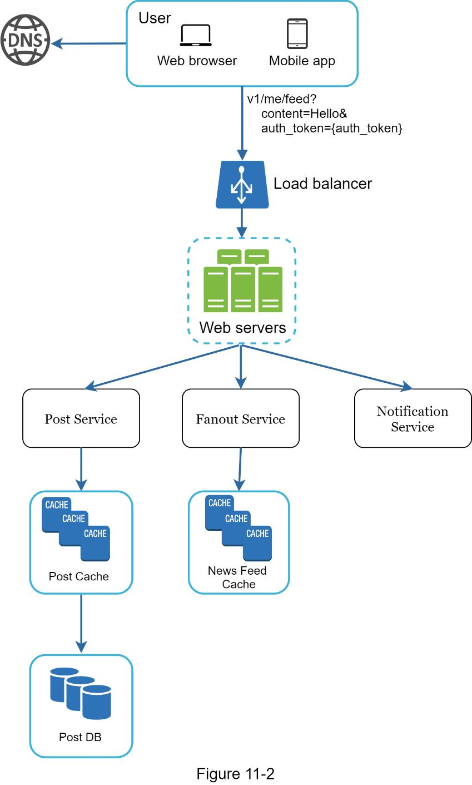
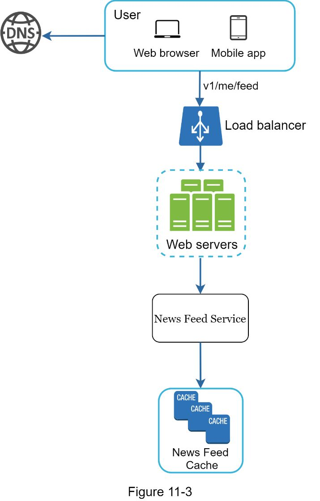
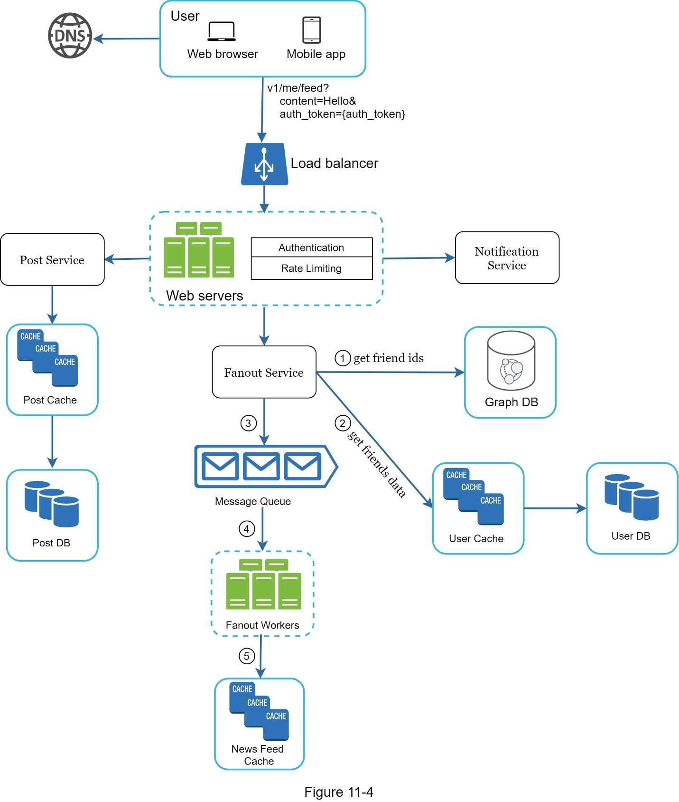
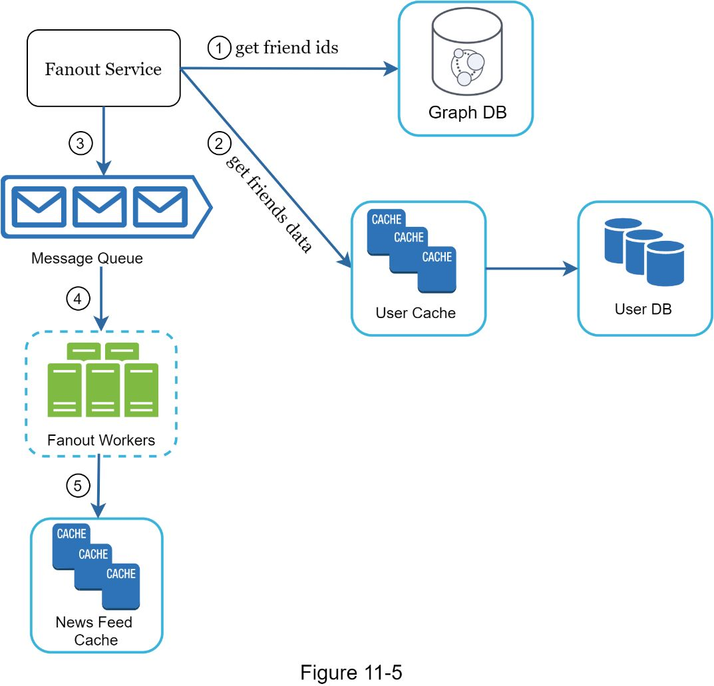
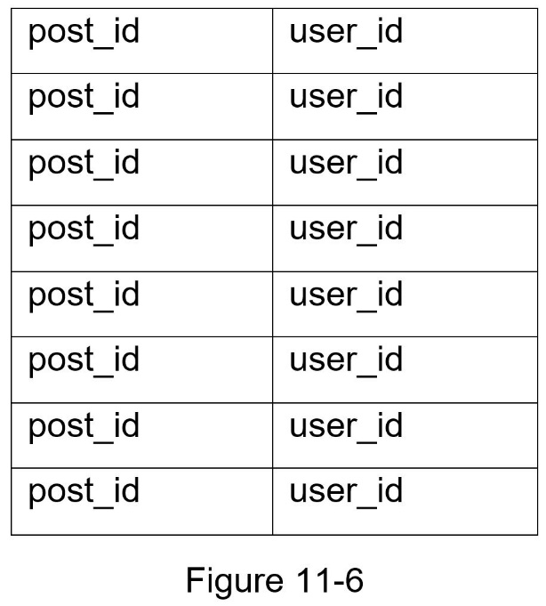
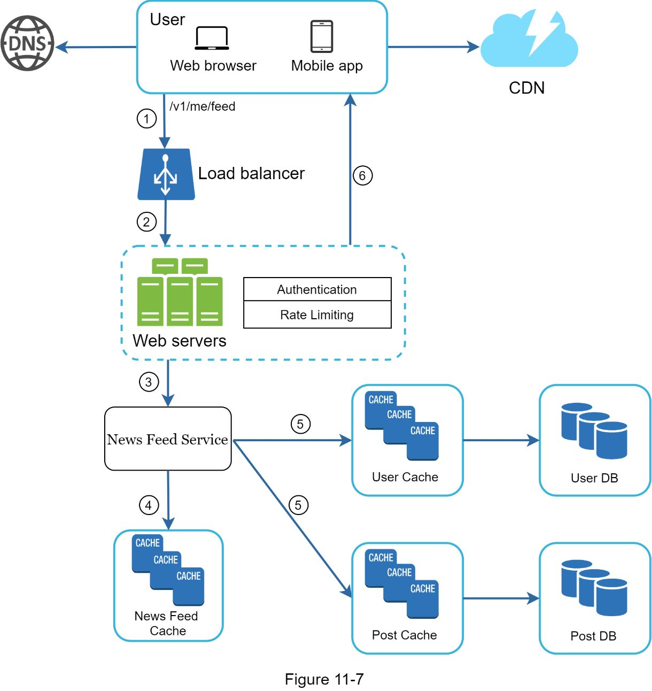
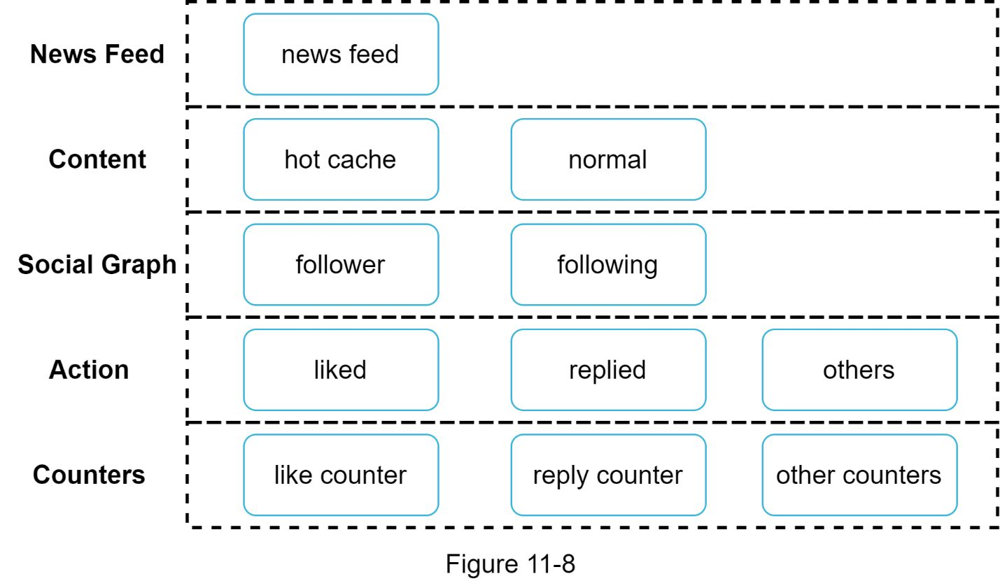

# Chapter 11: Design a News Feed System

## 问题定义

News Feed 是社交平台首页中持续更新的内容流，包含好友的状态更新、照片、视频、链接、点赞等动态（如 Facebook News Feed、Instagram Feed、Twitter Timeline）。

**核心需求：**
- 支持移动端和 Web 端
- 用户可以发布帖子，并在 News Feed 页面看到好友的帖子
- Feed 按时间倒序排列（reverse chronological order）
- 用户最多 5000 个好友
- 10 million DAU
- Feed 可包含文本、图片、视频等多媒体内容

---

## 架构图索引

| Figure | 文件 | 内容 | 设计阶段 |
|--------|------|------|----------|
| 11-1 |  | 手机端 News Feed 界面示意图，展示帖子列表含文本和视频 | 概览 |
| 11-2 |  | Feed Publishing 高层设计：User → Load Balancer → Web Servers → Post Service / Fanout Service / Notification Service | 高层设计 |
| 11-3 |  | News Feed Building 高层设计：User → Load Balancer → Web Servers → News Feed Service → News Feed Cache | 高层设计 |
| 11-4 |  | **Feed Publishing 详细设计**：含 Authentication/Rate Limiting、Post Cache/DB、Fanout Service → Graph DB + User Cache → Message Queue → Fanout Workers → News Feed Cache、Notification Service | 深入设计 |
| 11-5 |  | **Fanout Service 详细流程**：(1) 从 Graph DB 获取好友 ID → (2) 从 User Cache 获取好友数据 → (3) 发送到 Message Queue → (4) Fanout Workers 消费 → (5) 写入 News Feed Cache | 深入设计 |
| 11-6 |  | News Feed Cache 数据结构：`<post_id, user_id>` 映射表 | 深入设计 |
| 11-7 |  | **News Feed Retrieval 详细设计**：User → Load Balancer → Web Servers (Auth + Rate Limiting) → News Feed Service → News Feed Cache / User Cache / Post Cache，媒体内容从 CDN 获取 | 深入设计 |
| 11-8 |  | **Cache 架构分层**：News Feed / Content (hot cache + normal) / Social Graph (follower + following) / Action (liked + replied + others) / Counters (like + reply + other counters) | 深入设计 |

---

## 设计思路演进

### 主线一：Feed Publishing（发布流程）

#### 高层设计（Figure 11-2）

```
User (Browser/Mobile)
  → POST /v1/me/feed?content=Hello&auth_token={token}
  → Load Balancer
  → Web Servers
  → Post Service → Post Cache + Post DB（持久化帖子）
  → Fanout Service → News Feed Cache（推送到好友的 Feed）
  → Notification Service（推送通知）
```

#### 详细设计（Figure 11-4）

Web Servers 增加了两层防护：
- **Authentication**：只有合法 auth_token 的用户才能发帖
- **Rate Limiting**：限制用户在一定时间内的发帖频率，防止垃圾内容

Fanout Service 的详细流程（Figure 11-5）：
1. 从 **Graph DB** 获取好友 ID 列表（图数据库适合管理社交关系）
2. 从 **User Cache** 获取好友信息，并根据用户设置过滤（如 mute、选择性分享）
3. 将好友列表 + 新帖子 ID 发送到 **Message Queue**
4. **Fanout Workers** 从消息队列消费数据
5. 将 `<post_id, user_id>` 写入 **News Feed Cache**

**缓存策略**：只存 ID 不存完整对象，设置可配置的条数上限，减少内存消耗。

### 主线二：News Feed Building（读取流程）

#### 高层设计（Figure 11-3）

```
User (Browser/Mobile)
  → GET /v1/me/feed
  → Load Balancer
  → Web Servers
  → News Feed Service
  → News Feed Cache（获取 Feed ID 列表）
```

#### 详细设计（Figure 11-7）

1. 用户发送请求 `GET /v1/me/feed`
2. Load Balancer 分发请求到 Web Servers
3. Web Servers 调用 **News Feed Service**
4. News Feed Service 从 **News Feed Cache** 获取 post ID 列表
5. 从 **User Cache** 和 **Post Cache** 获取完整的用户和帖子对象，组装成完整的 hydrated feed
6. 媒体内容（图片、视频）从 **CDN** 获取
7. 返回 JSON 格式的完整 Feed 给客户端

---

## 关键设计考量 (Tradeoffs)

### 1. Fan-out on Write vs Fan-out on Read

| 维度 | Fan-out on Write (Push) | Fan-out on Read (Pull) |
|------|------------------------|----------------------|
| **核心思想** | 发帖时预计算，立即推送到好友的 Cache | 读取时按需拉取好友的最新帖子 |
| **优点** | Feed 实时生成，读取速度快（预计算） | 不浪费计算资源在不活跃用户上；无 hotkey 问题 |
| **缺点** | 好友多时推送慢（hotkey problem）；为不活跃用户预计算浪费资源 | 读取时需实时聚合，延迟较高 |

**最终方案：混合策略（Hybrid Approach）**
- 大多数普通用户 → **Push 模型**（保证读取速度）
- 名人/大 V（follower 极多） → **Pull 模型**（避免系统过载）
- 使用 **Consistent Hashing** 缓解 hotkey 问题，均匀分布请求和数据

### 2. Cache 分层架构（Figure 11-8）

缓存分为 5 层，各司其职：

| 缓存层 | 存储内容 | 说明 |
|--------|----------|------|
| **News Feed** | Feed ID 列表 | 每个用户的 Feed 流 |
| **Content** | 帖子数据 | 分为 hot cache（热门内容）和 normal |
| **Social Graph** | 社交关系 | follower / following 关系 |
| **Action** | 用户行为 | liked / replied / 其他交互 |
| **Counters** | 计数器 | like 数 / reply 数 / follower 数等 |

### 3. Graph Database 的选择

社交关系（好友关系、推荐）天然适合图数据库（如 Neo4j），用于 Fanout Service 查询好友列表。

### 4. Message Queue 解耦

Fanout Service 通过 Message Queue 将好友列表和帖子 ID 异步传递给 Fanout Workers，实现：
- 发布和推送解耦，提升发布响应速度
- Workers 可独立扩展，应对流量高峰

---

## 面试扩展话题

### 数据库扩展
- **Vertical Scaling vs Horizontal Scaling**：垂直扩展有上限，水平扩展是长期方案
- **SQL vs NoSQL**：帖子内容可能更适合 NoSQL（灵活 schema），社交关系适合 Graph DB
- **Master-Slave Replication**：主从复制提高读取能力
- **Read Replicas**：读副本分担读压力
- **Consistency Models**：强一致性 vs 最终一致性的权衡
- **Database Sharding**：按用户 ID 分片

### 系统架构扩展
- **Web Tier Stateless**：Web 层保持无状态，便于水平扩展
- **Cache as Much as Possible**：多层缓存架构减少数据库压力
- **Multiple Data Centers**：多数据中心部署，降低延迟，提高可用性
- **Loose Coupling with Message Queues**：消息队列松耦合各组件，提升系统弹性
- **Monitor Key Metrics**：监控 QPS（尤其峰值时段）和用户刷新 Feed 的延迟

---

## 速写练习要点

盲画时重点记住这些组件和连接：

1. **Feed Publishing 数据流**：User → LB → Web Servers (Auth + Rate Limiting) → Post Service (Cache + DB) + Fanout Service + Notification Service
2. **Fanout 详细流**：Fanout Service → Graph DB (好友 ID) → User Cache (过滤) → Message Queue → Fanout Workers → News Feed Cache
3. **Feed Retrieval 数据流**：User → LB → Web Servers → News Feed Service → News Feed Cache → User Cache + Post Cache → 组装 hydrated feed；媒体从 CDN 拉取
4. **Cache 五层**：News Feed / Content (hot + normal) / Social Graph / Action / Counters
5. **核心决策**：Fan-out on Write (普通用户) + Fan-out on Read (名人) = Hybrid Approach
6. **News Feed Cache 数据结构**：`<post_id, user_id>` 映射表，只存 ID 不存对象
