# Chapter 13: Design a Search Autocomplete System

## 问题定义

设计一个搜索自动补全系统（又称 typeahead / search-as-you-type / top-k），用户每输入一个字符就返回最热门的 5 条建议。

**核心需求：**
- 快速响应：100ms 内返回结果（否则造成卡顿）
- 相关性：建议与搜索词前缀匹配
- 按热度排序：基于历史查询频率排名
- 可扩展：支撑 10M DAU，~24,000 QPS（峰值 ~48,000）
- 高可用：部分节点故障不影响服务

**粗略估算：**
- 10M DAU x 10 queries/day x 20 chars = ~24,000 QPS
- 每日新增数据量：10M x 10 x 20 bytes x 20% = 0.4 GB/day

---

## 架构图索引

| Figure | 文件 | 内容 | 设计阶段 |
|--------|------|------|----------|
| 13-1 |  | Google 搜索自动补全示例（输入 "dinner"） | 问题定义 |
| 13-2 | 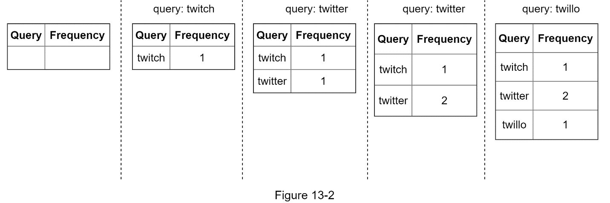 | 频率表更新过程：依次输入 twitch/twitter/twillo | 高层设计 |
| 13-3 | 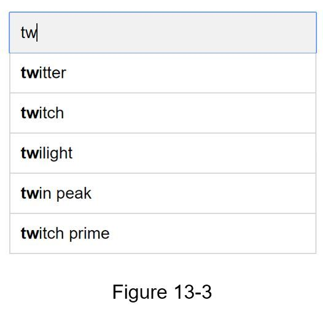 | 输入 "tw" 时返回 top 5 搜索建议 | 高层设计 |
| 13-4 | 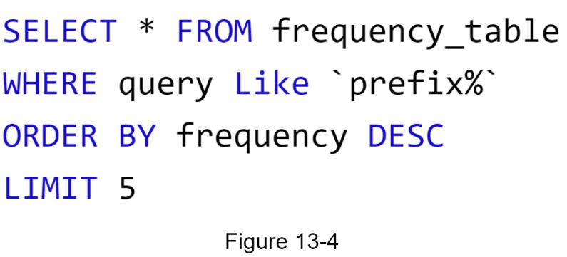 | SQL 查询 top 5（简单方案） | 高层设计 |
| 13-5 | 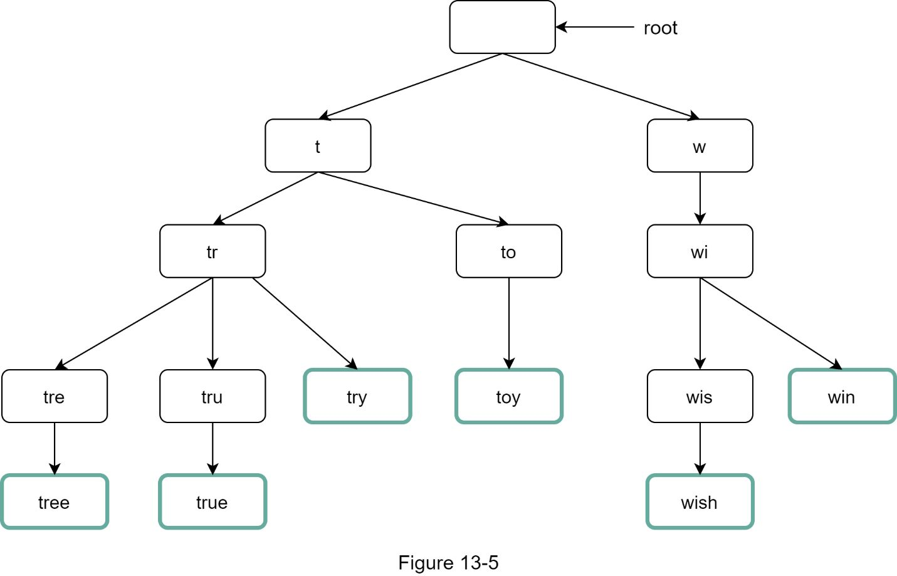 | **基础 Trie 结构**：root → t/w 分支，叶节点为 tree/true/try/toy/wish/win，完整词用粗边框标注 | 数据结构 |
| 13-6 | 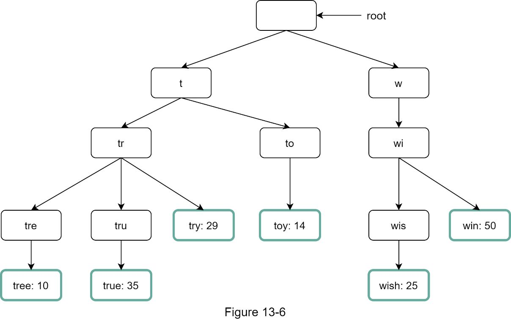 | **带频率的 Trie**：每个叶节点标注频率（tree:10, true:35, try:29, toy:14, wish:25, win:50） | 数据结构 |
| 13-7 | 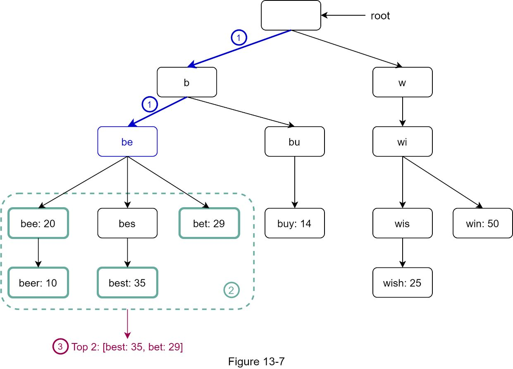 | **Trie 查询算法**：3 步标注 -- (1)找前缀节点 "be"，(2)遍历子树（虚线框），(3)排序得 Top 2: [best:35, bet:29] | 数据结构 |
| 13-8 | 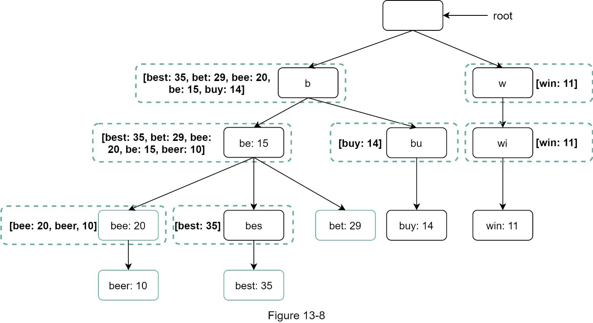 | **优化 Trie -- 节点缓存 Top-k**：每个节点旁虚线框存储 top 5 查询列表（如 "b" 节点存 [best:35, bet:29, bee:20, be:15, buy:14]） | 数据结构优化 |
| 13-9 | 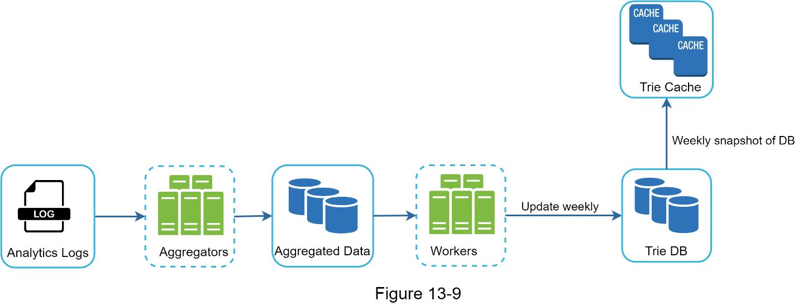 | **Data Gathering Service 架构**：Analytics Logs → Aggregators → Aggregated Data → Workers → Trie DB → (Weekly snapshot) → Trie Cache | 深入设计 |
| 13-10 | 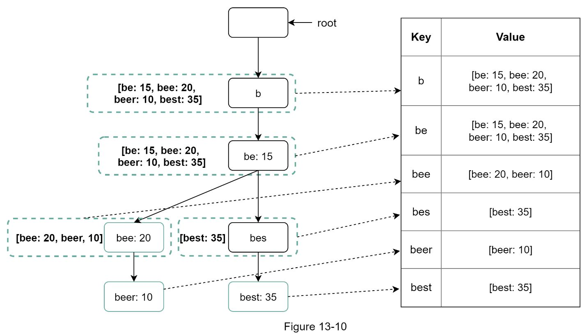 | **Trie 到 Key-Value 映射**：左侧 Trie 节点逐一映射到右侧哈希表 key-value（如 key="be" → value=[be:15, bee:20, beer:10, best:35]） | 存储设计 |
| 13-11 | 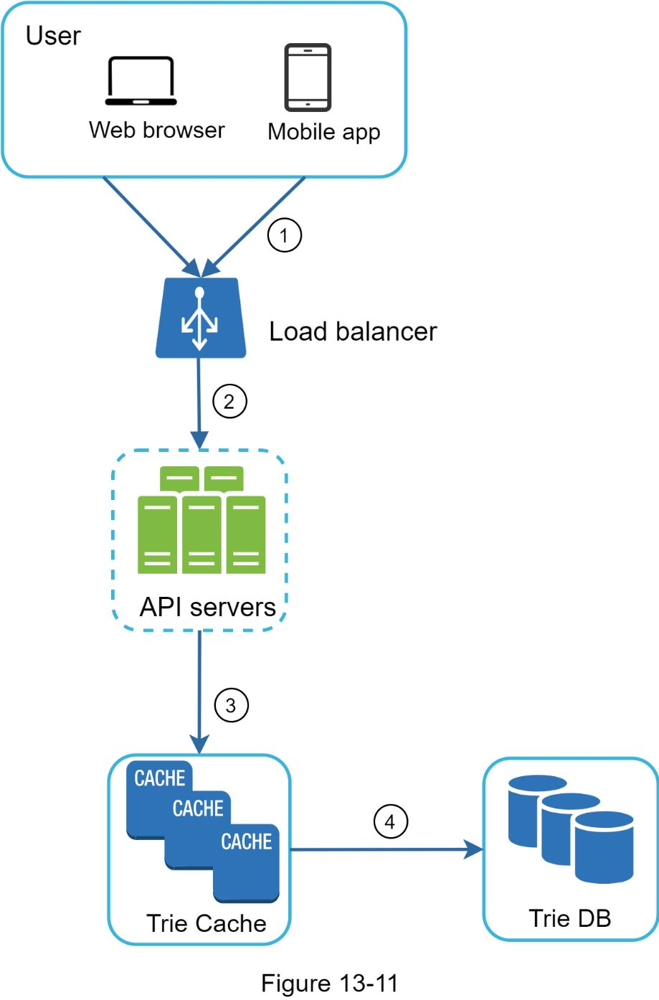 | **Query Service 架构**：User(Web/Mobile) → (1) Load Balancer → (2) API Servers → (3) Trie Cache → (4) cache miss 时回源 Trie DB | 深入设计 |
| 13-12 | 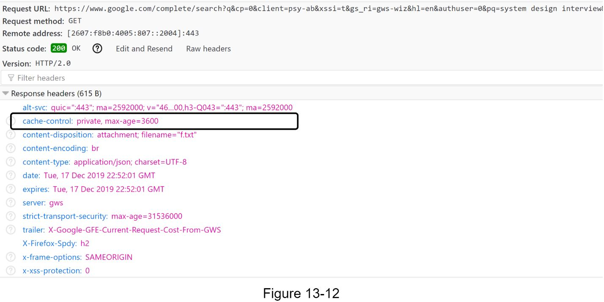 | Google 浏览器缓存示例：cache-control: private, max-age=3600 | 查询优化 |
| 13-13 | 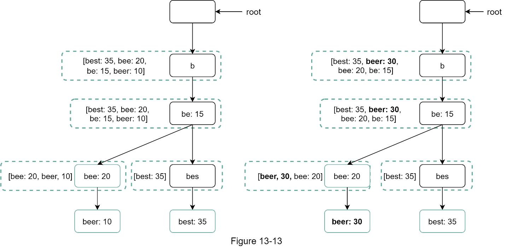 | Trie 节点更新操作：beer 从 10 更新到 30，祖先节点同步更新 | Trie 操作 |
| 13-14 | 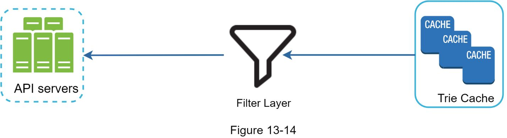 | **Filter Layer**：Trie Cache → Filter Layer（漏斗图标）→ API Servers，过滤不当内容 | Trie 操作 |
| 13-15 | 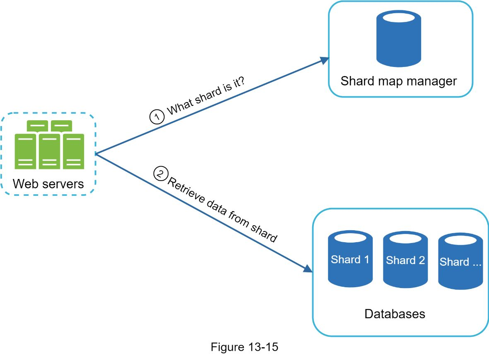 | **存储分片架构**：Web Servers → (1) Shard Map Manager 查询分片 → (2) 从对应 Shard (Shard 1/2/...) 检索数据 | 扩展性 |

---

## 设计思路演进

### Step 1: 高层设计 -- 简单方案

```
用户输入 → Frequency Table (query, frequency) → SQL: ORDER BY frequency DESC LIMIT 5
```

- 每次用户搜索时，直接更新频率表（实时聚合）
- 查询时用 `SELECT * FROM table WHERE query LIKE 'prefix%' ORDER BY frequency DESC LIMIT 5`
- **问题**：数据量大时全表扫描太慢，无法满足 100ms 延迟要求

### Step 2: 引入 Trie 数据结构

**基础 Trie：**
- 树形结构，root 代表空串，每个节点存储一个字符
- 每个节点最多 26 个子节点（a-z）
- 完整查询词在叶节点标记

**加入频率信息：**
- 每个代表完整词的节点存储查询频率
- 查询 top-k 的 3 步算法：
  1. 找到前缀节点 → O(p)
  2. 遍历子树获取所有有效子节点 → O(c)
  3. 排序取 top-k → O(c log c)

**两大优化：**

| 优化策略 | 做法 | 效果 |
|----------|------|------|
| 限制前缀最大长度 | p 限制为 50 字符 | "找前缀"从 O(p) 降为 O(1) |
| 每个节点缓存 top-k | 每个节点存储 top 5 热门查询 | "取 top-k"从 O(c log c) 降为 O(1) |

- 优化后总时间复杂度：**O(1)**
- Tradeoff：空间换时间，每个节点额外存储 top-k 列表

### Step 3: Data Gathering Service（离线数据管道）

```
Analytics Logs → Aggregators → Aggregated Data → Workers → Trie DB
                                                              ↓
                                                    (Weekly snapshot)
                                                              ↓
                                                         Trie Cache
```

**各组件职责：**
- **Analytics Logs**：追加写入的原始搜索日志（query + timestamp）
- **Aggregators**：按时间窗口聚合查询频率（实时应用用短窗口，一般应用按周聚合）
- **Aggregated Data**：聚合后的 (time, query, frequency) 表
- **Workers**：异步定时任务，用聚合数据构建 Trie 并写入 Trie DB
- **Trie DB**：持久化存储，两种选项：
  - Document Store（如 MongoDB）：序列化整棵 Trie 存储
  - Key-Value Store：每个前缀作为 key，对应 top-k 列表作为 value
- **Trie Cache**：分布式内存缓存，从 DB 定期加载快照

### Step 4: Query Service（在线查询服务）

```
User (Web/Mobile)
      ↓ (1)
Load Balancer
      ↓ (2)
API Servers
      ↓ (3)
Trie Cache ——→ (4) cache miss 时回源 Trie DB
```

**查询优化：**
- **AJAX 请求**：不刷新整个页面，异步获取建议
- **Browser Caching**：cache-control: private, max-age=3600（缓存 1 小时）
- **Data Sampling**：只记录 1/N 的请求到日志，降低写入压力

### Step 5: Trie 操作

| 操作 | 策略 |
|------|------|
| **Create** | Workers 用聚合数据离线构建 |
| **Update** | 方案 1：每周整棵替换（推荐）；方案 2：直接更新节点（需级联更新祖先） |
| **Delete** | Filter Layer 拦截不当内容 → 异步从 DB 物理删除 → 下次构建 Trie 时生效 |

### Step 6: 存储分片 (Scale the Storage)

```
Web Servers → (1) Shard Map Manager 查分片 → (2) 从对应 Shard 取数据
```

- **朴素分片**：按首字母分配到 26 台服务器 → 数据不均匀（"c" 远多于 "x"）
- **智能分片**：Shard Map Manager 维护查找表，根据历史数据分布动态分配
  - 例："s" 单独一个 shard，"u"~"z" 合并一个 shard

---

## 关键设计考量 (Tradeoffs)

### 1. 实时更新 vs 离线批处理
- **实时更新 Trie**：每次查询都写入 → QPS 太高，拖慢查询服务
- **离线批处理**：按周聚合 + 重建 Trie → 延迟可接受，吞吐量高
- **折中**：Twitter 等实时性要求高的场景用更短的聚合窗口

### 2. 空间 vs 时间
- 每个 Trie 节点缓存 top-k 列表：大幅增加空间消耗
- 但将查询时间从 O(c log c) 降到 O(1)
- 对于 100ms 延迟的硬性要求，空间换时间完全值得

### 3. Trie DB 选型：Document Store vs Key-Value Store
- **Document Store（MongoDB）**：序列化整棵 Trie，适合定期全量快照
- **Key-Value Store**：每个前缀独立存储，支持更灵活的增量更新

### 4. 存储分片策略
- 按字母简单分片会导致数据倾斜
- 需要 Shard Map Manager 根据实际查询分布做智能路由

### 5. 内容过滤
- Filter Layer 放在 Trie Cache 与 API Servers 之间
- 规则灵活可配，不影响核心 Trie 数据
- 物理删除异步执行，不阻塞查询

### 6. 浏览器缓存
- 自动补全建议短时间内不会频繁变化
- 利用 HTTP cache-control 在客户端缓存结果，减少后端请求

---

## 面试扩展话题

### 多语言支持
- Trie 节点存储 **Unicode** 字符而非仅 ASCII
- Unicode 覆盖全球所有文字系统

### 不同国家/地区的热门搜索差异
- 为不同国家构建**独立的 Trie**
- 将 Trie 存储在 **CDN** 中，就近返回结果，降低延迟

### Trending（实时热搜）
- 原有设计的局限：离线 Workers 按周调度，无法捕捉突发热点
- 解决思路：
  - **缩小数据集**：通过分片降低单节点压力
  - **调整 Ranking Model**：给近期查询更高权重
  - **引入流处理**：数据以 Stream 形式持续到达，需要专门的流处理系统
    - Apache Hadoop MapReduce / Spark Streaming / Storm / Kafka 等
  - 流处理与批处理是不同的技术栈，需要专门领域知识

---

## 速写练习要点

盲画时重点记住这些组件和连接：

1. **Trie 数据结构**：root → 字符节点逐层展开，叶节点标注频率，每个节点旁缓存 top-k 列表（虚线框）
2. **Data Gathering 管道**：Analytics Logs → Aggregators → Aggregated Data → Workers → Trie DB → (Weekly snapshot) → Trie Cache
3. **Query Service 路径**：User → Load Balancer → API Servers → Trie Cache → (miss) Trie DB
4. **Filter Layer**：Trie Cache → Filter Layer（漏斗）→ API Servers
5. **存储分片**：Web Servers → Shard Map Manager → Shard 1/2/...（注意不均匀分布问题）
6. **Trie 到 KV 映射**：每个前缀是 key，对应 top-k 列表是 value
7. **两条核心数据流**：离线写路径（Log → Trie）和在线读路径（User → Cache）要分开画
