# Chapter 15: Design Google Drive

## 问题定义

Google Drive 是一个云端文件存储与同步服务，支持用户在多设备间上传、下载、同步和共享文件。

**核心需求：**
- 上传和下载文件（支持 Simple Upload 和 Resumable Upload）
- 跨设备文件同步（File Sync）
- 文件版本历史（File Revisions）
- 文件共享
- 文件变更通知（Notification）

**非功能性需求：**
- Reliability：数据不可丢失
- Fast Sync Speed：同步速度要快
- Bandwidth Usage：减少不必要的网络带宽消耗
- Scalability：支撑高流量
- High Availability：部分节点故障时仍可用

**粗略估算：**
- 50M 注册用户，10M DAU
- 每用户 10 GB 免费空间 → 总计 500 PB 存储
- 每天人均上传 2 文件，平均 500 KB → Upload QPS ~240，Peak ~480

---

## 架构图索引

| Figure | 文件 | 内容 | 设计阶段 |
|--------|------|------|----------|
| 15-1 | 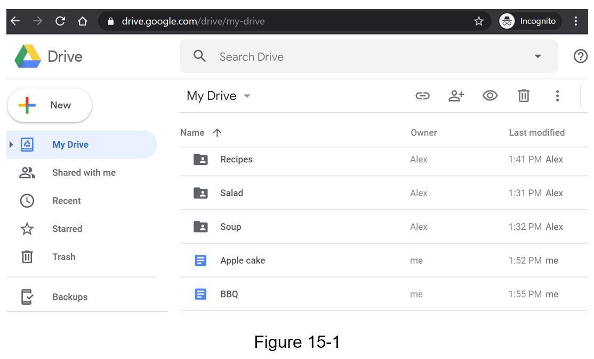 | Google Drive 浏览器界面截图 | 背景介绍 |
| 15-2 | 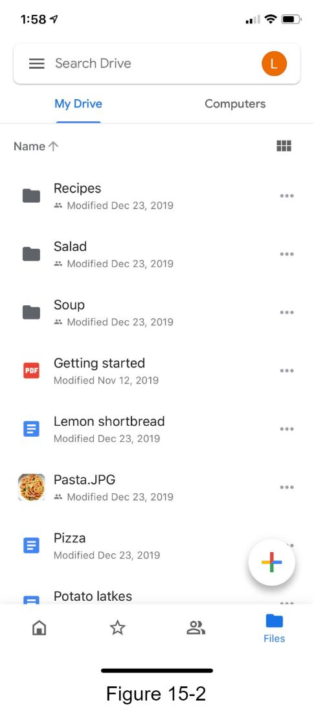 | Google Drive 移动端界面截图 | 背景介绍 |
| 15-3 | 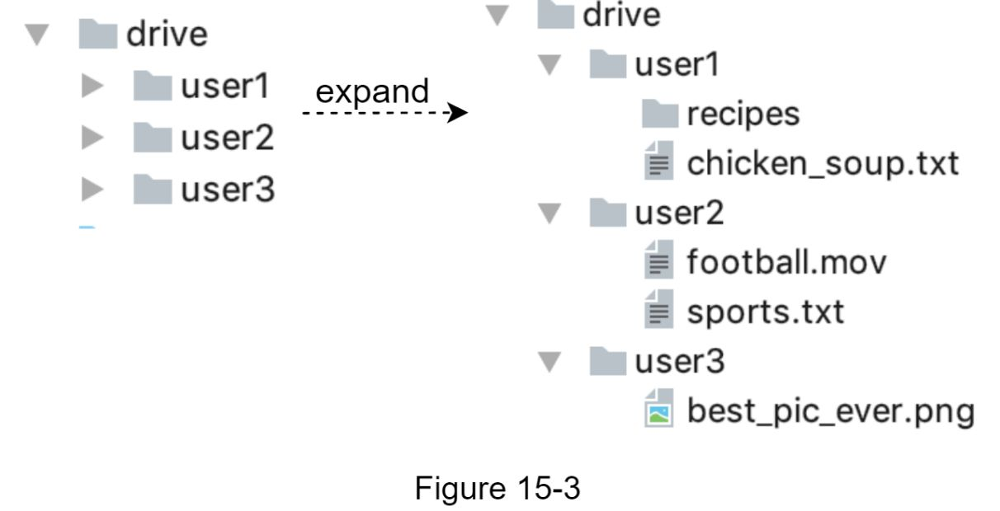 | 单机 `/drive` 目录结构（namespace → 用户文件树） | 单机设计 |
| 15-4 | 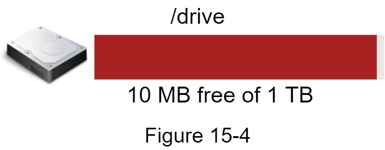 | 存储空间告警（仅剩 10 MB） | 演进：单机瓶颈 |
| 15-5 | 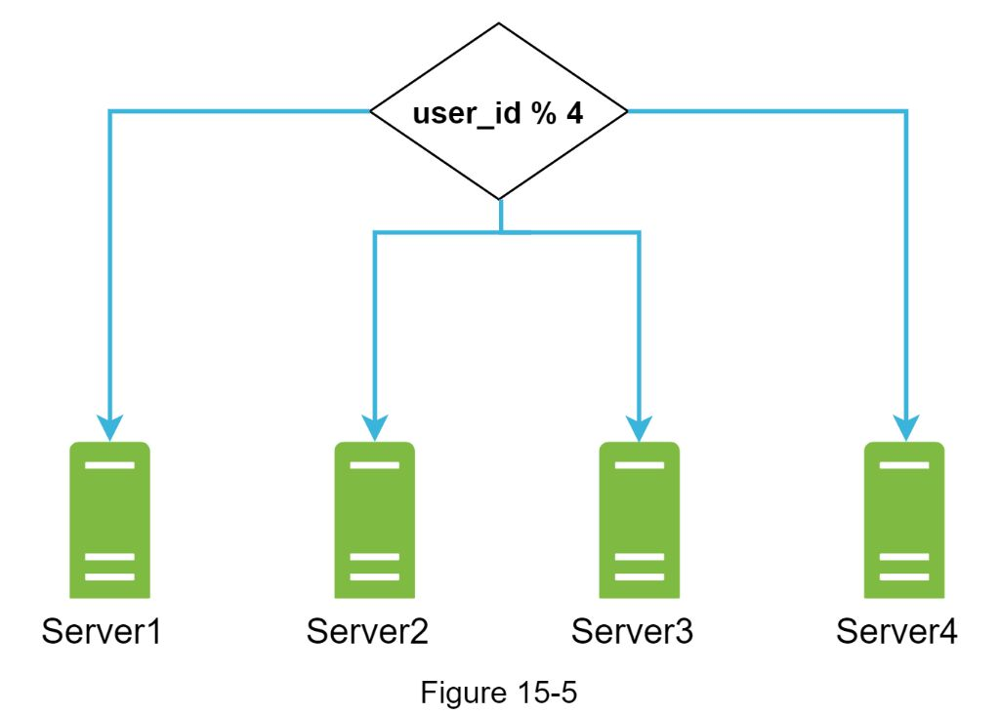 | 基于 user_id 的数据分片（Sharding） | 演进：分片 |
| 15-6 | 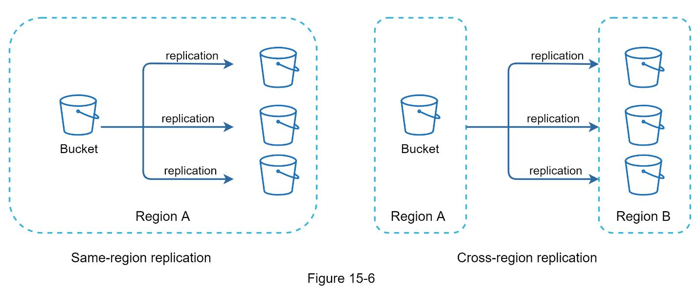 | Amazon S3 同区域 / 跨区域复制 | 演进：云存储 |
| 15-7 | 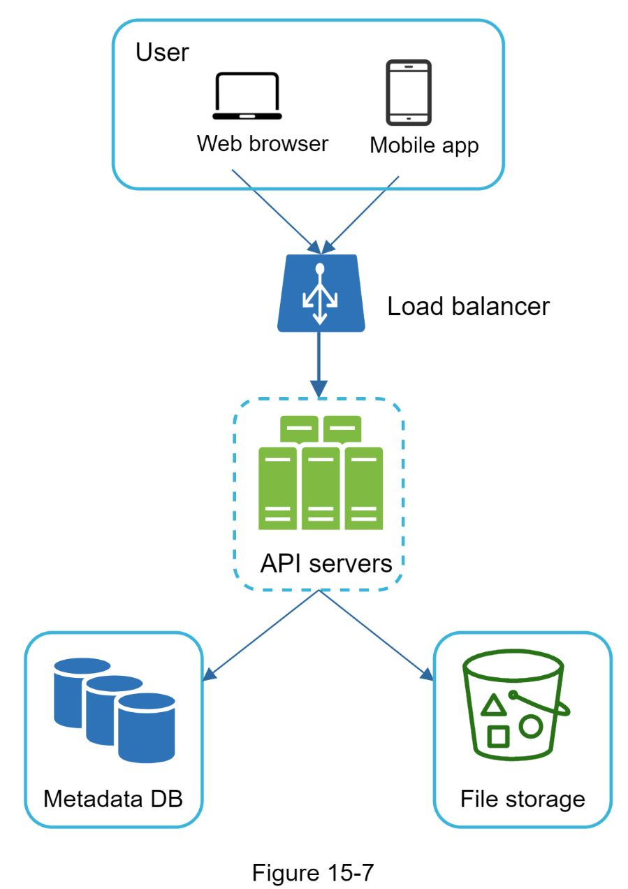 | **解耦后的架构**：User → Load Balancer → API Servers → Metadata DB + File Storage（S3） | 高层设计 |
| 15-8 | 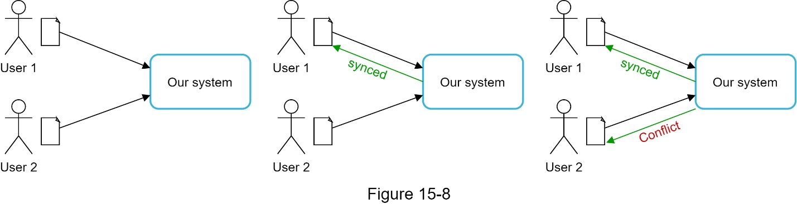 | Sync Conflict 场景：两用户同时修改同一文件 | 冲突处理 |
| 15-9 | 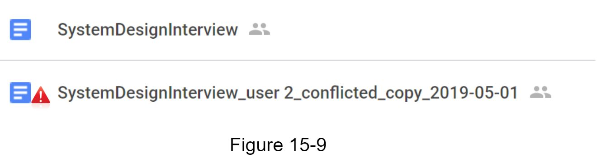 | 冲突解决：展示本地副本和服务端最新版本供用户选择 | 冲突处理 |
| 15-10 | 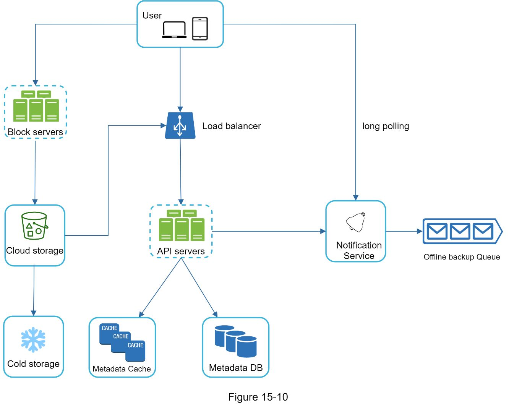 | **完整高层架构图**：User → Load Balancer → Block Servers / API Servers → Cloud Storage / Cold Storage / Metadata DB / Metadata Cache / Notification Service / Offline Backup Queue | 高层设计 |
| 15-11 | 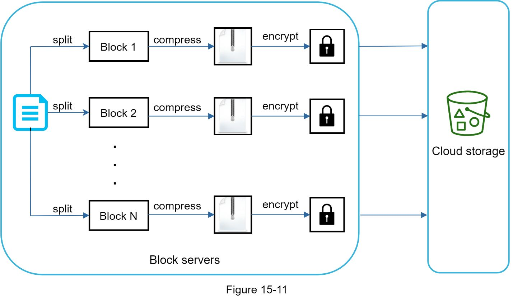 | Block Server 工作流程：文件 → 分块 → 压缩 → 加密 → 上传到 Cloud Storage | 深入设计 |
| 15-12 | 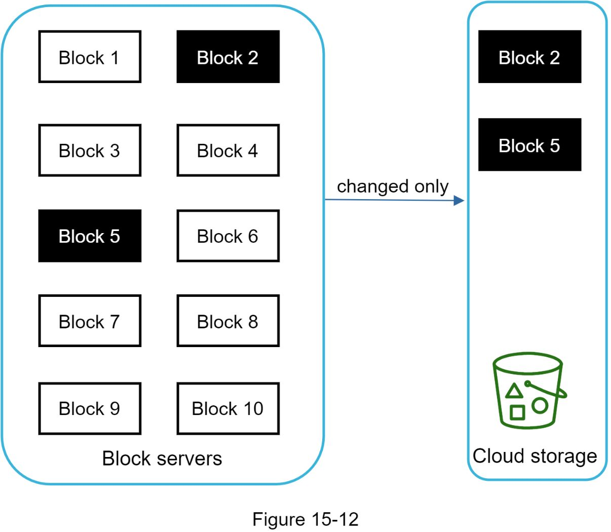 | **Delta Sync**：10 个 Block 中只有 Block 2 和 Block 5 变更，仅上传这两个 Block 到 Cloud Storage | 深入设计 |
| 15-13 | 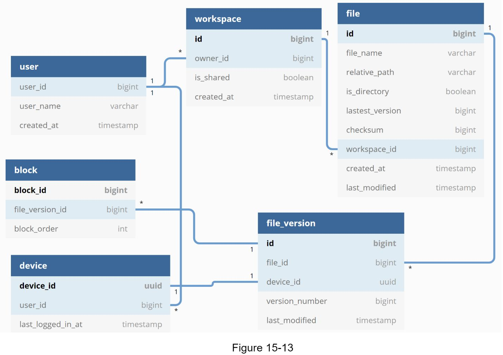 | **数据库 Schema**：user / workspace / file / file_version / block / device 六张表及其关联关系 | 深入设计 |
| 15-14 | 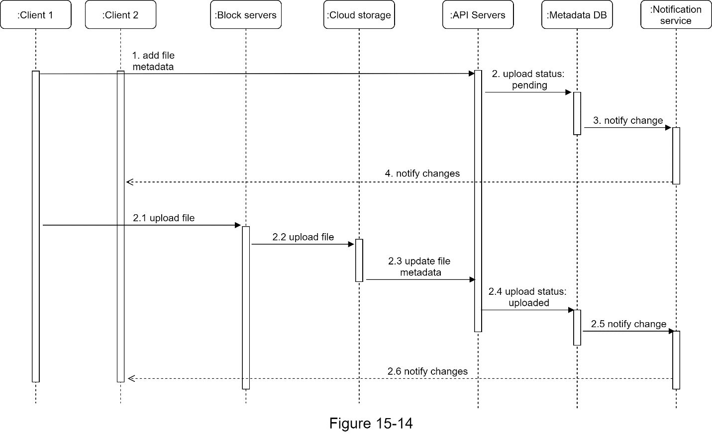 | **Upload 时序图**：Client 1 并行发送 metadata 请求和文件上传，Block Servers 分块上传到 Cloud Storage，通过 Notification Service 通知 Client 2 | 深入设计 |
| 15-15 | 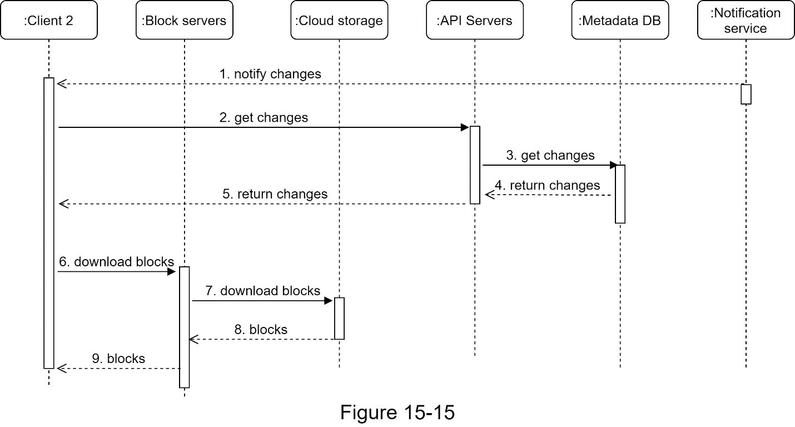 | **Download 时序图**：Notification Service 通知 Client 2 → 获取 metadata → 从 Block Servers 下载 blocks 重建文件 | 深入设计 |

---

## 设计思路演进

### Step 1: 从单机到分布式

```
单机方案：Apache Web Server + MySQL + 本地 /drive 目录
    ↓ 磁盘空间不足
数据分片：基于 user_id 分片到多台存储服务器
    ↓ 仍有数据丢失风险
Amazon S3：对象存储 + 同区域/跨区域复制
    ↓ 继续解耦
最终方案：Load Balancer + Web Servers + Metadata DB + S3 File Storage
```

### Step 2: 高层架构（Figure 15-10）

系统核心组件：
- **Block Servers**：负责文件上传的重活 -- 分块、压缩、加密、上传到 Cloud Storage
- **Cloud Storage**：存储文件块（S3）
- **Cold Storage**：存储不活跃的冷数据（如 S3 Glacier）
- **API Servers**：处理除上传外的所有请求（认证、用户管理、metadata CRUD 等）
- **Metadata DB**：关系型数据库，存储用户、文件、块、版本等元数据
- **Metadata Cache**：缓存热点元数据，加速读取
- **Notification Service**：基于 Long Polling 的发布/订阅系统，通知客户端文件变更
- **Offline Backup Queue**：客户端离线时暂存变更通知，上线后同步

### Step 3: Block Server 与 Delta Sync

```
文件上传流程：
  原始文件 → 分块（max 4MB/block，参考 Dropbox）→ 压缩 → 加密 → 上传到 S3

Delta Sync（增量同步）：
  文件修改后 → 只同步变更的 Block（非全量）→ 大幅节省带宽
```

### Step 4: Sync Conflict 处理

```
User 1 和 User 2 同时修改同一文件
    ↓
先到的版本（User 1）直接生效
后到的版本（User 2）标记为冲突
    ↓
系统向 User 2 展示两个版本（本地 + 服务端最新）
User 2 选择合并或覆盖
```

### Step 5: Upload / Download 流程

**Upload（Figure 15-14）：** 两条并行路径
1. 路径一：Client → API Servers → Metadata DB（状态设为 "pending"）→ Notification Service → 通知其他客户端
2. 路径二：Client → Block Servers → Cloud Storage → 回调 API Servers → Metadata DB（状态改为 "uploaded"）→ Notification Service → 通知其他客户端

**Download（Figure 15-15）：**
1. Notification Service 通知 Client 有文件变更
2. Client → API Servers → Metadata DB 获取变更的 metadata
3. Client → Block Servers → Cloud Storage 下载变更的 blocks → 重建文件

### Step 6: Notification Service 选型

| 方案 | 优点 | 缺点 | 结论 |
|------|------|------|------|
| **Long Polling** | 单向通信即可满足需求，实现简单 | 超时后需重连 | 选用（Dropbox 同样采用） |
| **WebSocket** | 双向实时通信 | 文件同步场景无需双向通信，过于重量级 | 不选 |

---

## 关键设计考量 (Tradeoffs)

### 1. Strong Consistency vs Eventual Consistency
- **选择 Strong Consistency**：文件同步系统不允许不同客户端看到不同版本
- 使用关系型数据库（原生支持 ACID）
- 缓存层在数据库写入时立即失效（Invalidate on Write）

### 2. Block Size 选择
- 参考 Dropbox：最大 4 MB/Block
- Block 太大 → Delta Sync 优势减弱；Block 太小 → 元数据开销增大

### 3. Resumable Upload vs Simple Upload
- 小文件 → Simple Upload
- 大文件 → Resumable Upload（支持断点续传，应对网络中断）

### 4. 节省存储空间的三个策略
- **De-duplication**：相同 Hash 值的 Block 只存一份
- **智能备份策略**：限制版本数量 + 偏向保留最新版本
- **冷热分层**：不活跃数据移至 Cold Storage（S3 Glacier），成本大幅降低

### 5. 故障处理策略

| 故障类型 | 应对方案 |
|----------|----------|
| Load Balancer 故障 | Secondary 通过 Heartbeat 检测接管 |
| Block Server 故障 | 其他 Block Server 接管未完成任务 |
| Cloud Storage 故障 | 跨区域多副本复制，自动切换到其他区域 |
| API Server 故障 | 无状态服务，Load Balancer 自动重定向 |
| Metadata Cache 故障 | 多副本缓存，故障节点替换后恢复 |
| Metadata DB Master 故障 | Slave 提升为 Master + 新增 Slave |
| Metadata DB Slave 故障 | 读请求切到其他 Slave + 新增替换节点 |
| Notification Service 故障 | 客户端重连到其他服务器（单机百万连接，重连较慢） |
| Offline Backup Queue 故障 | 队列多副本复制，Consumer 重新订阅备份队列 |

### 6. 客户端直传 Cloud Storage vs 经过 Block Server
- **直传优点**：文件只需传一次，速度更快
- **直传缺点**：分块/压缩/加密逻辑需在 iOS / Android / Web 多端实现，工程成本高且客户端不安全
- **本设计选择经过 Block Server**：逻辑集中化，安全性更高

---

## 面试扩展话题

- **客户端直传 Cloud Storage**：省去 Block Server 中间层，速度更快但安全性和工程成本是问题
- **Presence Service 独立化**：将在线/离线检测从 Notification Service 中抽出为独立服务，方便其他服务集成
- **Google Docs 协同编辑**：多人同时编辑同一文档的同步问题（Differential Synchronization / OT / CRDT）
- **文件加密**：端到端加密 vs 服务端加密的 tradeoff
- **大规模 Long Polling 连接管理**：单机百万连接的资源优化与故障恢复策略

---

## 速写练习要点

盲画时重点记住这些组件和连接：

1. **核心架构（Figure 15-10）**：User → Load Balancer → 分两路：Block Servers（上传流）和 API Servers（元数据流）
2. **存储三层**：Cloud Storage（热数据）← Block Servers；Cold Storage（冷数据）；Metadata DB + Cache（元数据）
3. **通知链路**：API Servers → Notification Service（Long Polling）→ Client；离线时 → Offline Backup Queue
4. **Upload 双路并行**：Client 同时发 metadata 请求（→ API Servers → DB）和文件上传（→ Block Servers → S3）
5. **Download 流程**：Notification → 拉 metadata → 拉 blocks → 重建文件
6. **Delta Sync**：文件分块，只传变更的 Block（配合 Hash 比对）
7. **Conflict Resolution**：先到者生效，后到者收到冲突通知并手动合并
