# Chapter 2: Design Nearby Friends

## 问题定义

为移动应用设计一个可扩展的 "Nearby Friends" 后端系统。与 Proximity Service（静态地址）不同，本章核心挑战是**动态位置数据**——用户位置频繁变化，需要近实时地将位置更新推送给所有在线好友。

**功能需求：**
- 用户可在手机上看到附近好友列表，每条记录含距离和最后更新时间戳
- 列表每隔几秒刷新一次

**非功能需求：**
- 低延迟：位置更新不能有明显延迟
- 可靠性：整体可靠，但偶尔丢失一个数据点可接受
- 最终一致性：不需要强一致，几秒延迟可接受

**估算：**
- 10 亿用户，10% 使用 Nearby Friends = 1 亿 DAU
- 并发用户 = 10% x 1 亿 = 1000 万
- 位置更新间隔 30 秒 → QPS = 1000 万 / 30 ≈ 334K/s
- 平均 400 好友，10% 在线且附近 → 每秒需转发 334K x 400 x 10% = **1300 万位置更新/s**

---

## 架构图索引

| Figure | 文件 | 内容 | 设计阶段 |
|--------|------|------|----------|
| Figure 1 | 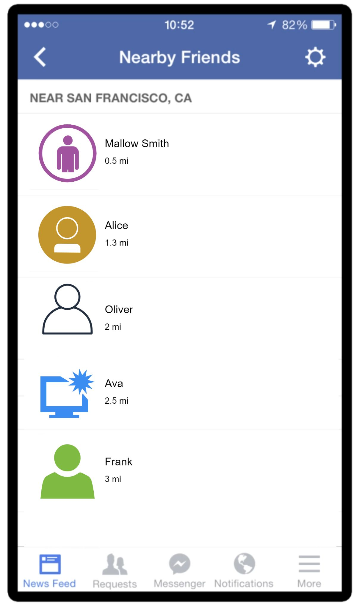 | Facebook Nearby Friends 功能截图 | 问题背景 |
| Figure 2 | 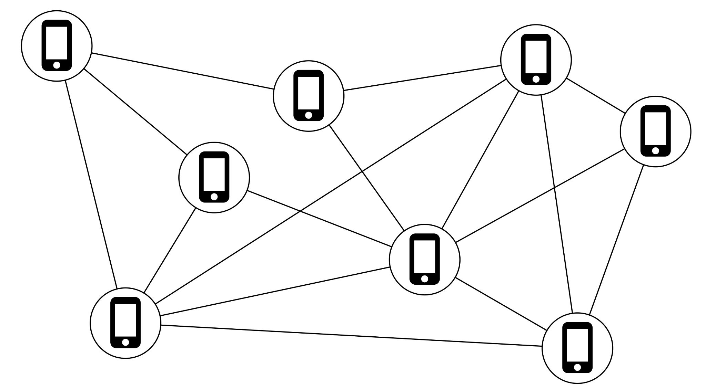 | Peer-to-peer 方案：用户间直接维护持久连接 | 高层设计（初始思路） |
| Figure 3 | 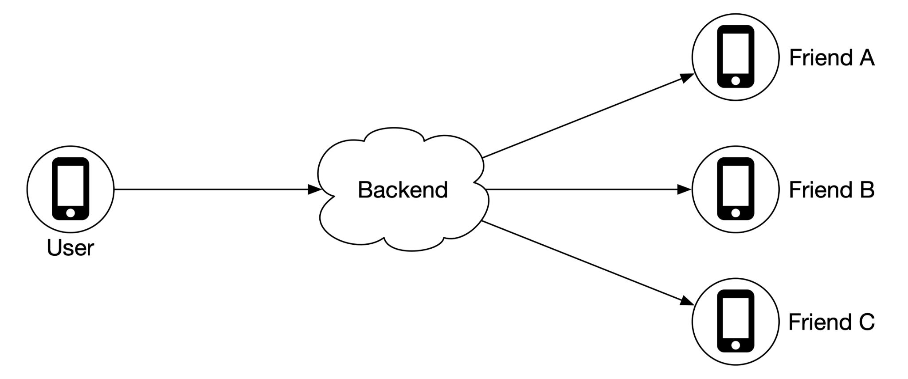 | Shared backend 方案：用户通过共享后端传递位置 | 高层设计（改进思路） |
| Figure 4 | 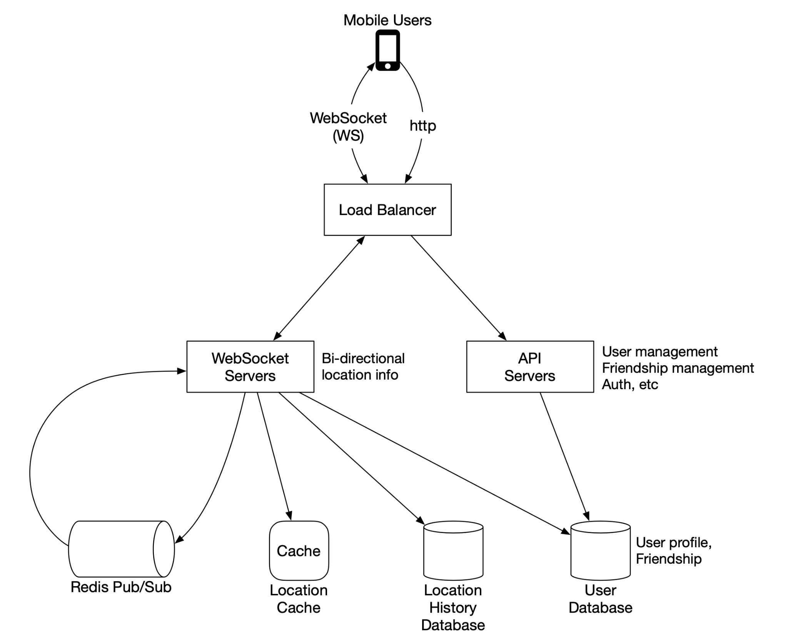 | **完整高层架构图**：Mobile Users → Load Balancer → WebSocket Servers / API Servers → Redis Pub/Sub、Location Cache、Location History DB、User DB | 高层设计 |
| Figure 5 | 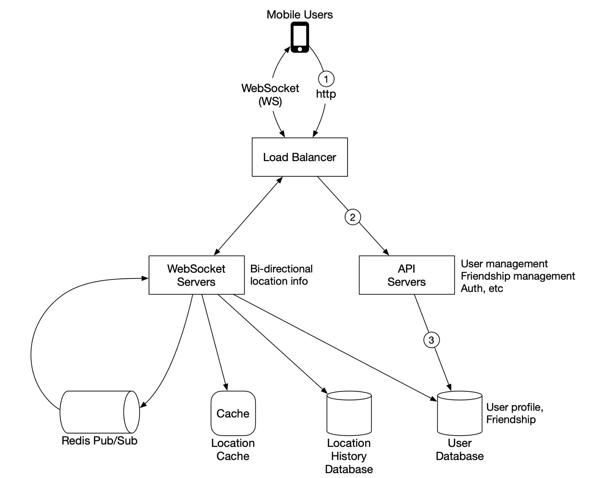 | RESTful API 请求流：Load Balancer → API Servers → User DB | 高层设计 |
| Figure 6 | 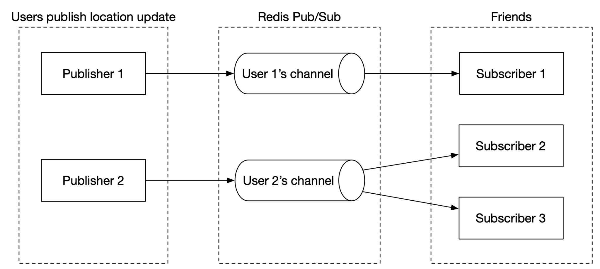 | Redis Pub/Sub 工作原理示意 | 高层设计 |
| Figure 7 | 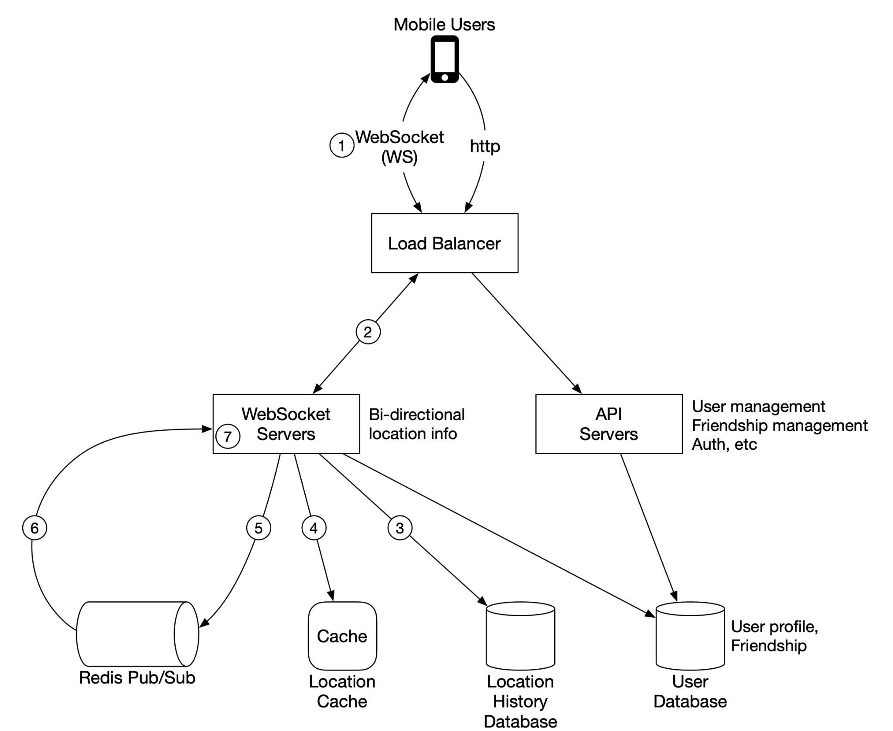 | **周期性位置更新流程**：带编号步骤 1-7，Mobile → LB → WebSocket → 并行写 Location History DB(3)、Location Cache(4)、Redis Pub/Sub(5-6) → 好友 WebSocket(7) | 高层设计 |
| Figure 8 | 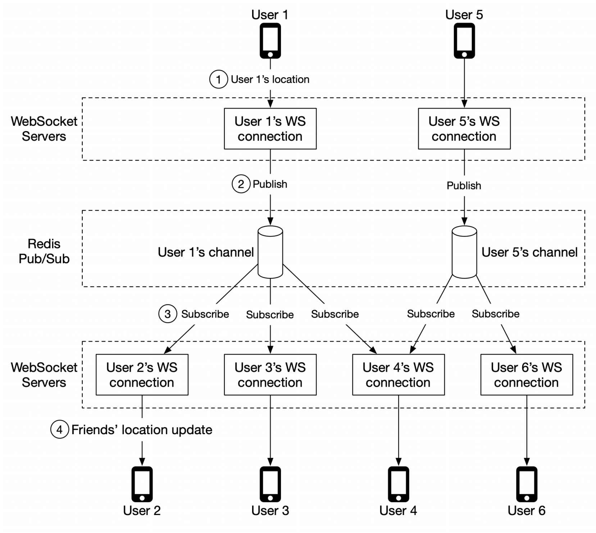 | **位置更新转发具体示例**：User 1 和 User 5 各自 publish 到自己的 channel，好友的 WS connection handler subscribe 并接收更新 | 高层设计 |
| Figure 9 | 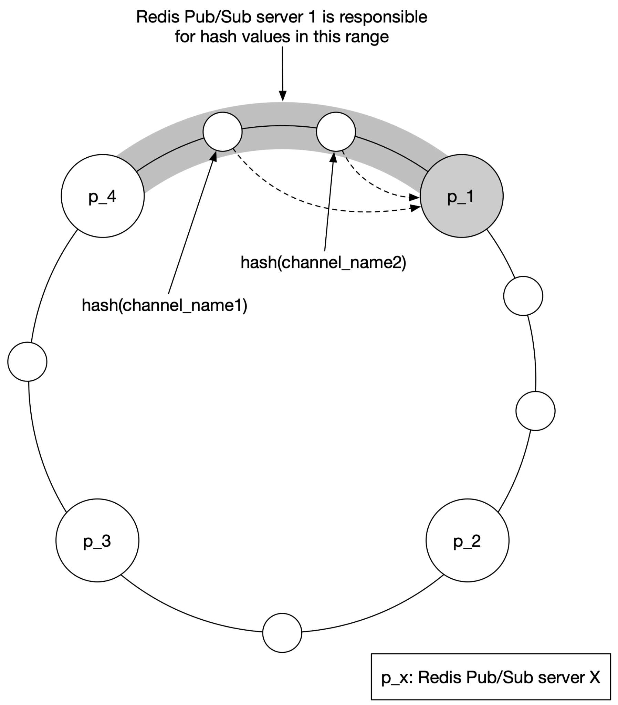 | **Consistent Hashing 环**：p_1~p_4 四个 Redis Pub/Sub server 分布在 hash ring 上，channel 通过 hash 映射到对应 server | 深入设计 |
| Figure 10 | 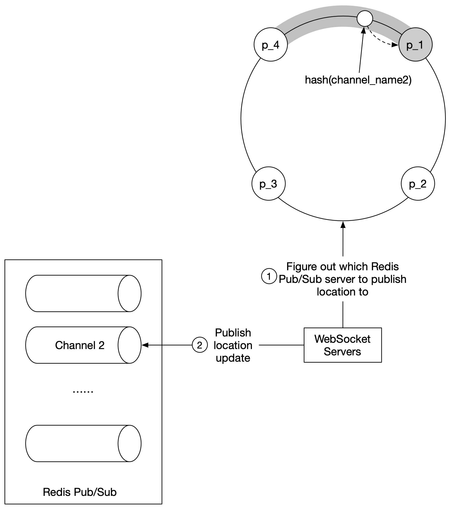 | WebSocket Server 通过 hash ring 确定正确的 Redis Pub/Sub Server 写入 | 深入设计 |
| Figure 11 | 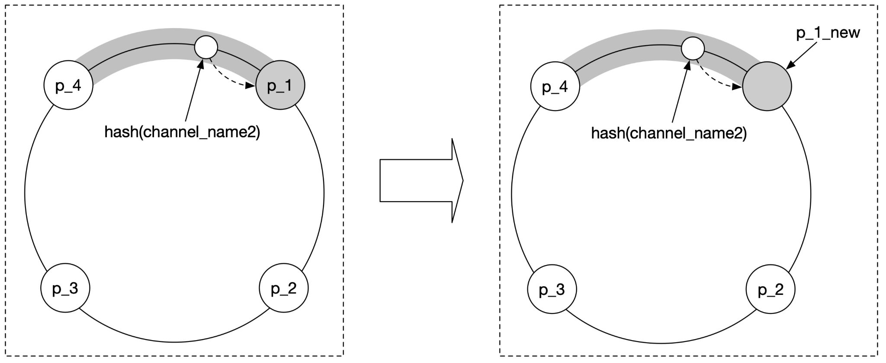 | 替换故障 Pub/Sub Server：p_1 替换为 p_1_new | 深入设计（运维） |
| Figure 12 | 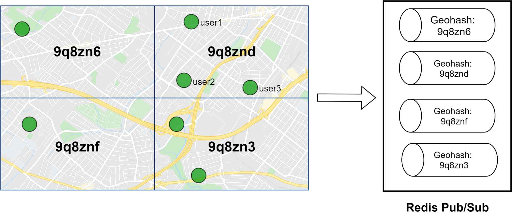 | **Nearby Random Person**：按 geohash 网格划分区域，每个网格一个 Redis Pub/Sub channel（9q8zn6、9q8znd、9q8znf、9q8zn3） | 扩展设计 |
| Figure 13 | 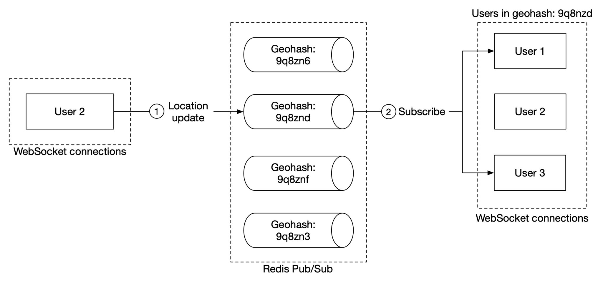 | 用户在 geohash 网格内发布位置更新到该网格 channel | 扩展设计 |
| Figure 14 | 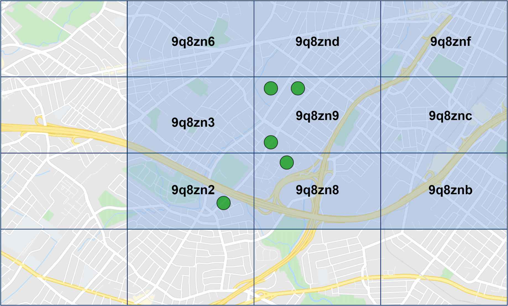 | 九宫格 geohash：订阅所在网格 + 周围 8 个网格解决边界问题 | 扩展设计 |

---

## 设计思路演进

### Step 1: 通信模型选择

```
Peer-to-peer ❌ → 移动设备连接不稳定，功耗高
Shared backend ✅ → 统一后端接收更新并转发给好友
```

后端职责：
1. 接收所有活跃用户的位置更新
2. 找到每个更新应该转发给的在线好友，并转发
3. 距离超过阈值则不转发

### Step 2: 高层架构

```
Mobile Users
    ↓ WebSocket / HTTP
Load Balancer
    ↓              ↓
WebSocket Servers    API Servers (RESTful)
  ↓   ↓   ↓   ↓        ↓
Redis  Location  Location   User
Pub/Sub  Cache   History DB  Database
```

**各组件职责：**

| 组件 | 类型 | 职责 |
|------|------|------|
| Load Balancer | 基础设施 | 分发流量到 WebSocket 和 API Server |
| API Servers | 无状态 HTTP | 辅助功能：添加/删除好友、更新用户资料等 |
| WebSocket Servers | **有状态** | 维持持久连接，处理近实时位置更新推送 + Client 初始化 |
| Redis Location Cache | KV 缓存 | 存储每个活跃用户最新位置，带 TTL 自动过期 |
| User Database | 关系/NoSQL | 用户资料和好友关系数据 |
| Location History DB | 写密集型存储 | 存储历史位置数据（用于 ML 等），推荐 Cassandra |
| Redis Pub/Sub | 消息总线 | **路由层**：将位置更新从一个用户分发到其所有在线好友 |

### Step 3: 周期性位置更新流程（核心）

```
1. Mobile Client → WebSocket (location update)
2. Load Balancer → WebSocket Server
  ┌─ 3. 写入 Location History Database
  ├─ 4. 更新 Location Cache（刷新 TTL）+ 保存到 WS handler 变量
  └─ 5. Publish 到用户自己的 Redis Pub/Sub channel
6. Redis Pub/Sub → Broadcast 到所有订阅者（好友的 WS handler）
7. 每个好友的 WS handler 计算距离
   → 在搜索半径内 → 发送新位置到好友客户端
   → 超出半径 → 丢弃
```

**关键点：** 步骤 3-5 可并行执行。

### Step 4: Redis Pub/Sub 设计

**为什么选 Redis Pub/Sub？**
- Channel 创建极其轻量（现代 Redis 可持有数百万 channel）
- 无订阅者时 publish 直接丢弃，几乎无负载
- 每个用户分配一个 channel，好友在初始化时订阅

**Pub/Sub 模型（每用户一个 channel）：**
```
User 1 的 channel ← User 2、3、4 的 WS handler 订阅
User 5 的 channel ← User 4、6 的 WS handler 订阅
```

好友上线/下线不需要动态订阅/退订，简化设计。Tradeoff 是多用一些内存，但内存不是瓶颈。

### Step 5: 分布式 Redis Pub/Sub 集群

**瓶颈分析：**
- 内存：100M channel x 100 在线好友 x 20 bytes ≈ 200 GB → 约 2 台 Redis
- CPU：1300 万更新/s，单机约处理 10 万推送/s → 需要约 **130 台** Redis
- 结论：**CPU 是瓶颈，不是内存**

**分片方案：Consistent Hashing**
- Channel 通过 publisher 的 user ID hash 映射到 hash ring 上的 Redis Pub/Sub Server
- 使用 Service Discovery（etcd / Zookeeper）管理 hash ring 配置
- WebSocket Server 缓存 hash ring 本地副本，订阅更新保持同步

### Step 6: Client 初始化流程

WebSocket 连接建立后：
1. 更新用户位置到 Location Cache
2. 保存位置到 WS handler 变量
3. 从 User DB 加载所有好友
4. 批量请求 Location Cache 获取好友位置（TTL 过期 = 不活跃）
5. 计算距离，在搜索半径内的好友返回给客户端
6. 订阅所有好友的 Redis Pub/Sub channel（包括不活跃的好友）
7. 发送用户位置到自己的 channel

---

## 关键设计考量 (Tradeoffs)

### 1. WebSocket vs HTTP Polling
- **WebSocket**：双向持久连接，适合频繁的位置更新推送
- HTTP Polling 在 30 秒间隔 + 1000 万用户规模下效率极低
- WebSocket Server 是**有状态的**，扩缩容需要注意连接排空（draining）

### 2. Redis Pub/Sub 的有状态特性
- 消息本身是无状态的（发完即丢，不持久化）
- 但 channel 的**订阅者列表是有状态的**
- 扩缩容时 channel 迁移会导致大量重新订阅，可能丢失部分更新
- 应视为**有状态集群**管理，提前预留容量，避免频繁调整
- 调整应在每天流量最低时进行

### 3. Location Cache 设计
- 只关心当前位置 → 每用户只存一条 → Redis + TTL
- 不需要持久化：Redis 挂掉后空实例重启，等新数据流入即可
- 单机可承载 1000 万用户位置（每条 < 100 bytes），但 334K/s 写入需**分片**
- 按 user ID 分片，可加 standby 节点提升可用性

### 4. Location History 存储选型
- 写密集型 → **Cassandra** 或按 user ID 分片的关系型数据库
- 不直接服务于 Nearby Friends 功能，但对 ML 等有价值

### 5. Redis Pub/Sub 集群运维
- **替换单台故障节点**：风险低，只影响该节点上的 channel
  - 监控告警 → 运维更新 hash ring → WS Server 重新订阅受影响 channel
- **集群扩缩容**：风险高，大量 channel 迁移
  - 步骤：确定新 ring 大小 → 更新 hash ring → 监控 CPU spike
  - 应在低流量时段操作

### 6. 好友数量上限与热点问题
- 好友数有硬上限（如 Facebook 5000 人），不是粉丝模型
- 订阅者分散在多台 WebSocket Server 上，不会造成热点
- "大户" 用户分散在多台 Pub/Sub Server 上，增量负载可控

### 7. 添加/删除好友的处理
- 客户端注册 callback，好友变更时发送 WebSocket 消息
- 添加好友 → subscribe 新好友 channel，返回其最新位置
- 删除好友 → unsubscribe 该好友 channel
- 同样适用于好友开启/关闭位置共享

---

## 面试扩展话题

### Nearby Random Person（附近陌生人）
- 按 **geohash** 将区域划分为网格，每个网格一个 Redis Pub/Sub channel
- 用户位置更新时，计算所属 geohash，publish 到该网格 channel
- 所有订阅该 channel 的用户（排除发送者）收到更新
- **边界问题**：客户端订阅所在网格 + 周围 8 个网格（九宫格）

### Erlang 替代方案
- Erlang/OTP 的轻量级 process（约 300 bytes/process）天然适合此场景
- 可以将每个活跃用户建模为一个 Erlang process
- 用 Erlang 实现 WebSocket 服务，并**完全替代 Redis Pub/Sub 集群**
- 用户 process 之间通过 Erlang 原生的 subscription 机制形成 mesh 连接
- 优势：更低的运维开销、优秀的分布式支持、生产环境调试工具
- 劣势：Erlang 生态小众，招聘困难

### 其他潜在话题
- Service Discovery 的选型（etcd vs Zookeeper）与高可用
- WebSocket Server 的版本发布与灰度（需同样的 draining 策略）
- 位置数据的隐私合规（GDPR / CCPA）
- 位置精度与电池消耗的权衡

---

## 速写练习要点

盲画时重点记住这些组件和连接：

1. **核心架构**：Mobile → Load Balancer → WebSocket Servers（有状态）+ API Servers（无状态）
2. **四个存储**：Redis Pub/Sub、Location Cache（Redis + TTL）、Location History DB（Cassandra）、User DB
3. **位置更新流**：WS Server 并行写 History DB / Cache / Pub/Sub → 好友 WS handler 收到 → 计算距离 → 决定是否转发
4. **Pub/Sub 分片**：Consistent Hashing ring + Service Discovery（etcd）→ WebSocket Server 缓存本地 hash ring
5. **Nearby Random Person 扩展**：Geohash 网格 → 每格一个 Pub/Sub channel → 九宫格订阅解决边界
6. **关键数字**：334K QPS 位置更新，1300 万/s 推送转发，约 130 台 Redis Pub/Sub Server（CPU 瓶颈）
