# Chapter 5: Design a Metrics Monitoring and Alerting System

## 问题定义

设计一个可扩展的 Metrics Monitoring and Alerting System，面向大型公司内部使用，提供基础设施健康状况的可视化，确保高可用和高可靠。

**核心需求：**
- 监控运维指标（CPU load、Memory usage、Disk space、Request count 等），不含业务指标
- 规模：100M DAU，1,000 server pools x 100 machines/pool x 100 metrics/machine = ~10M metrics
- 数据保留 1 年，支持 downsampling（7 天原始 → 30 天 1 分钟精度 → 1 年 1 小时精度）
- 告警渠道：Email、Phone、PagerDuty、Webhooks

**非功能需求：**
- Scalability：适应不断增长的 metrics 和 alert 量
- Low latency：Dashboard 和 Alert 的查询延迟要低
- Reliability：不漏报关键告警
- Flexibility：Pipeline 可灵活集成新技术

**不在范围内：**
- Log monitoring（ELK Stack 领域）
- Distributed system tracing（Zipkin/Dapper 领域）

---

## 架构图索引

| Figure | 文件 | 内容 | 设计阶段 |
|--------|------|------|----------|
| 5-1 | 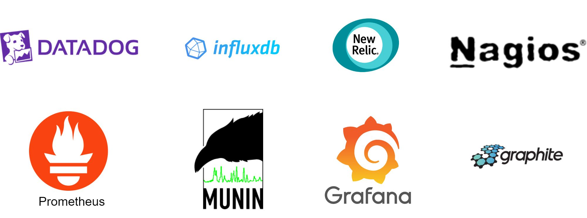 | 市面主流监控告警服务（Datadog, Splunk 等） | 背景 |
| 5-2 | 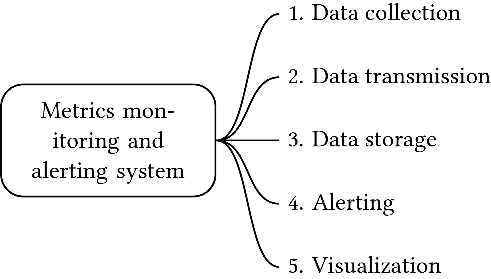 | 系统五大组件：Data Collection → Transmission → Storage → Alerting → Visualization | 基础模型 |
| 5-3 | 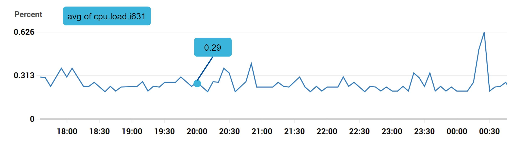 | CPU load 数据点示例（时间序列模型） | 数据模型 |
| 5-4 | 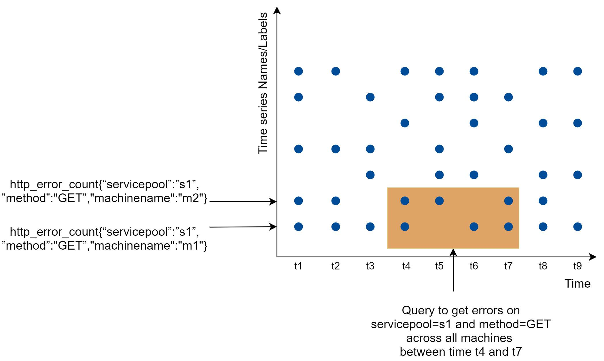 | 数据访问模式：y 轴为 time series，x 轴为时间，写密集读突发 | 数据模型 |
| 5-5 | 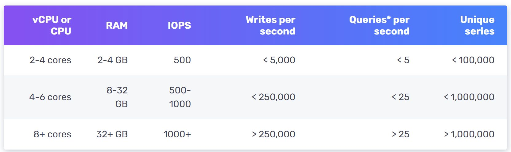 | InfluxDB 性能基准：8 核 32GB RAM 可达 250K writes/s | 存储选型 |
| 5-6 | 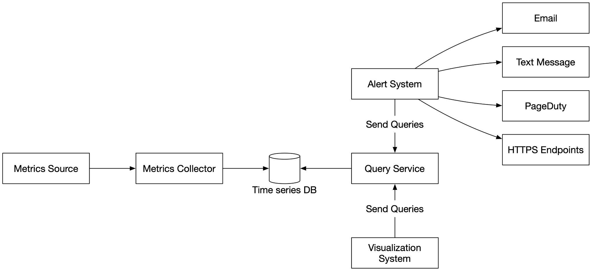 | **高层设计图**：Metrics Source → Metrics Collector → Time Series DB → Query Service → Alert System / Visualization System，Alert 输出到 Email/Text/PagerDuty/HTTPS | 高层设计 |
| 5-7 | 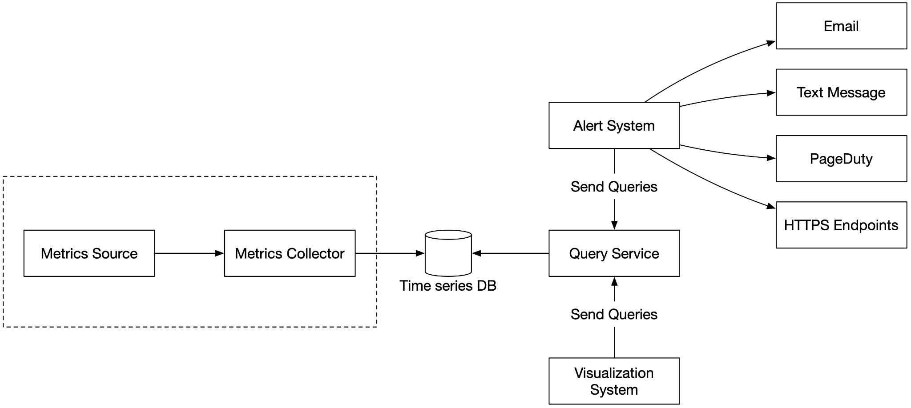 | Metrics Collection 流程（虚线框标注采集部分） | 深入设计 |
| 5-8 | 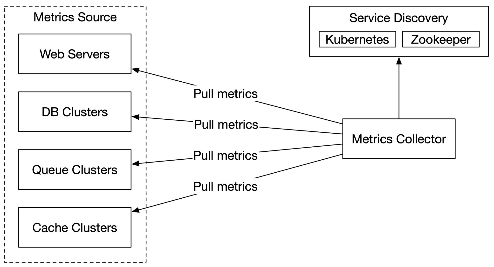 | Pull Model：Metrics Collector 通过 HTTP 从应用拉取 | 采集模型 |
| 5-9 | 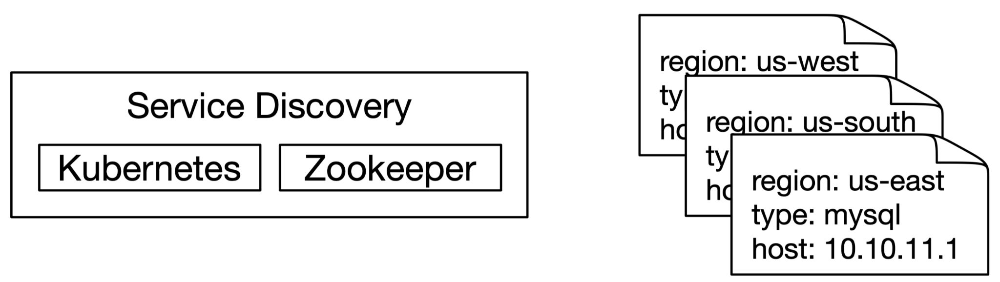 | Service Discovery 配置规则 | 采集模型 |
| 5-10 | 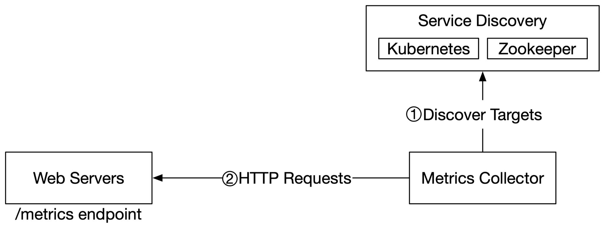 | Pull Model 详细流程：Service Discovery → Collector → /metrics endpoint | 采集模型 |
| 5-11 | 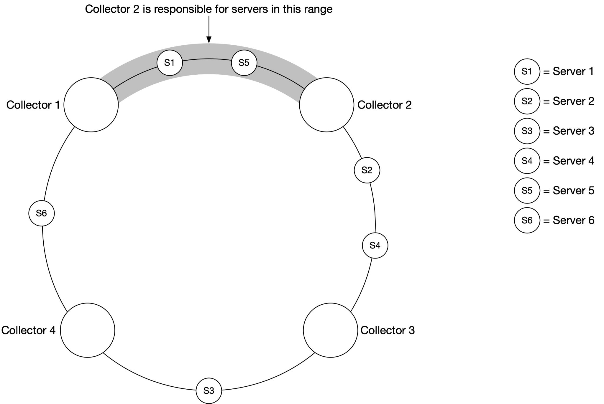 | **Consistent Hashing**：4 个 Collector 和 6 台 Server 在哈希环上的分配，每个 Collector 负责一段范围内的 Server | 采集模型 |
| 5-12 | 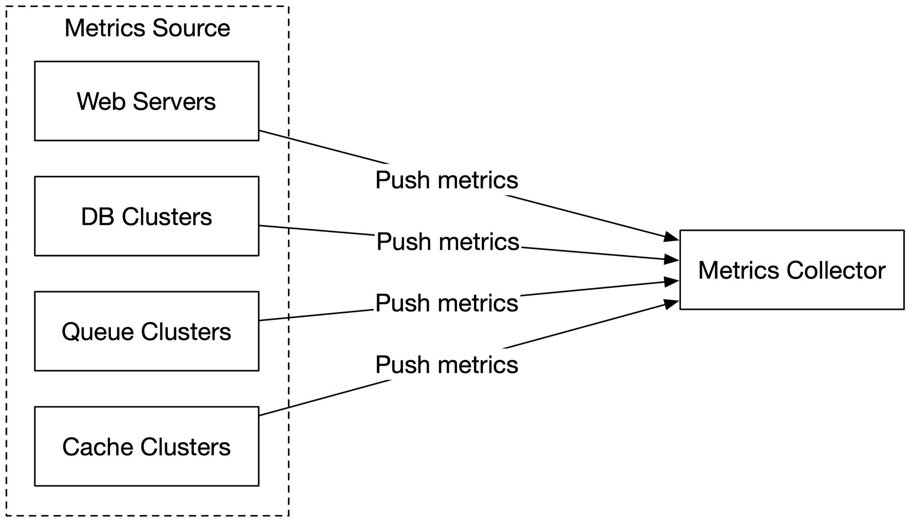 | Push Model：各 Metrics Source 直接推送到 Collector | 采集模型 |
| 5-13 | 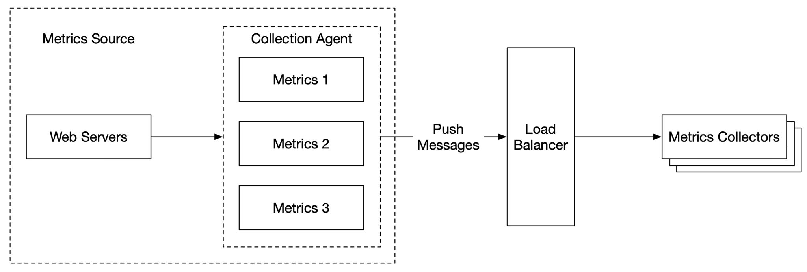 | Push Model + Load Balancer + Auto-scaling Collector 集群 | 采集模型 |
| 5-14 |  | Metrics Transmission Pipeline（Collector → Time Series DB） | 传输管道 |
| 5-15 | 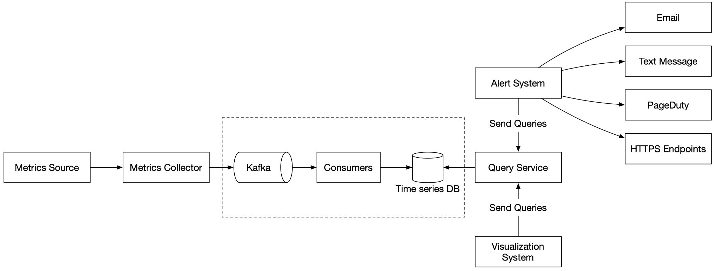 | **引入 Kafka 的架构**：Metrics Source → Collector → Kafka → Consumers → Time Series DB → Query Service → Alert/Visualization，虚线框标注 Kafka 管道 | 传输管道 |
| 5-16 | 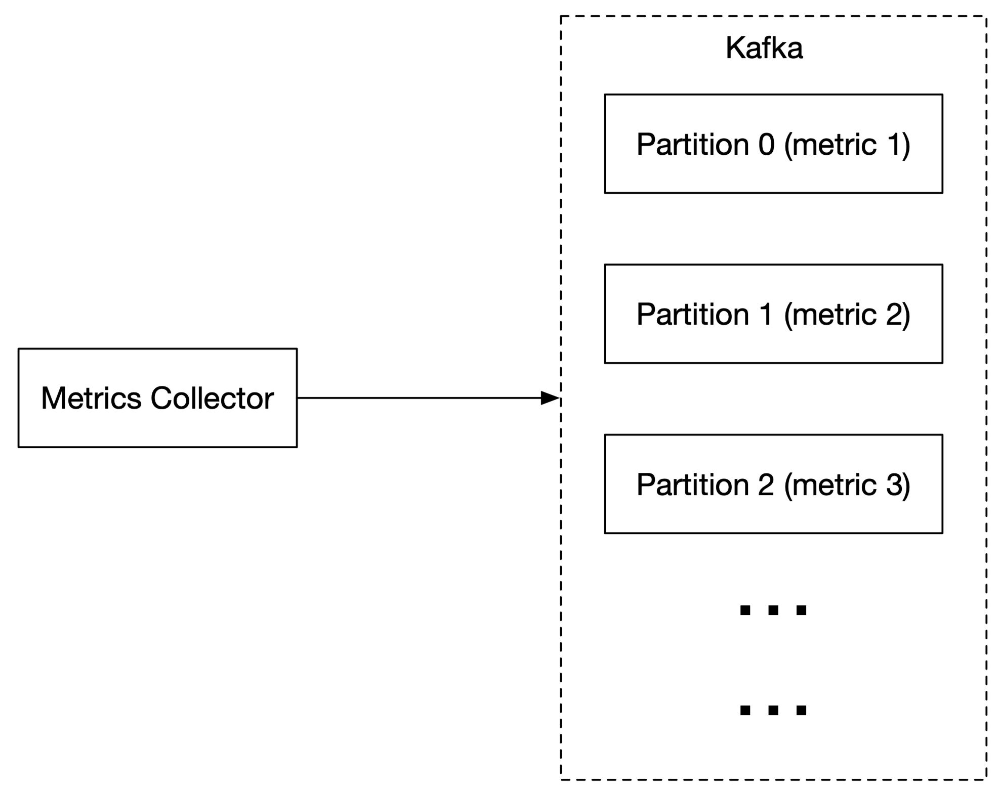 | Kafka Partition：按 metric name 分区 | 传输管道 |
| 5-17 | 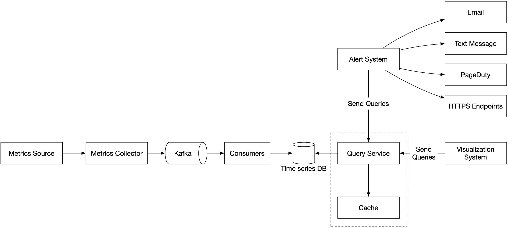 | Query Service + Cache Layer | 查询服务 |
| 5-18 | 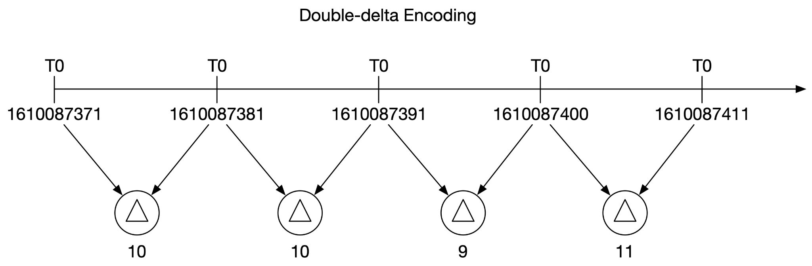 | 数据编码：时间戳 delta 编码（32 bit → 4 bit） | 存储优化 |
| 5-19 | 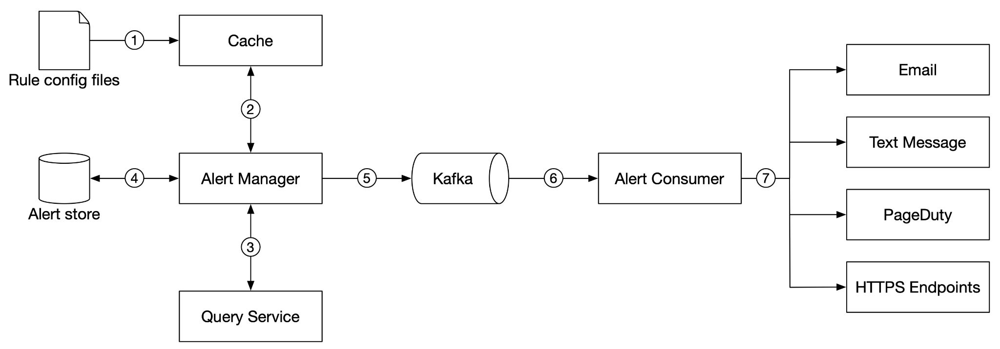 | **Alert System 详细流程**：Rule Config Files →(1) Cache →(2) Alert Manager →(3) Query Service；Alert Manager →(4) Alert Store (KV DB)；→(5) Kafka →(6) Alert Consumer →(7) Email/Text/PagerDuty/HTTPS | 告警系统 |
| 5-20 | 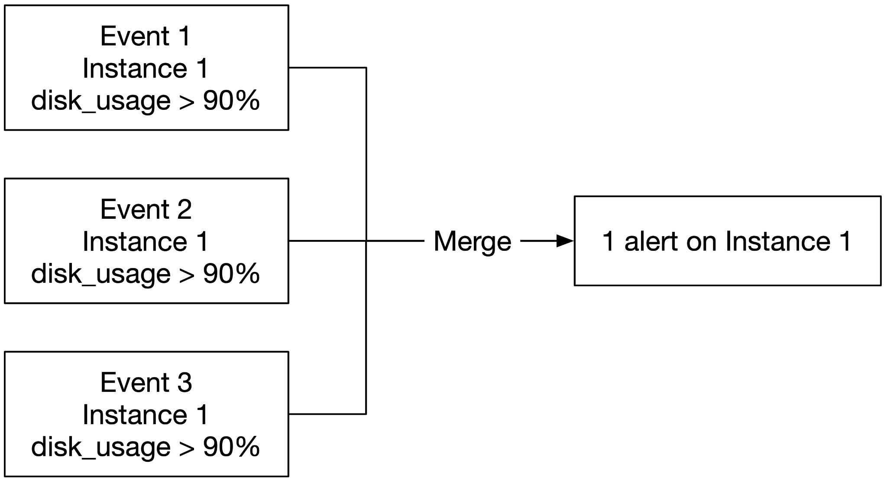 | Alert 合并示例（同实例多告警合并） | 告警系统 |
| 5-21 | 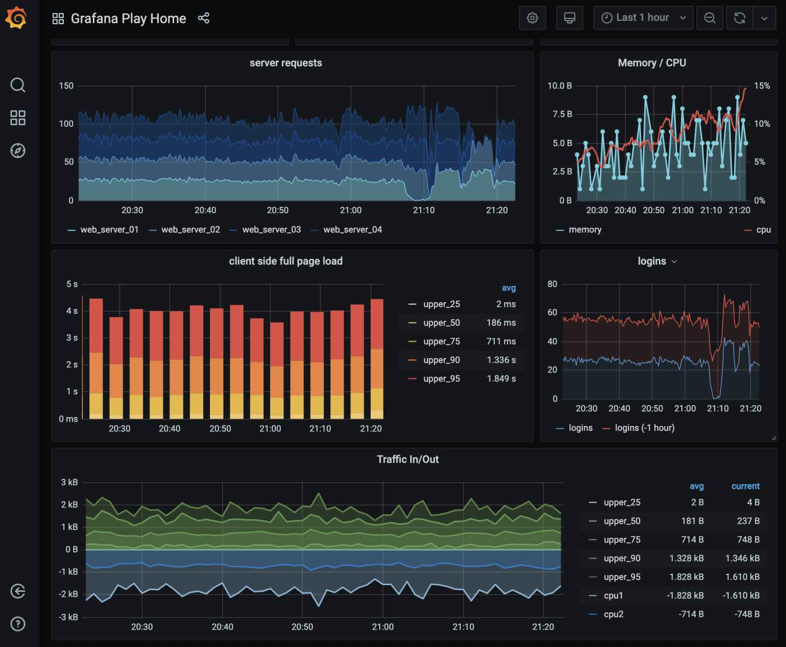 | Grafana Dashboard UI（展示 server requests、CPU、memory 等指标） | 可视化 |
| 5-22 |  | **最终设计图**：完整架构，包含 Metrics Source → Collector → Kafka → Consumers → Time Series DB → Query Service（含 Cache）→ Alert System / Visualization System | 最终设计 |

---

## 设计思路演进

### Step 1: 系统五大组件

```
Data Collection → Data Transmission → Data Storage → Alerting → Visualization
```

核心理解：监控系统本质上是一个 **时间序列数据管道**，从采集到存储到消费（告警 + 可视化）。

### Step 2: 数据模型 - Time Series

每个 metric 数据点由三部分组成：
- **metric_name**（String）：如 `cpu.load`
- **labels/tags**（Key-Value pairs）：如 `host:i631, env:prod`
- **values + timestamps**（数组）：如 `<0.29, 1613707265>`

采用 **Line Protocol** 格式（Prometheus / OpenTSDB 通用）：
```
CPU.load host=webserver01,region=us-west 1613707265 50
```

**数据访问模式：** 写密集（~10M metrics 持续写入），读突发（Dashboard 和 Alert 的 spiky read）。

### Step 3: 存储选型 - 为什么用 Time-Series DB

```
关系型数据库 ❌ → 时间序列操作需要复杂 SQL，heavy write 下性能差
NoSQL (Cassandra/Bigtable) △ → 可行但需深入调优 schema
Time-Series DB ✅✅ → InfluxDB / Prometheus（专用优化，250K writes/s）
```

关键特性：按 label 建索引，支持快速聚合分析，内置 data retention 和 aggregation。

### Step 4: 高层架构

```
Metrics Source → Metrics Collector → Time Series DB → Query Service → Alert System
                                                                    → Visualization System
```

Alert System 输出到 Email / Text Message / PagerDuty / HTTPS Endpoints。

### Step 5: Metrics Collection - Pull vs Push

**Pull Model：**
```
Service Discovery (etcd/ZooKeeper)
        ↓ (配置元数据：IP、拉取间隔、超时参数)
Metrics Collector ──HTTP GET /metrics──→ Application Servers
```
- 多 Collector 协调：用 **Consistent Hashing** 将 server 映射到 collector，避免重复采集
- 代表：Prometheus

**Push Model：**
```
Application Servers → Collection Agent → Metrics Collector (behind Load Balancer)
                      (本地聚合)         (Auto-scaling Cluster)
```
- Agent 本地聚合后推送，减少传输量
- 代表：Amazon CloudWatch, Graphite

### Step 6: 引入 Kafka 扩展传输管道

```
Metrics Collector → Kafka → Consumers (Storm/Flink/Spark) → Time Series DB
```

解决问题：Time Series DB 不可用时防止数据丢失，解耦采集和处理。

**Kafka 扩展策略：**
- 按 metric name 分 partition → consumer 可按 metric 聚合
- 进一步按 tags/labels 分区
- 对 metrics 分优先级，重要指标优先处理

### Step 7: Query Service + Cache

```
Visualization / Alert System → Query Service → Cache → Time Series DB
```

Query Service 作为薄封装层，解耦消费端和存储端。Cache 缓存查询结果降低 DB 负载。

### Step 8: 存储层优化

- **Data Encoding**：时间戳 delta 编码（如 `base=1610087371, +10, +10, +9, +11`），32 bit → 4 bit
- **Downsampling**：7 天原始 → 30 天 1 分钟精度 → 1 年 1 小时精度
- **Cold Storage**：不活跃数据转入低成本存储

### Step 9: Alert System

```
Rule Config Files →(1) Cache →(2) Alert Manager →(3) Query Service
                                       ↕ (4)
                                  Alert Store (Cassandra, 记录状态: inactive/pending/firing/resolved)
                                       ↓ (5)
                                     Kafka →(6) Alert Consumer →(7) Email / Text / PagerDuty / Webhooks
```

Alert Manager 职责：
- Filter / Merge / Dedupe（同实例告警合并）
- Access Control（权限控制）
- Retry（至少一次通知保证）

---

## 关键设计考量 (Tradeoffs)

### 1. Pull vs Push 模型选择

| 维度 | Pull | Push |
|------|------|------|
| 调试 | `/metrics` 端点随时可查 (**Pull 胜**) | - |
| 健康检查 | 无响应即知 server down (**Pull 胜**) | 无 metrics 可能是网络问题 |
| 短生命周期任务 | 来不及被 pull | Agent 主动推送 (**Push 胜**) |
| 防火墙/复杂网络 | 需所有端点可达 | LB + auto-scaling 可接收任意来源 (**Push 胜**) |
| 传输性能 | TCP | UDP，延迟更低 (**Push 微胜**) |
| 数据真实性 | 预定义 config，来源可信 (**Pull 胜**) | 任意 client 可推送，需白名单/认证 |

**结论：** 大型组织应同时支持两种模型，尤其在 Serverless 场景下无法安装 agent。

### 2. 通用数据库 vs Time-Series DB

- 关系型 DB：时间序列操作的 SQL 极为复杂（如 exponential moving average），heavy write 性能差
- NoSQL：可行但需深度 schema 调优，无专用查询语言
- Time-Series DB：专用优化（高吞吐写入、label 索引、内置聚合和 retention 策略）

### 3. Kafka 引入 vs 直连 DB

- **引入 Kafka**：解耦、缓冲、防数据丢失、支持 partition 扩展
- **反对意见**：维护 Kafka 集群开销大；Facebook Gorilla 证明了高可用 TSDB 可直接写入不用中间队列
- **Tradeoff**：可靠性 vs 运维复杂度

### 4. Aggregation 在哪里做？

| 位置 | 优点 | 缺点 |
|------|------|------|
| Collection Agent（客户端） | 简单聚合，减少传输量 | 只能做简单逻辑（如 counter） |
| Ingestion Pipeline（写入前） | 大幅减少写入量 | 丢失数据精度，late event 处理复杂 |
| Query Side（查询时） | 无数据损失 | 查询慢，需扫描全量数据 |

### 5. Build vs Buy（告警和可视化）

- **告警系统**：工业级现成方案丰富，与 TSDB 深度集成；自建需要强理由
- **可视化系统**：Grafana 等工具与主流 TSDB 完美集成，自建性价比极低
- **面试建议**：Senior 岗位需准备好 justify 自建 vs 采购的决策

### 6. Query Service 的必要性

- **正方**：解耦消费端和存储，灵活替换 TSDB 或可视化/告警系统
- **反方**：主流可视化/告警系统已内置 TSDB 插件，额外抽象层可能多余
- 好的 TSDB 自带查询语言（Flux / PromQL），无需额外 cache

---

## 面试扩展话题

- **Pull vs Push 深入辩论**：理解优劣比选定答案更重要；大型系统可能两者共存
- **Kafka 替代方案**：Facebook Gorilla 直连高可用 TSDB 的模式，省去中间队列的运维开销
- **Time-Series DB 内部原理**：InfluxDB 存储引擎设计（TSM Tree），Prometheus 的本地存储
- **专用查询语言 vs SQL**：Flux (InfluxDB) / PromQL (Prometheus) 在时间序列分析场景远优于 SQL
- **Downsampling 策略设计**：如何定义不同 metric 的 retention 和 resolution 规则
- **Aggregation 策略**：客户端 vs 管道 vs 查询时，根据场景权衡精度、延迟、存储
- **Alert 去重与合并**：同实例多告警如何 merge，alert state machine（inactive → pending → firing → resolved）
- **Cold Storage**：不活跃数据转入低成本存储（S3、Glacier），对查询延迟的影响
- **Data Encoding / Compression**：delta encoding、Gorilla compression 等时间序列专用压缩技术
- **Serverless 监控挑战**：无法安装 agent 的场景如何采集 metrics（Push Gateway）
- **Build vs Buy 决策**：在面试中需能论证何时自建、何时采购（Grafana、PagerDuty、Datadog）

---

## 速写练习要点

盲画时重点记住这些组件和连接：

1. **核心数据流**：Metrics Source → Metrics Collector → Kafka → Consumers → Time Series DB
2. **查询层**：Time Series DB → Query Service (+ Cache) → Alert System / Visualization System
3. **Pull Model 关键要素**：Service Discovery → Collector → /metrics endpoint + Consistent Hashing 环
4. **Push Model 关键要素**：Agent → Load Balancer → Auto-scaling Collector Cluster
5. **Alert 流程 7 步**：Rule Config →(1) Cache →(2) Alert Manager →(3) Query Service →(4) Alert Store →(5) Kafka →(6) Alert Consumer →(7) 通知渠道
6. **存储优化三板斧**：Delta Encoding + Downsampling + Cold Storage
7. **最终架构区别于高层设计**：多了 Kafka 管道和 Cache 层
