# Chapter 8: Design a Distributed Email Service

## 问题定义

设计一个大规模邮件服务（如 Gmail、Outlook），支持 10 亿用户级别的邮件收发、存储与搜索。

**核心需求：**
- 发送和接收邮件（含 Attachment）
- 获取所有邮件、按已读/未读过滤
- 按主题、发件人、正文搜索邮件
- Anti-spam 与 Anti-virus
- 支持 HTTP 协议的 Web 客户端通信

**非功能需求：**
- Reliability：邮件数据不能丢失
- Availability：多节点自动复制，部分故障不影响服务
- Scalability：用户和邮件增长不影响性能
- Flexibility / Extensibility：支持超越传统 POP/IMAP 的新功能

**规模估算：**
- 10 亿用户，发送 QPS ~ 100,000
- 每人每天收 40 封邮件，metadata 50KB/封 → 1 年 730 PB
- 20% 邮件有附件，平均 500KB → 1 年 1,460 PB
- 结论：必须使用分布式数据库方案

---

## 架构图索引

| Figure | 文件 | 内容 | 设计阶段 |
|--------|------|------|----------|
| Figure 1 |  | 主流邮件服务商（Gmail, Outlook, Yahoo Mail）概览 | 背景介绍 |
| Figure 2 | 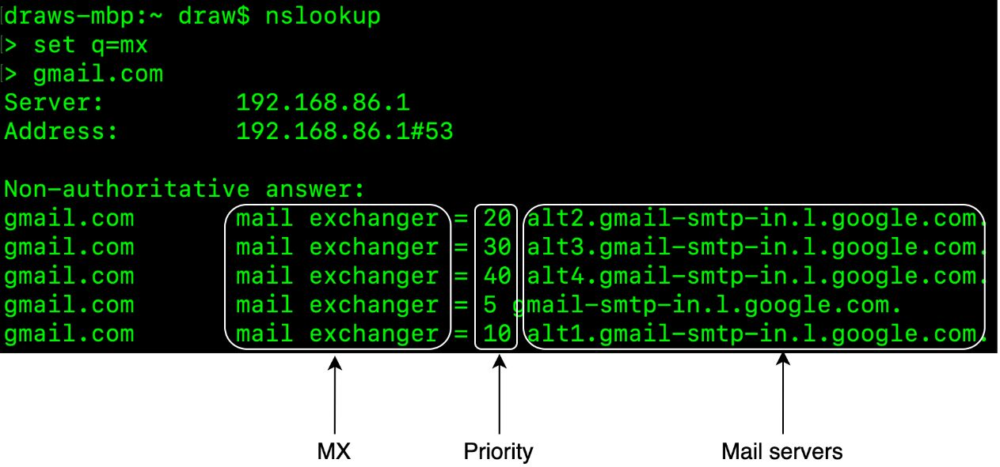 | DNS MX 记录查询示例（gmail.com 的 MX records 按优先级排列） | 基础知识 |
| Figure 3 | 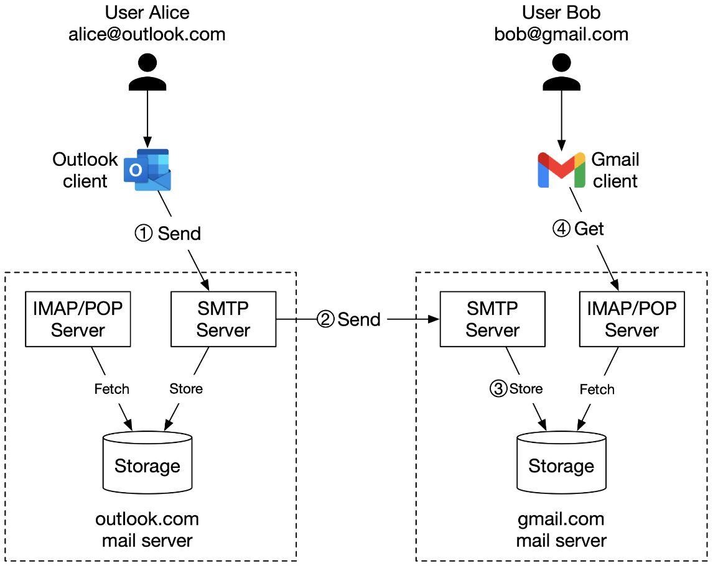 | 传统邮件服务器架构：Alice(Outlook) 通过 SMTP 发送到 Bob(Gmail)，经 IMAP/POP 获取 | 高层设计 |
| Figure 4 | 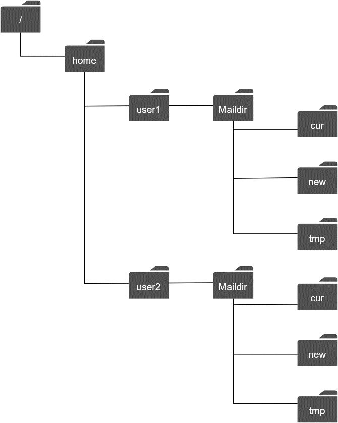 | Maildir 目录结构：传统文件系统存储邮件的方式 | 高层设计 |
| Figure 5 | 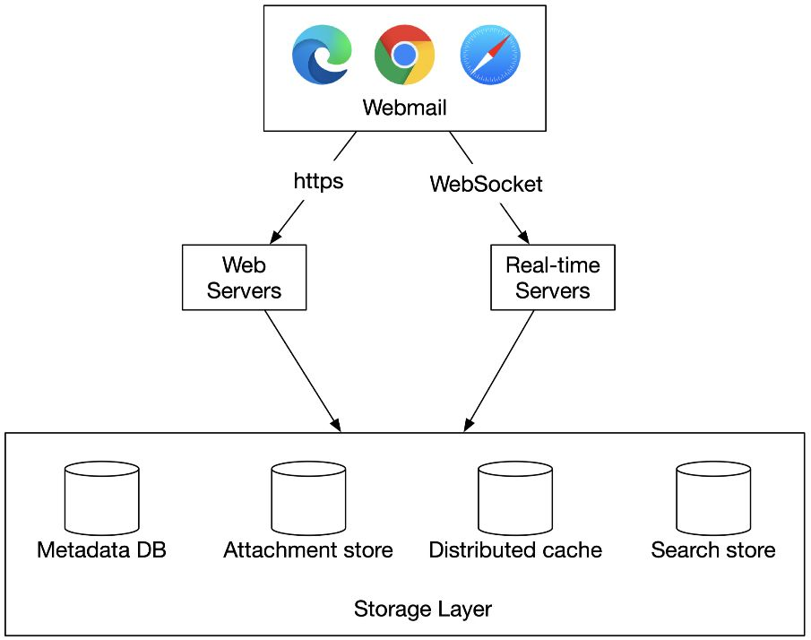 | **分布式邮件服务器高层架构**：Webmail 通过 HTTPS 连接 Web Servers、通过 WebSocket 连接 Real-time Servers，底层 Storage Layer 包含 Metadata DB、Attachment Store、Distributed Cache、Search Store | 高层设计 |
| Figure 6 | 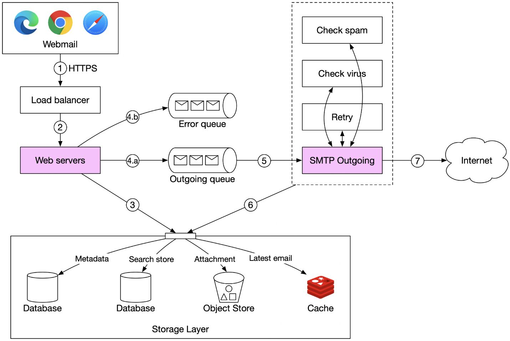 | **邮件发送流程**：Webmail → Load Balancer → Web Servers → Outgoing Queue / Error Queue → SMTP Outgoing (Check Spam/Virus/Retry) → Internet；同时写入 Storage Layer（Metadata DB、Search Store、Object Store、Cache） | 核心流程 |
| Figure 7 | 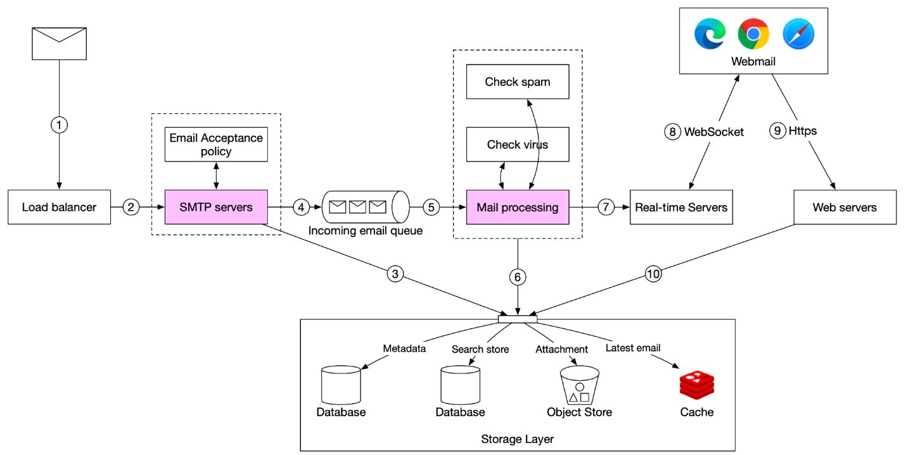 | **邮件接收流程**：邮件 → Load Balancer → SMTP Servers (Email Acceptance Policy) → Incoming Queue → Mail Processing (Check Spam/Virus) → Storage Layer + Real-time Servers (WebSocket) / Web Servers (HTTPS) → Webmail | 核心流程 |
| Figure 8 | 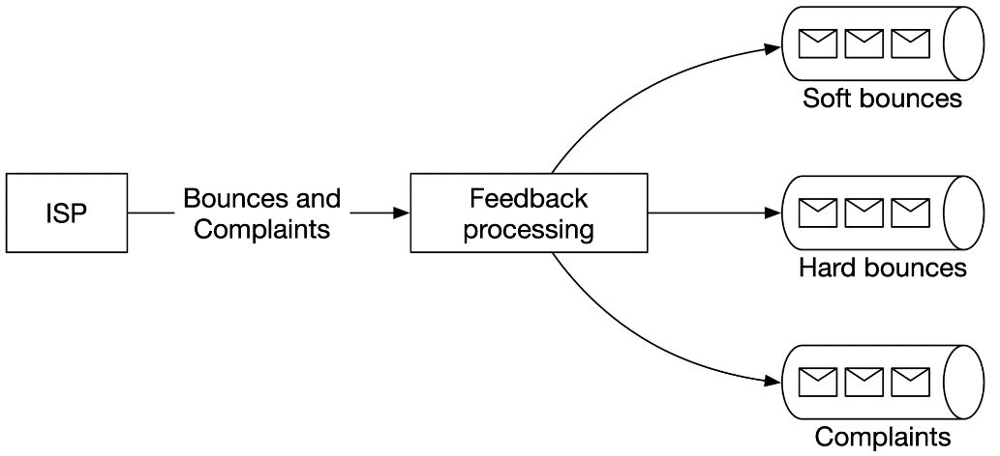 | Feedback Loop 处理：ISP 返回 Bounces/Complaints → Feedback Processing → 分别入 Soft Bounces、Hard Bounces、Complaints 三个队列 | 深入设计 |
| Figure 9 | 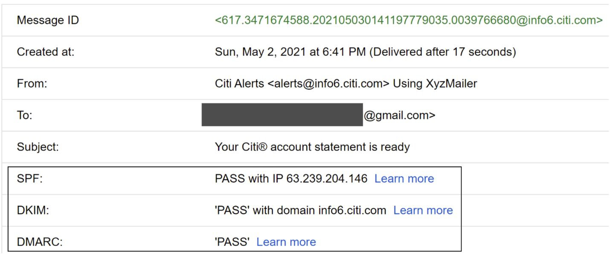 | Gmail 邮件头示例：展示 SPF、DKIM、DMARC 认证信息 | 深入设计 |
| Figure 10 | 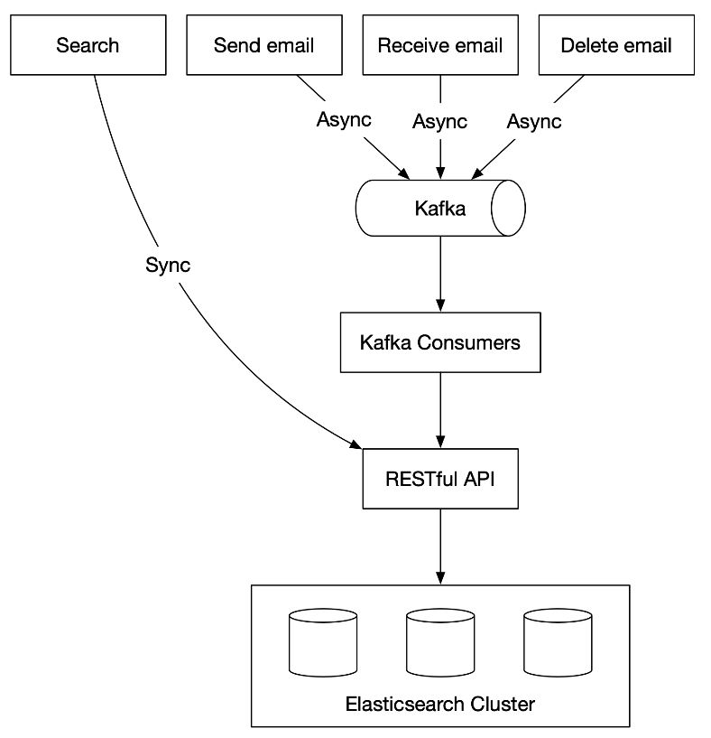 | **Elasticsearch 搜索架构**：Send/Receive/Delete 事件异步经 Kafka → Kafka Consumers → RESTful API → Elasticsearch Cluster；Search 操作同步查询 ES Cluster | 深入设计 |
| Figure 11 | 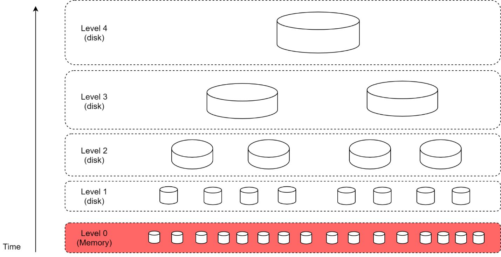 | LSM Tree 结构：Level 0 (Memory, 红色) → Level 1-4 (Disk)，数据从内存逐层 merge 到磁盘，优化顺序写入 | 深入设计 |
| Figure 12 | 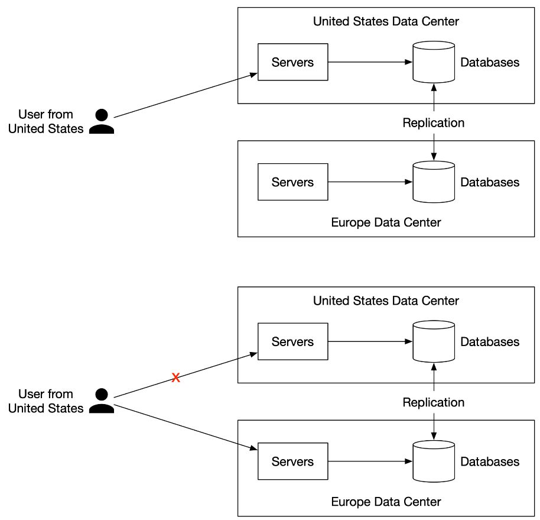 | **多数据中心部署**：用户就近连接 US/Europe Data Center，数据库间 Replication；故障时自动 failover 到另一个 DC | 可扩展性 |
| Table 1 | 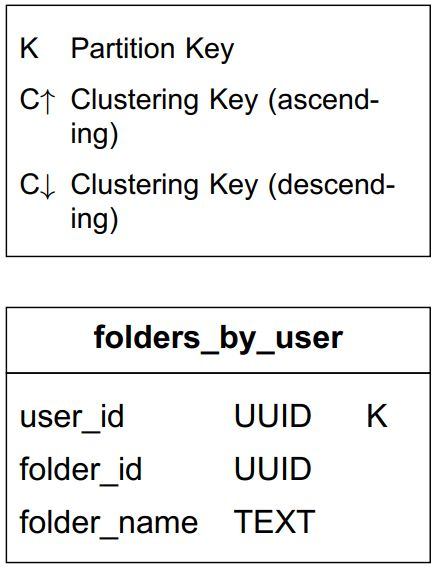 | Folders by User 表结构：partition key = user_id | 数据模型 |
| Table 2 | 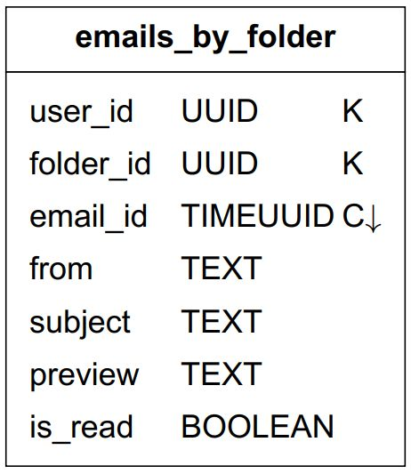 | Emails by Folder 表结构：composite partition key = <user_id, folder_id>，clustering key = email_id (TIMEUUID) | 数据模型 |
| Table 3 | 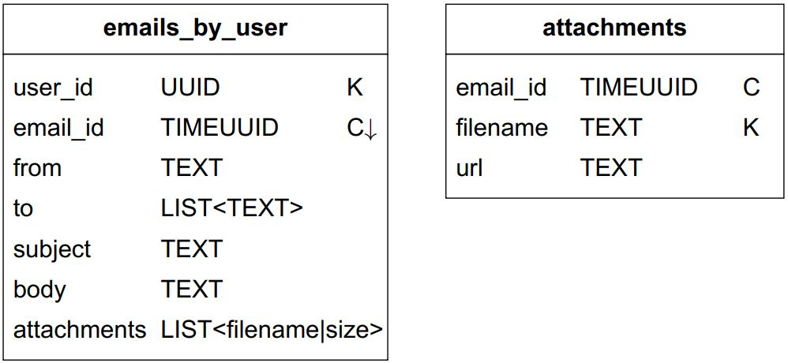 | Emails by User 表结构：支持按 email_id 查询邮件详情及附件 | 数据模型 |
| Table 4 | 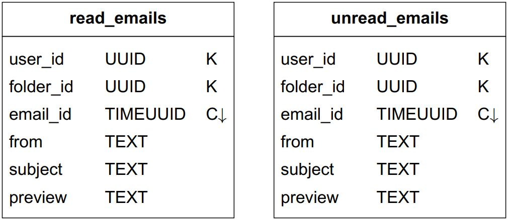 | Read/Unread Emails 反范式化表：拆分为 read_emails 和 unread_emails 两张表 | 数据模型 |

---

## 设计思路演进

### Step 1: 邮件协议基础 → 传统架构的局限

```
传统架构：
  Alice (Outlook) --SMTP--> Outlook SMTP Server --SMTP--> Gmail SMTP Server
  Bob (Gmail) <--IMAP/POP-- Gmail IMAP/POP Server <--Fetch-- Gmail Storage

协议对比：
  SMTP  → 发送协议（服务器间、客户端到服务器）
  POP   → 下载后删除，只能单设备访问
  IMAP  → 按需下载，多设备访问，最广泛使用
  HTTPS → 非传统协议，但 Web 邮件和 ActiveSync 广泛使用
```

**传统架构的问题：**
- 文件系统存储（Maildir）→ 磁盘 I/O 成瓶颈，无法备份数十亿邮件
- 单服务器设计 → 无法横向扩展、无高可用
- POP/IMAP/SMTP 协议年代久远 → 不支持 threading、labels、搜索等现代功能

### Step 2: 分布式邮件服务器高层架构

```
                    Webmail (浏览器)
                   /              \
              HTTPS              WebSocket
                /                    \
         Web Servers          Real-time Servers
              |                      |
    ┌─────────┴──────────────────────┴─────────┐
    │              Storage Layer                │
    │  Metadata DB   Attachment Store (S3)      │
    │  Distributed Cache (Redis)   Search Store │
    └──────────────────────────────────────────┘
```

**组件选型决策：**
- Attachment Store → S3（适合大文件，Cassandra blob 实际限制 < 1MB，且占用 row cache）
- Distributed Cache → Redis（支持 list 等丰富数据结构，最近邮件缓存加速加载）
- Search Store → Inverted Index（支持全文搜索）

### Step 3: 邮件发送流程 (7 步)

```
Webmail → ① HTTPS → Load Balancer → ② → Web Servers
  Web Servers: ③ 基础验证 + 同域直接入库
    ↓ 验证通过           ↓ 验证失败
  4.a Outgoing Queue   4.b Error Queue
    ↓
  ⑤ SMTP Outgoing Workers (Spam Check + Virus Check + Retry)
    ↓
  ⑥ 存入 Sent Folder (Storage Layer)
    ↓
  ⑦ 发送到收件人邮件服务器 (Internet)
```

**关键设计：** 消息队列解耦 Web Servers 和 SMTP Outgoing Workers，支持独立扩展。

### Step 4: 邮件接收流程 (10 步)

```
邮件到达 → ① Load Balancer → ② SMTP Servers (Email Acceptance Policy)
  → ③ 大附件直接存入 S3
  → ④ Incoming Email Queue
  → ⑤ Mail Processing Workers (Spam/Virus 过滤)
  → ⑥ 存入 Storage Layer (DB + Cache + Object Store)
  → ⑦ 在线用户: Real-time Servers 推送 (WebSocket) ⑧
  → ⑨⑩ 离线用户: 上线后通过 Web Servers (HTTPS) 拉取
```

### Step 5: Metadata 数据库选型

```
关系型数据库 ❌ → 单条邮件 > 几KB，BLOB 搜索效率低
分布式对象存储 (S3) ❌ → 适合备份，但不适合标记已读、搜索、threading 等操作
NoSQL (Bigtable/Cassandra) △ → Gmail 用 Bigtable（未开源），Cassandra 可行但无大规模验证
自定义 KV Store ✅ → 大规模邮件服务通常自研数据库
```

**自定义数据库应具备的特性：**
- 单列支持 MB 级数据
- Strong Consistency
- 优化磁盘 I/O
- 高可用 + 容错
- 支持增量备份

### Step 6: 数据模型设计（NoSQL 风格）

```
查询1: 用户所有文件夹 → folders_by_user (partition key: user_id)
查询2: 文件夹内邮件 → emails_by_folder (partition key: <user_id, folder_id>, clustering key: email_id TIMEUUID)
查询3: 邮件详情+附件 → emails_by_user (partition key: email_id)
查询4: 已读/未读过滤 → 反范式化为 read_emails + unread_emails 两张表
Bonus: 会话线程 → 利用 Message-Id / In-Reply-To / References 头字段重建对话链
```

### Step 7: 搜索方案

```
方案 A: Elasticsearch
  Send/Receive/Delete → Kafka (异步) → Kafka Consumers → ES Cluster
  Search → 同步查询 ES Cluster
  优点: 易集成，全文搜索能力强
  缺点: 两份数据需保持一致，需专门团队维护

方案 B: 自定义搜索引擎 (LSM Tree)
  写入路径: Level 0 Memory → 阈值触发 → 逐层 Merge 到 Disk (Level 1-4)
  优点: 单份数据、易扩展、可针对邮件场景优化
  缺点: 工程投入大
```

**选择建议：** 小规模用 Elasticsearch；大规模（Gmail/Outlook 级别）自研搜索引擎内嵌数据库。

---

## 关键设计考量 (Tradeoffs)

### 1. 存储架构分层

- **Metadata DB** 存邮件头和正文（频繁读取的 header vs 偶尔读取的 body）
- **S3 Object Store** 存附件（单独管理大文件，避免污染 DB 缓存）
- **Redis Cache** 缓存最近邮件（82% 的读请求集中在 16 天内的数据）
- **Search Store** 独立索引（inverted index 支持全文搜索）

### 2. 一致性 vs 可用性 (Consistency Trade-off)

- 邮件系统正确性优先 → 每个 Mailbox 采用 Single Primary 设计
- Failover 期间 Mailbox 不可访问 → 牺牲 Availability 换取 Consistency
- 跨数据中心复制提供容灾，但不做多写

### 3. 同步 vs 异步通信

- **同步**：Search 查询（用户等待结果）
- **异步**：邮件发送/接收的 Indexing（通过 Kafka 解耦）、SMTP Outgoing Workers（通过 Message Queue 解耦）

### 4. 反范式化 (Denormalization) 的代价

- NoSQL 不支持对非 partition/clustering key 的查询
- 将 `emails_by_folder` 拆为 `read_emails` + `unread_emails` → 读性能提升，但应用层逻辑复杂化
- 标记已读 = 从 unread 表删除 + 插入 read 表（两步操作）

### 5. Email Deliverability（送达率）

- **Dedicated IPs**：专用 IP 发送，避免 IP 信誉被污染
- **分类发送**：营销邮件和重要邮件使用不同 IP/服务器
- **IP Warm-up**：新 IP 需 2-6 周慢速预热，建立信誉
- **快速封禁 Spammer**：在影响服务器信誉前及时处理
- **Feedback Loop**：ISP → Feedback Processing → 分流到 Soft Bounce / Hard Bounce / Complaint 队列
- **邮件认证**：SPF + DKIM + DMARC 三重认证防钓鱼

### 6. 队列监控与重试策略

- Outgoing Queue 积压可能原因：收件方服务器不可用 / Consumer 不足
- 重试策略：Exponential Backoff
- 达到最大重试次数 → 转入死信队列，人工排查

### 7. 实时推送 vs 轮询

- 在线用户 → WebSocket 实时推送
- WebSocket 不兼容时 → Long Polling 作为 fallback
- 离线用户 → 上线后通过 RESTful API 拉取

---

## 面试扩展话题

### Fault Tolerance（容错）
- 节点故障、网络分区、事件延迟的处理策略
- 多数据中心部署：用户就近访问，故障时 failover 到其他 DC
- 数据多副本复制确保持久性

### Compliance（合规）
- GDPR：欧洲用户 PII 数据的存储和处理合规
- Legal Intercept（合法拦截）：需预留接口支持法律监管要求
- 数据主权：不同地区数据可能需要存储在本地

### Security（安全）
- Phishing Protection（钓鱼防护）
- Safe Browsing（安全浏览）
- Proactive Alerts（主动预警）
- Account Safety（账户安全）
- Confidential Mode（机密模式）
- Email Encryption（邮件加密）

### Optimizations（优化）
- 群发邮件中相同附件的去重存储：存储前先检查 S3 中是否已存在（Content-Addressable Storage 思路）
- 减少不必要的存储开销

---

## 速写练习要点

盲画时重点记住这些组件和连接：

1. **高层架构**：Webmail → (HTTPS) Web Servers + (WebSocket) Real-time Servers → Storage Layer (Metadata DB / S3 / Redis / Search Store)
2. **发送流**：Webmail → LB → Web Servers → Outgoing Queue → SMTP Outgoing Workers (Spam/Virus) → Internet；同时写 Storage Layer
3. **接收流**：Internet → LB → SMTP Servers → Incoming Queue → Mail Processing → Storage Layer + Real-time Servers (在线) / Web Servers (离线)
4. **搜索架构**：Send/Receive/Delete → Kafka (async) → ES Cluster；Search → ES Cluster (sync)
5. **Feedback Loop**：ISP → Feedback Processing → 3 个队列 (Soft Bounce / Hard Bounce / Complaint)
6. **多 DC**：用户就近接入 → 数据中心间 Replication → 故障时 failover
7. **数据模型核心思路**：user_id 做 partition key → 单用户数据在同一 shard → 反范式化支持读/未读过滤
