# Chapter 11: Payment System

## 问题定义

为电商平台（如 Amazon）设计支付系统后端，处理从买家到卖家的完整资金流动。

**核心需求：**
- Pay-in flow：代替卖家从买家处收款
- Pay-out flow：将资金支付给全球卖家
- 可靠性与容错：支付失败需妥善处理
- 对账机制（Reconciliation）：内部服务与外部服务（PSP）之间异步验证数据一致性
- 安全合规：不直接存储信用卡信息，依赖第三方 PSP

**规模估算：**
- 100 万笔交易/天 = ~10 TPS
- TPS 不高，设计重心不在高吞吐，而在**正确处理支付事务**

---

## 架构图索引

| Figure | 文件 | 内容 | 设计阶段 |
|--------|------|------|----------|
| Figure 1 | 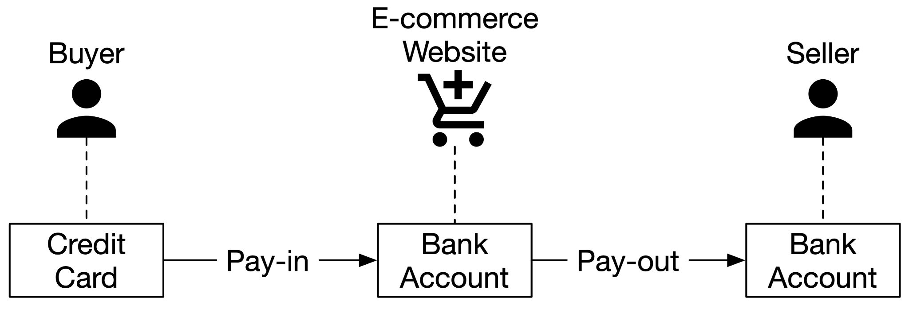 | 简化 Pay-in / Pay-out 流程：Buyer Credit Card → Pay-in → E-commerce Bank Account → Pay-out → Seller Bank Account | 高层设计 |
| Figure 2 | 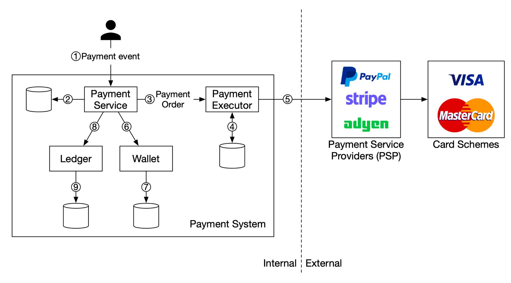 | **Pay-in flow 架构图**：Payment Event → Payment Service → Payment Executor → PSP (PayPal/Stripe/Adyen) → Card Schemes (Visa/MasterCard)；内部含 Ledger 和 Wallet 及各自 DB | 高层设计 |
| Figure 3 | 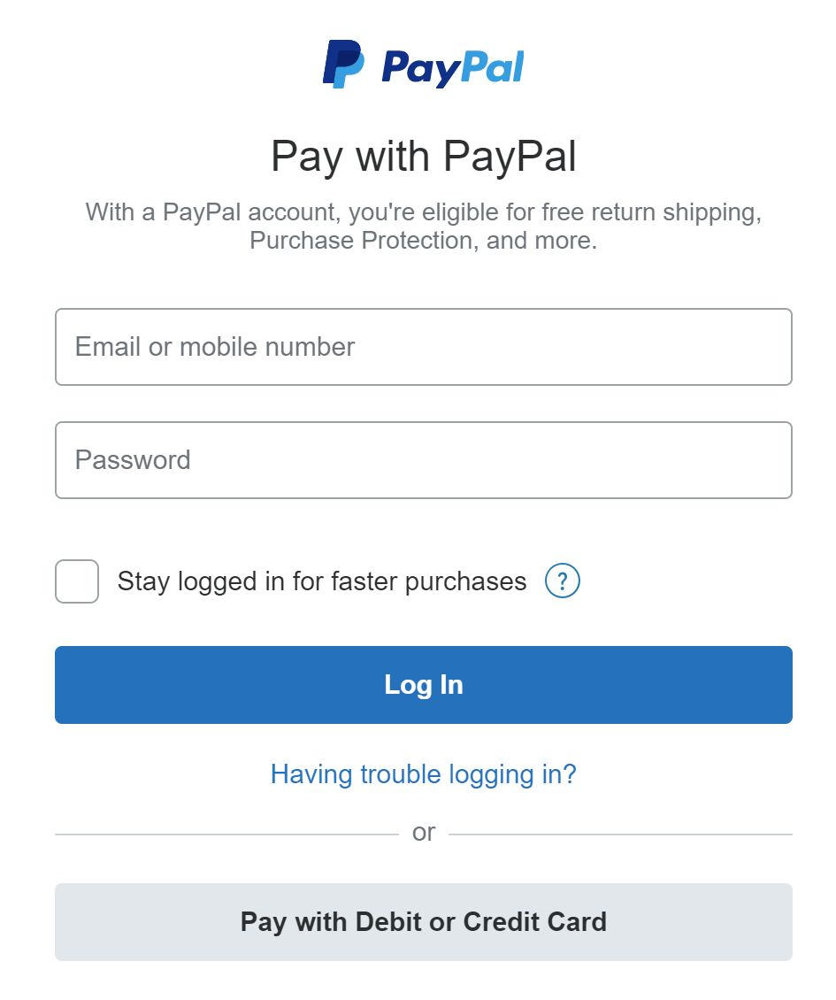 | PayPal Hosted Payment Page 示例（结账体验截图） | 高层设计 |
| Figure 4 | 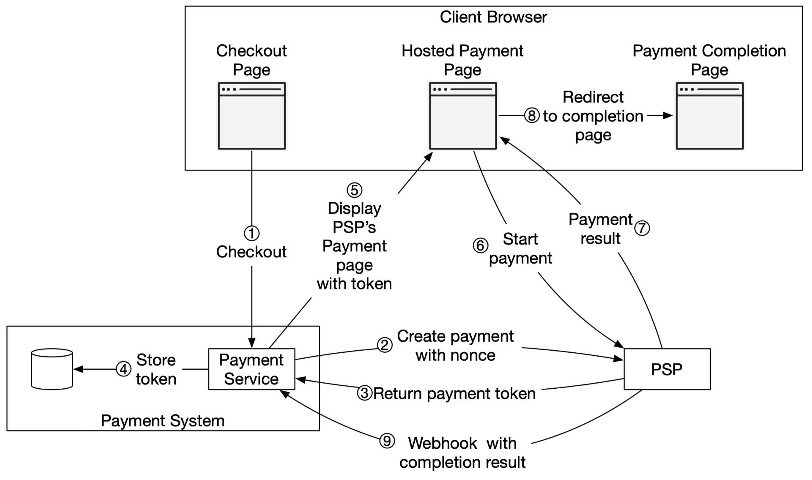 | **Hosted Payment Page 完整流程**：Client Browser (Checkout → Hosted Payment Page → Completion Page) ↔ Payment Service (store token) ↔ PSP (nonce/token 交换 + webhook 回调)，共9步 | 深入设计 |
| Figure 5 | 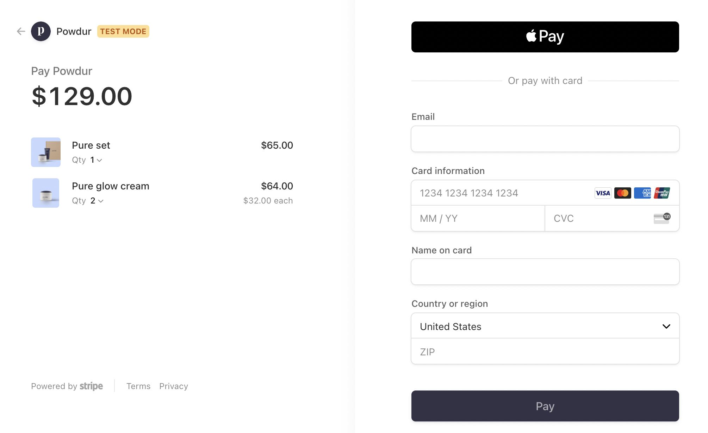 | Stripe Hosted Payment Page 示例（嵌入式支付表单截图） | 深入设计 |
| Figure 6 | 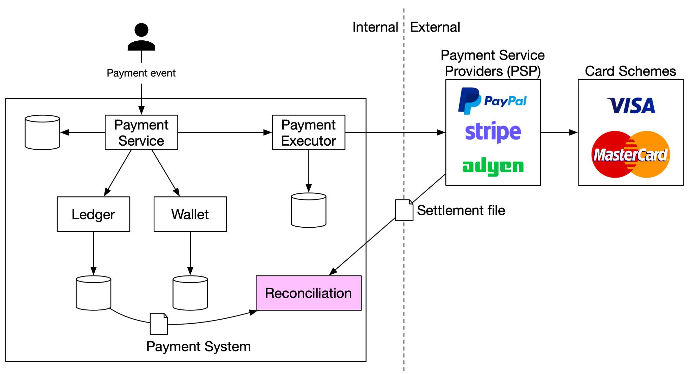 | **Reconciliation 架构**：在 Pay-in flow 基础上增加 Reconciliation 模块，接收 PSP 的 Settlement file，与 Ledger/Wallet DB 对账 | 深入设计 |
| Figure 7 | (文本描述) | Message Queue 单接收者模型示意 | 深入设计 |
| Figure 8 | 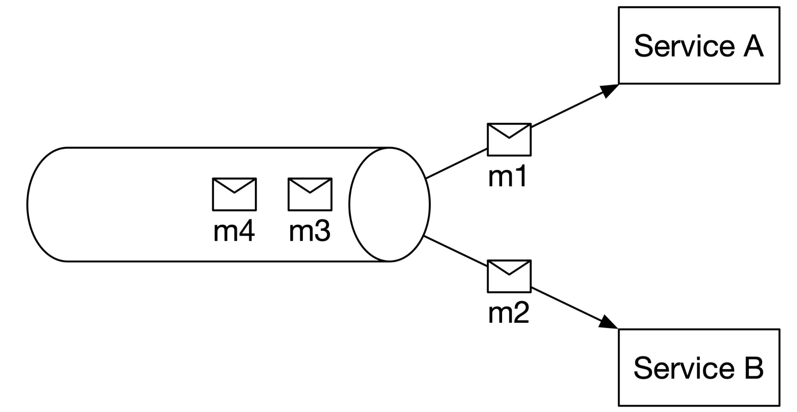 | Single receiver：m1/m2 被 Service A/B 分别消费后从队列移除 | 深入设计 |
| Figure 9 | 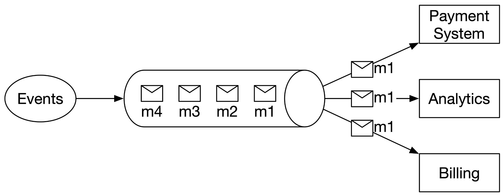 | Multiple receivers：Kafka 模型，同一 Payment Event 被 Payment System、Analytics、Billing 等多服务消费 | 深入设计 |
| Figure 10 | 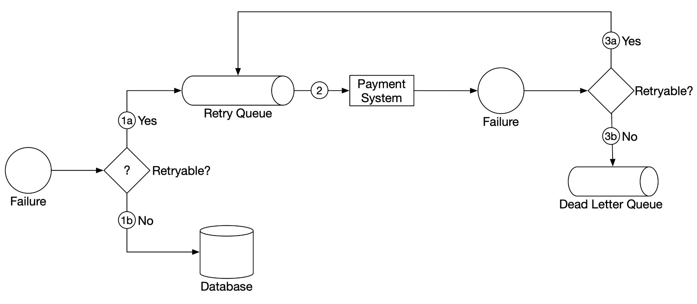 | **失败处理流程**：Failure → 判断是否 Retryable → Yes 进 Retry Queue → Payment System 重试 → 再次失败判断 → 超阈值进 Dead Letter Queue；不可重试直接入 DB | 深入设计 |
| Figure 11 | 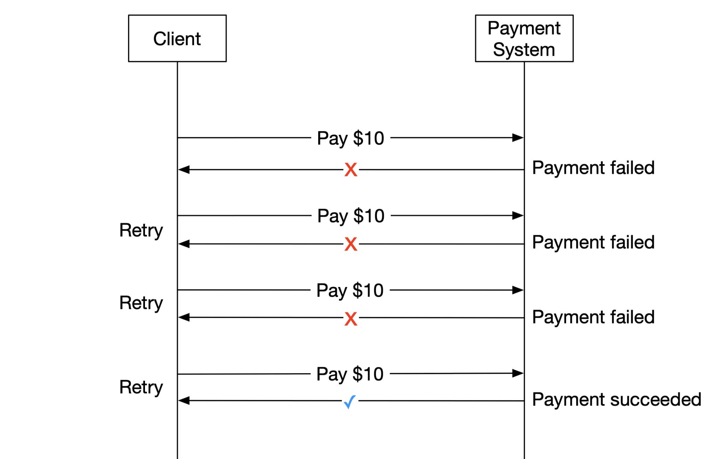 | Retry 示意：客户端多次重试 $10 支付，第4次成功 | 深入设计 |
| Figure 12 | 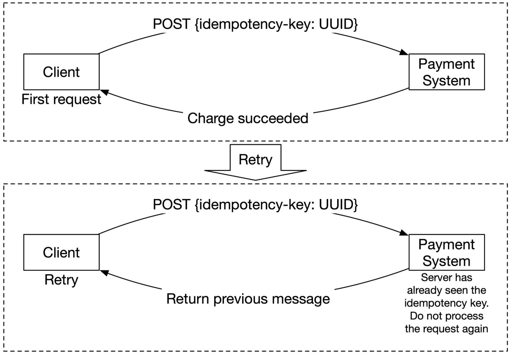 | **Idempotency 机制**：首次 POST 带 idempotency-key (UUID) 成功；重试时服务端识别到相同 key，返回上次结果，不重复处理 | 深入设计 |

---

## 设计思路演进

### Step 1: Pay-in / Pay-out 资金流拆分

```
Buyer (Credit Card)
    ──Pay-in──→ E-commerce 平台银行账户（平台托管资金）
                    ──Pay-out──→ Seller (Bank Account)
```

- Pay-in：买家下单后，资金从买家信用卡流入平台账户
- Pay-out：商品交付后，扣除平台佣金，将余额转入卖家账户
- Pay-out 通常使用第三方应付账款服务（如 Tipalti）

### Step 2: Pay-in Flow 核心组件

```
Payment Event (用户下单)
    → Payment Service (风控检查 AML/CFT → 存储事件)
        → Payment Executor (执行单笔 Payment Order)
            → PSP (PayPal / Stripe / Adyen)
                → Card Schemes (Visa / MasterCard)
    → Wallet (更新卖家余额)
    → Ledger (记录复式记账)
```

**9步流程：**
1. 用户点击下单，生成 Payment Event
2. Payment Service 存储事件到 DB
3. 拆分为多个 Payment Order（多卖家场景）
4. Payment Executor 存储 Order 到 DB
5. Payment Executor 调用 PSP 处理信用卡支付
6. 成功后 Payment Service 更新 Wallet（卖家余额）
7. Wallet 存储余额到 DB
8. Payment Service 更新 Ledger
9. Ledger 追加记录到 DB

### Step 3: PSP 集成与 Hosted Payment Page

```
Client Browser                    Payment Service              PSP
    │                                  │                        │
    ├─① Checkout────────────────→│                        │
    │                     ②─→ Create payment (nonce) ──→│
    │                     ③←─ Return token ────────────←│
    │                     ④ Store token in DB            │
    ├←─⑤ Display PSP Hosted Page──│                        │
    ├─⑥ User fills card info, pay─────────────────────→│
    ├←─⑦ Payment result──────────────────────────────←│
    ├─⑧ Redirect to completion page                      │
    │                     ⑨←─ Webhook (async) ─────────←│
```

**关键设计：**
- Nonce (UUID) 确保注册请求只执行一次
- Token 唯一映射到 Payment Order，作为 PSP 侧的 idempotency key
- Redirect URL 用于跳转到支付完成页
- Webhook URL 用于 PSP 异步通知支付结果

### Step 4: Reconciliation（对账）

```
PSP / Bank ──Settlement File (每晚)──→ Reconciliation System
                                            ↕ 比对
                                      Ledger / Wallet DB
```

- 每晚 PSP/银行发送结算文件，包含当日所有交易和余额
- Reconciliation 系统解析结算文件，与内部 Ledger 逐笔比对
- 同时用于检测内部系统（Ledger 与 Wallet）之间的不一致

**不匹配处理三类：**
1. 可分类 + 可自动修复 → 程序自动调整
2. 可分类 + 无法自动修复 → 入队列由财务团队手动修复
3. 无法分类 → 入特殊队列由财务团队手动调查

### Step 5: Exactly-Once 保障（幂等性）

```
Exactly-once = At-least-once (Retry) + At-most-once (Idempotency)
```

**Retry 策略：**
- Immediate retry / Fixed intervals / Incremental intervals
- Exponential backoff（推荐：网络问题短时难恢复时使用）
- Cancel（永久性失败时）

**Idempotency 实现：**
- Client → Server：HTTP Header 携带 `idempotency-key: UUID`（通常为购物车 ID）
- Server 端用 DB 唯一键约束去重：插入成功 = 新请求，插入失败 = 重复请求
- PSP 侧：Token 作为 idempotency key，防止重复扣款
- 并发请求同一 key → 仅处理一个，其余返回 `429 Too Many Requests`

### Step 6: 失败处理机制

```
Failure
  ├─ Retryable? ──Yes──→ Retry Queue → Payment System 重试
  │                                         ├─ 成功 → 完成
  │                                         └─ 再失败 → 超阈值? → Dead Letter Queue
  └─ No ──→ 存入 DB（不可重试错误如无效输入）
```

---

## 关键设计考量 (Tradeoffs)

### 1. 数据类型：amount 用 string 而非 double
- 不同协议/硬件序列化精度不同，double 可能导致舍入误差
- 金额可能极大（日本 GDP 约 5x10^14 日元）或极小（比特币 satoshi = 10^-8）
- 传输和存储用 string，仅在展示/计算时才转为数值

### 2. 复式记账 (Double-Entry Ledger)
- 每笔交易记录两个账户：一个借方 (Debit)，一个贷方 (Credit)，金额相同
- 所有交易条目之和必须为 0（差一分钱意味着别人多一分钱）
- 提供端到端可追溯性，确保支付周期一致性

### 3. 数据库选型
- 优先选择传统关系型数据库（支持 ACID 事务），不用 NoSQL/NewSQL
- 核心考量：成熟稳定性（大型金融机构使用 5 年以上）、工具生态、DBA 人才市场

### 4. 同步 vs 异步通信
| 维度 | 同步 (HTTP) | 异步 (Message Queue / Kafka) |
|------|-------------|------------------------------|
| 设计复杂度 | 简单 | 较复杂 |
| 性能 | 链式依赖，瓶颈在最慢的服务 | 解耦，独立扩展 |
| 容错 | PSP 挂了整个链路断 | 消息持久化，故障隔离 |
| 扩展性 | 难扩展（无缓冲） | Queue 作为缓冲，削峰 |
| 一致性 | 强一致性 | 最终一致性 |

- 单接收者模型（Message Queue）：消息消费后从队列移除
- 多接收者模型（Kafka）：同一 Payment Event 可触发 Payment、Analytics、Billing 等多个下游服务

### 5. 数据一致性策略
- 内部服务间：Exactly-once processing 保障
- 内部与外部（PSP）之间：Idempotency + Reconciliation
- 数据库副本同步：
  - 方案 A：主库处理所有读写（简单但浪费副本资源）
  - 方案 B：共识算法（Paxos / Raft）或分布式数据库（YugabyteDB / CockroachDB）

### 6. 支付处理延迟
- 部分支付可能需数小时甚至数天（风控人工审核、3D Secure 验证等）
- PSP 返回 pending 状态，客户端展示并提供查询页面
- PSP 通过 webhook 异步通知状态变更，或由 Payment Service 轮询 PSP

### 7. 安全防护

| 威胁 | 解决方案 |
|------|----------|
| 请求/响应窃听 | HTTPS |
| 数据篡改 | 加密 + 完整性监控 |
| 中间人攻击 | SSL + Certificate Pinning |
| 密码存储 | 加盐哈希 (Salted Hashing) |
| 数据丢失 | 多区域数据库复制 + 快照 |
| DDoS 攻击 | Rate Limiting + 防火墙 |
| 信用卡盗用 | Tokenization（用 Token 代替真实卡号） |
| PCI 合规 | 遵循 PCI DSS 标准 |
| 欺诈 | 地址验证 (AVS)、CVV 校验、用户行为分析 |

---

## 面试扩展话题

原书 Wrap-up 中列出的额外话题，面试中可能被追问：

1. **Monitoring（监控）**：监控关键指标（如特定支付方式的平均接受率、服务器 CPU 使用率等），通过 Dashboard 展示
2. **Alerting（告警）**：异常发生时及时通知 on-call 工程师
3. **Debugging Tools（调试工具）**：支持工程师和客服查看交易状态、处理服务器历史、PSP 记录等，快速定位"支付为什么失败"
4. **Currency Exchange（货币兑换）**：国际用户支付需考虑汇率转换
5. **Geography（地域差异）**：不同地区有完全不同的支付方式集合
6. **Cash Payment（现金支付）**：在印度、巴西等国家非常普遍，需要专门的设计（参考 Uber、Airbnb 的工程博客）
7. **Google/Apple Pay 集成**：移动支付 SDK 集成

---

## 速写练习要点

盲画时重点记住这些组件和连接：

1. **资金流全景**：Buyer (Credit Card) → Pay-in → Platform Bank Account → Pay-out → Seller (Bank Account)
2. **Pay-in 核心链路**：Payment Event → Payment Service → Payment Executor → PSP → Card Schemes；然后 Payment Service → Wallet → Ledger
3. **Hosted Payment Page 流程**：Client ↔ Payment Service ↔ PSP 的 9 步交互，关键是 nonce/token 交换和 webhook 回调
4. **Reconciliation 位置**：挂在 Payment System 下方，接收 PSP 的 Settlement file，与 Ledger DB 比对
5. **失败处理**：Failure → Retryable 判断 → Retry Queue → Dead Letter Queue 的决策流
6. **Idempotency 机制**：Client 带 idempotency-key → Server 用 DB 唯一约束去重 → PSP 用 token 去重
7. **双表结构**：Payment Event 表（checkout_id 为 PK）+ Payment Order 表（payment_order_id 为 PK，checkout_id 为 FK）
