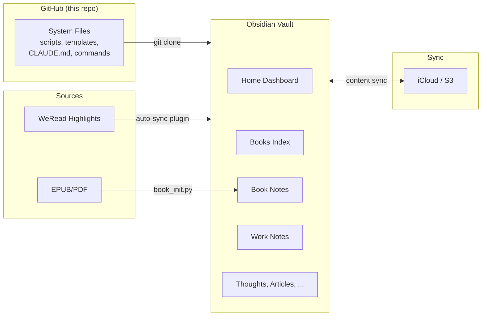
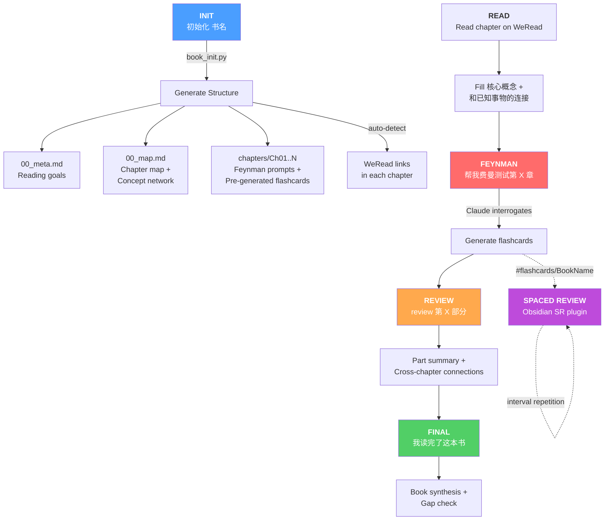

# Obsidian Workflow

System files for my Obsidian knowledge management vault. Content (notes, highlights, attachments) is synced separately — this repo only tracks the **workflow infrastructure**.

## What's in here

```
.claude/
  commands/       # Claude Code slash commands (/backup, /daily, /research, etc.)
  scripts/        # Auto-sync hooks
  skills/         # Claude Code skills (Obsidian markdown, Bases, Canvas, etc.)
  settings.json   # Hook configuration

Books/
  book_init.py    # EPUB/PDF parser → Obsidian note generator
  CLAUDE.md       # Book learning system instructions
  Books Index.md  # Dataview-powered book directory
  .bookrc.example # Config template for local paths

Templates/        # Work daily notes and project page templates
CLAUDE.md         # Vault-level Claude Code instructions
Home.md           # Obsidian dashboard with Dataview queries
```

## Architecture



## Book Learning System



A structured reading workflow: **scaffold first → directed reading → active construction → spaced review**.

```
python3 Books/book_init.py --file "path/to/book.epub" --output "path/to/vault/Books"
```

Generates per-book Obsidian notes:
- `00_meta.md` — reading goals and final evaluation
- `00_map.md` — chapter map + cross-chapter concept network
- `chapters/Ch01_*.md` — per-chapter notes with Feynman test prompts and flashcards

Features:
- EPUB and PDF support (CJK and English)
- Auto-links WeRead (微信读书) highlights to chapter notes
- Spaced repetition flashcards via [obsidian-spaced-repetition](https://github.com/st3v3nmw/obsidian-spaced-repetition)
- Interactive workflows: Feynman testing, Part Review, Final synthesis (via Claude Code)

## Setup

1. Clone into your Obsidian vault root
2. Copy `Books/.bookrc.example` to `.bookrc` in the vault root and edit paths
3. Install dependencies: `pip install ebooklib beautifulsoup4 pdfplumber`
4. Install Obsidian plugins: Dataview, Spaced Repetition

## Dependencies

- [Obsidian](https://obsidian.md) with Dataview plugin
- [Claude Code](https://claude.ai/claude-code) for interactive workflows
- Python 3 with `ebooklib`, `beautifulsoup4`, `pdfplumber`
