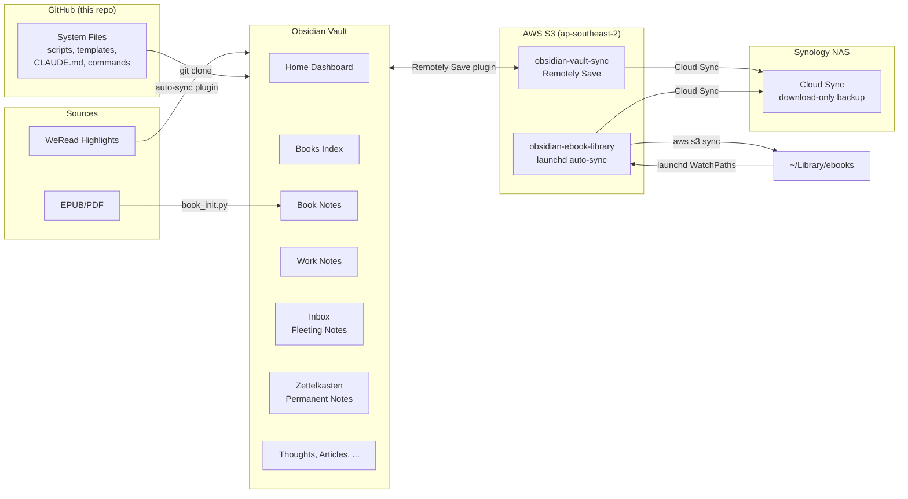
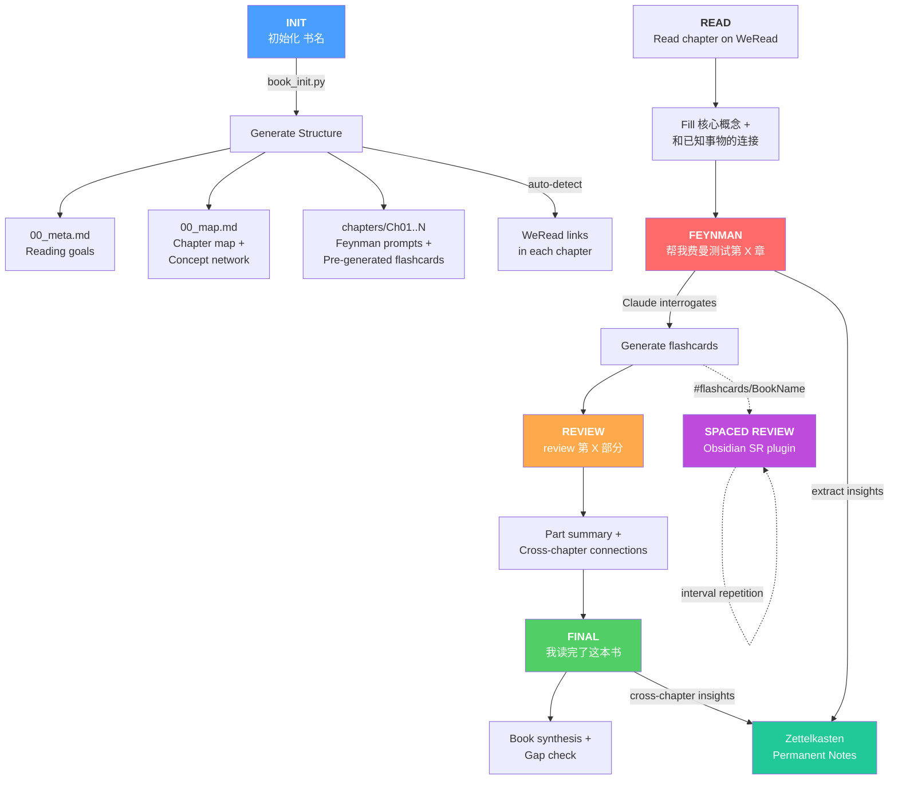
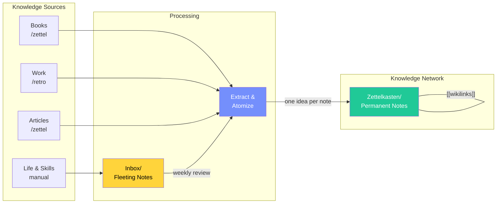

# Obsidian Workflow

System files for my Obsidian knowledge management vault. Content (notes, highlights, attachments) is synced separately — this repo only tracks the **workflow infrastructure**.

## What's in here

```
.claude/
  commands/       # Claude Code slash commands (/zettel, /retro, /daily, /research, etc.)
  scripts/        # Auto-sync hooks
  skills/         # Claude Code skills (Obsidian markdown, Bases, Canvas, etc.)
  settings.json   # Hook configuration

Books/
  book_init.py    # EPUB/PDF parser → Obsidian note generator
  CLAUDE.md       # Book learning system instructions
  Books Index.md  # Dataview-powered book directory + WeRead Library card view
  .bookrc.example # Config template for local paths

Inbox/            # Fleeting notes — quick capture, processed weekly
Zettelkasten/     # Permanent notes — one atomic idea per note, interlinked
Templates/        # Inbox, Zettel, Work Daily, Work Project templates
CLAUDE.md         # Vault-level Claude Code instructions
Home.md           # Obsidian dashboard with Dataview queries
```

## Architecture



## Book Learning System



A structured reading workflow: **scaffold first → directed reading → active construction → spaced review → permanent knowledge**.

## Knowledge Flow (Zettelkasten)



Three input pipelines feed the same knowledge network:
- **Reading** — Feynman tests and book reviews automatically suggest zettel extraction
- **Work** — `/retro` command extracts reusable lessons from daily notes and project pages
- **Life & Skills** — Capture to Inbox, process weekly into permanent notes

Each zettel is one atomic idea, written in your own words, linked to related zettel via `Related::` field. The `topics` frontmatter field (free-form keywords) enables filtering in the Zettelkasten Index.

### Commands

All commands run inside Claude Code (type `/command-name` in the chat).

#### Knowledge Building

| Command | When to use |
|---------|------------|
| `/zettel <source>` | Extract permanent zettel from a book, article, or note |
| `/inbox-review` | Weekly — process all Inbox notes into zettel or archive |
| `/retro <source>` | Extract reusable lessons from work daily notes or project pages |
| `/connections <topic>` | Find thematic connections across Book Summaries |

#### Research & Notes

| Command | When to use |
|---------|------------|
| `/research <topic>` | Web research → structured note saved to `Thoughts/` |
| `/summarize <note>` | Summarize a note or folder into key points |
| `/backlink [note]` | Scan a note and add `[[wikilinks]]` to referenced concepts |

#### Work

| Command | When to use |
|---------|------------|
| `/daily` | Create today's daily note in `Thoughts/` |
| `/meeting <title>` | Create a meeting note |
| `/decision-log <decision>` | Record a decision with context and rationale |
| `/project <name>` | Create a new project page in `Work/Projects/` |

#### Vault Maintenance

| Command | When to use |
|---------|------------|
| `/organize [folder]` | Review and sort notes in a folder |
| `/tag-audit` | Audit and clean up tags across the vault |
| `/sync-summaries` | Sync Book Summaries with the latest WeRead highlights |

### Zettelkasten Workflow

**Capture (mobile):** Use the `+ Inbox` button on Home.md to create a timestamped note in `Inbox/` — no format required, just the thought.

**Inbox → Zettel flow** (run `/inbox-review` in Claude Code):
1. Each inbox note is shown one at a time
2. Choose: **convert to zettel** / **archive** / **skip**
3. Converted notes become permanent zettel in `Zettelkasten/`
4. Processed notes are archived to `Inbox/archive/YYYY-MM/` (never deleted)
5. Skipped notes remain in `Inbox/` for the next review

**Zettel status lifecycle:**
- 🌱 `seedling` — newly created, 0–1 Related links
- 🌿 `growing` — 2+ Related links, idea connected to the network
- 🌳 `evergreen` — manually marked; deeply internalized, cross-domain connections

```
python3 Books/book_init.py --file "path/to/book.epub" --output "path/to/vault/Books"
```

Generates per-book Obsidian notes:
- `00_meta.md` — reading goals and final evaluation
- `00_map.md` — chapter map + cross-chapter concept network
- `chapters/Ch01_*.md` — per-chapter notes with Feynman test prompts and flashcards

Features:
- EPUB and PDF support (CJK and English)
- Auto-links WeRead (微信读书) highlights to chapter notes
- Spaced repetition flashcards via [obsidian-spaced-repetition](https://github.com/st3v3nmw/obsidian-spaced-repetition)
- Interactive workflows: Feynman testing, Part Review, Final synthesis (via Claude Code)

## Setup (new machine)

### Prerequisites

- [Obsidian](https://obsidian.md)
- [Claude Code](https://claude.ai/claude-code)
- Python 3 with `pip install ebooklib beautifulsoup4 pdfplumber`
- AWS CLI (`brew install awscli`)

### 1. AWS credentials

Configure the `obsidian-sync` IAM user (least-privilege access to S3 only):

```bash
aws configure --profile obsidian-sync
# Access Key ID and Secret Access Key are stored in password manager
# Region: ap-southeast-2
```

### 2. Vault sync (Remotely Save)

1. Open Obsidian → Settings → Community Plugins → Install **Remotely Save**
2. Configure S3 backend:
   - **Endpoint**: `s3.ap-southeast-2.amazonaws.com`
   - **Region**: `ap-southeast-2`
   - **Bucket**: `obsidian-vault-sync-391824190072`
   - **Access Key / Secret**: from `obsidian-sync` IAM user
3. Trigger first sync — this downloads the full vault

### 3. Ebook library

```bash
# Create local ebook directory
mkdir -p ~/Library/ebooks

# Download ebooks from S3
aws s3 sync s3://obsidian-ebook-library-391824190072 ~/Library/ebooks --profile obsidian-sync
```

### 4. Ebook auto-sync (launchd)

Create `~/Library/LaunchAgents/com.tedfan.ebook-s3-sync.plist` (replace `/Users/tedfan` with your home directory):

```xml
<?xml version="1.0" encoding="UTF-8"?>
<!DOCTYPE plist PUBLIC "-//Apple//DTD PLIST 1.0//EN" "http://www.apple.com/DTDs/PropertyList-1.0.dtd">
<plist version="1.0">
<dict>
    <key>Label</key>
    <string>com.tedfan.ebook-s3-sync</string>
    <key>ProgramArguments</key>
    <array>
        <string>/usr/local/bin/aws</string>
        <string>s3</string>
        <string>sync</string>
        <string>/Users/tedfan/Library/ebooks</string>
        <string>s3://obsidian-ebook-library-391824190072</string>
        <string>--region</string>
        <string>ap-southeast-2</string>
        <string>--exclude</string>
        <string>.DS_Store</string>
        <string>--profile</string>
        <string>obsidian-sync</string>
    </array>
    <key>WatchPaths</key>
    <array>
        <string>/Users/tedfan/Library/ebooks</string>
    </array>
    <key>StandardOutPath</key>
    <string>/tmp/ebook-s3-sync.log</string>
    <key>StandardErrorPath</key>
    <string>/tmp/ebook-s3-sync.log</string>
</dict>
</plist>
```

```bash
launchctl load ~/Library/LaunchAgents/com.tedfan.ebook-s3-sync.plist
```

Any changes to `~/Library/ebooks/` are automatically synced to S3.

### 5. Book system config

```bash
cp Books/.bookrc.example .bookrc
# Edit .bookrc:
#   books_dir = "~/Library/ebooks"
#   vault_dir = "~/Vaults/Workspace"
```

### 6. Obsidian plugins

Install via Community Plugins: Dataview, Spaced Repetition, Kanban, Calendar, Excalidraw, Tag Wrangler, Remotely Save

### 7. NAS backup (optional)

Synology NAS can pull from S3 as an offline backup via **Cloud Sync**:

1. Open **Package Center** → Install **Cloud Sync**
2. Create a new sync task:
   - **Cloud Provider**: Amazon S3
   - **Access Key / Secret Key**: from `obsidian-sync` IAM user
   - **Bucket**: select the bucket to back up
   - **Local path**: a folder on the NAS (e.g., `/volume1/Backup/obsidian-vault`)
   - **Sync direction**: Download only (NAS as read-only backup)
3. Repeat for the second bucket if desired

This gives you a 3-2-1 backup: local Mac + S3 + NAS.

## AWS resources

| Resource | Value |
|----------|-------|
| IAM user | `obsidian-sync` |
| Vault bucket | `obsidian-vault-sync-391824190072` |
| Ebook bucket | `obsidian-ebook-library-391824190072` |
| Region | `ap-southeast-2` (Sydney) |
